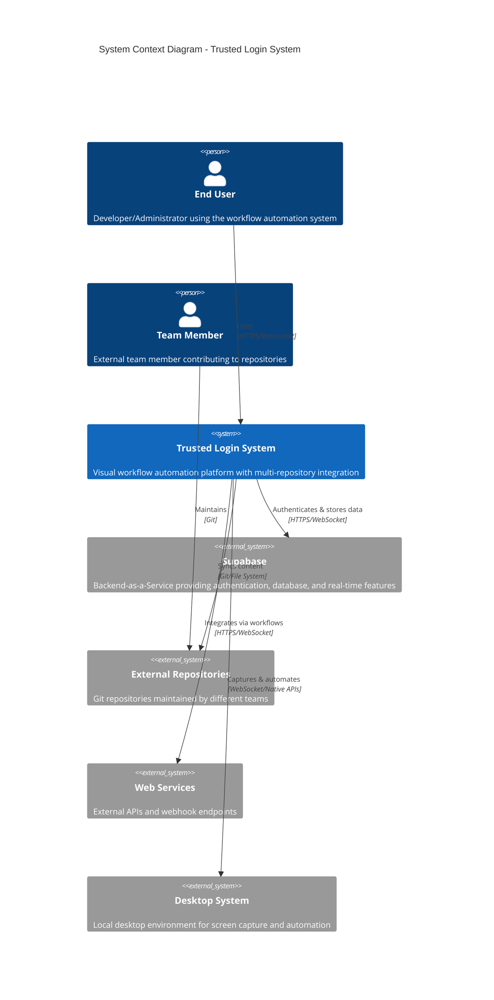
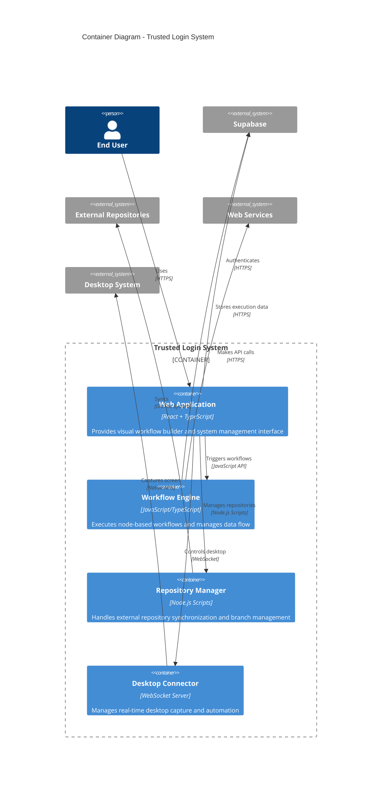
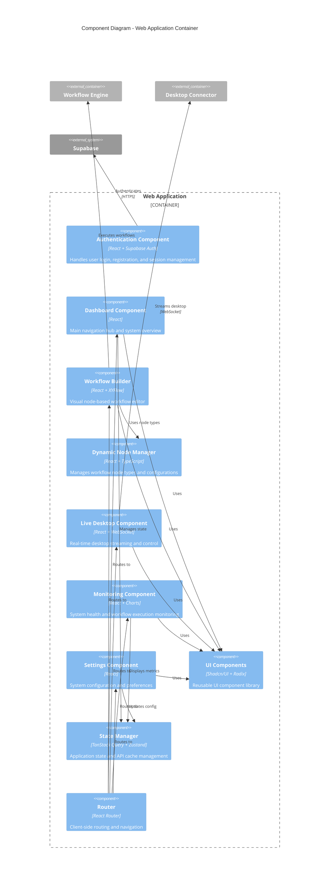
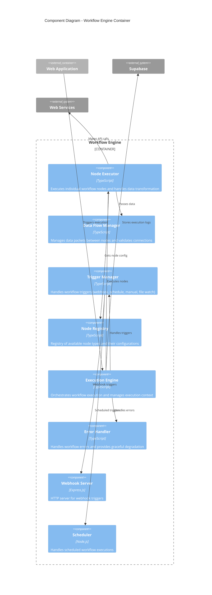
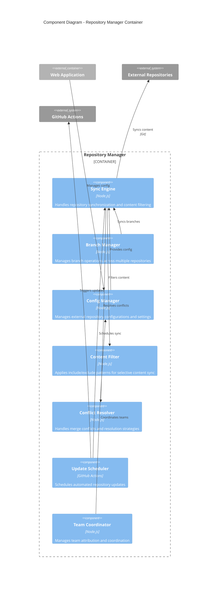
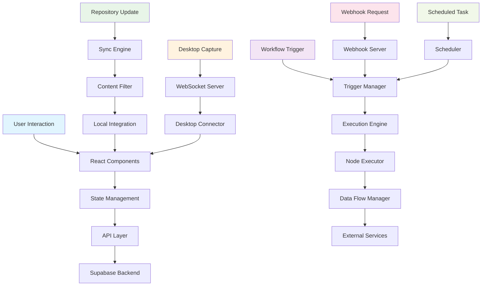
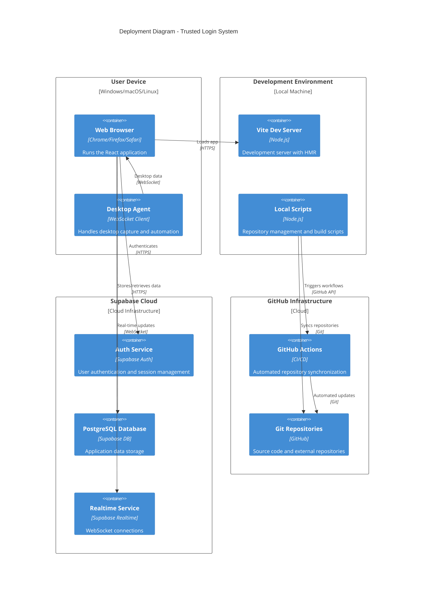
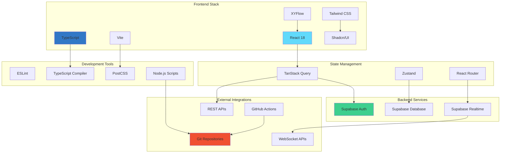

# C4 Architecture Diagrams - Trusted Login System

## Overview

This document contains C4 model diagrams for the Trusted Login System, providing a hierarchical view of the system architecture from high-level context down to detailed components.

## Level 1: System Context Diagram

## Level 2: Container Diagram

## Level 3: Component Diagram - Web Application

## Level 3: Component Diagram - Workflow Engine

## Level 3: Component Diagram - Repository Manager

## Data Flow Diagram

## Deployment Architecture

## Security Architecture

```mermaid
flowchart TB
    subgraph "Security Layers"
        A[Authentication Layer]
        B[Authorization Layer]
        C[Data Protection Layer]
        D[Network Security Layer]
    end
    
    subgraph "Authentication Components"
        A1[Supabase Auth]
        A2[Session Management]
        A3[Token Refresh]
    end
    
    subgraph "Authorization Components"
        B1[Route Guards]
        B2[API Permissions]
        B3[Resource Access Control]
    end
    
    subgraph "Data Protection"
        C1[Input Validation]
        C2[Data Encryption]
        C3[Secure Storage]
    end
    
    subgraph "Network Security"
        D1[HTTPS/TLS]
        D2[WebSocket Security]
        D3[CORS Configuration]
    end
    
    A --> A1
    A --> A2
    A --> A3
    
    B --> B1
    B --> B2
    B --> B3
    
    C --> C1
    C --> C2
    C --> C3
    
    D --> D1
    D --> D2
    D --> D3
    
    style A fill:#ffebee
    style B fill:#e8f5e8
    style C fill:#e3f2fd
    style D fill:#fff3e0
```

## Technology Stack Overview

---

## Notes

- **C4 Model Levels**: Context → Container → Component → Code
- **Mermaid Syntax**: Used for diagram generation and documentation
- **Security Focus**: Authentication, authorization, and data protection layers
- **Scalability**: Modular architecture supporting horizontal scaling
- **Integration**: Multi-repository workflow with external service integration

These diagrams provide a comprehensive view of the system architecture, from high-level context down to detailed component interactions, following C4 modeling best practices for software architecture documentation.