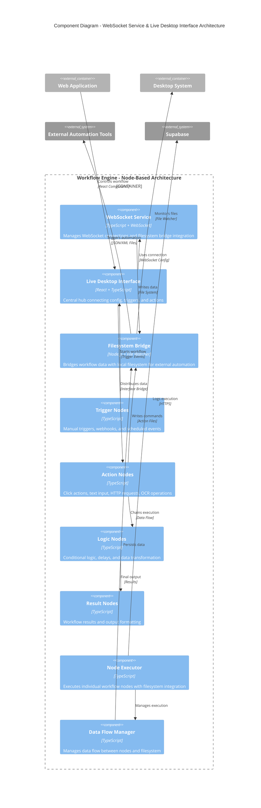
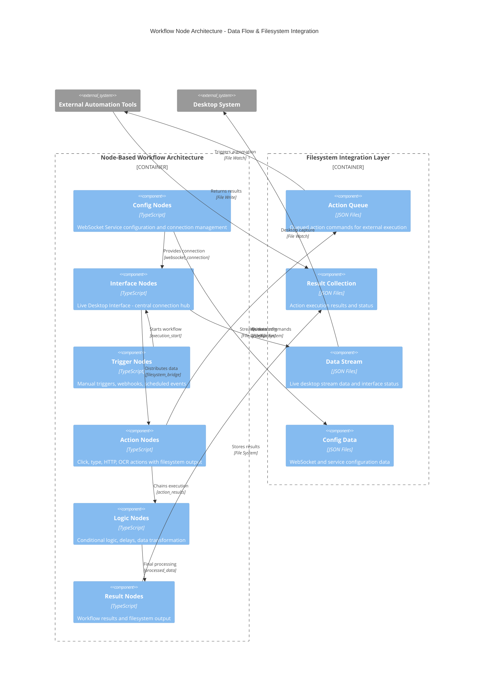
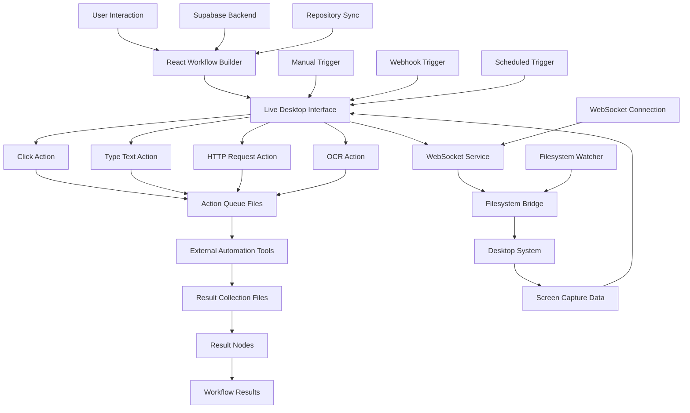
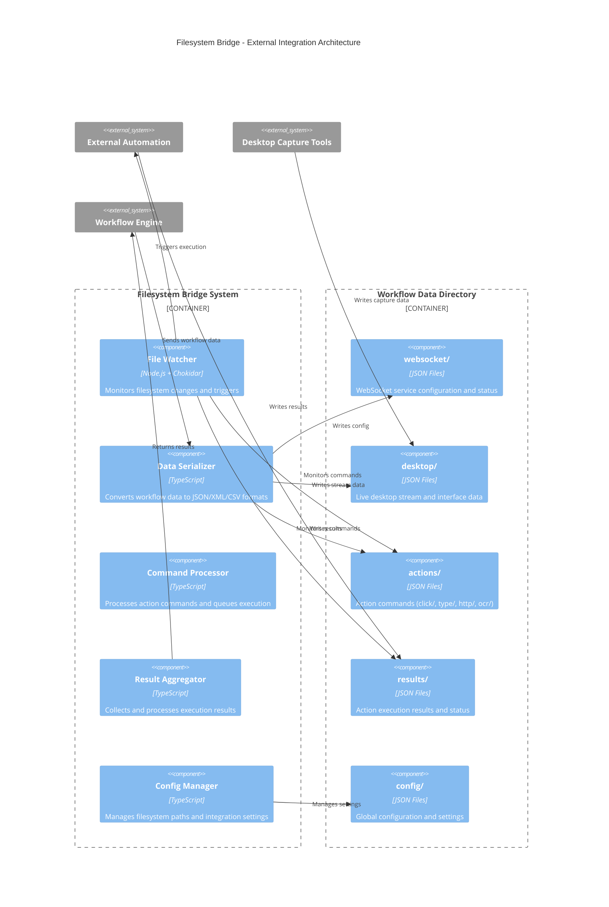

# C4 Architecture Diagrams - Trusted Login System

## Overview

This document contains C4 model diagrams for the Trusted Login System, providing a hierarchical view of the system architecture from high-level context down to detailed components.

## Level 1: System Context Diagram


## Level 2: Container Diagram


## Level 3: Component Diagram - Web Application


## Level 3: Component Diagram - Workflow Engine


## Level 3: Component Diagram - Repository Manager


## Level 4: Component Diagram - WebSocket Service & Live Desktop Interface (Updated Architecture)



## Workflow Node Architecture Diagram



## Data Flow Diagram - Updated Architecture



## Filesystem Bridge Architecture



## Deployment Architecture


## Security Architecture


## Technology Stack Overview


---

## Architecture Summary - WebSocket Service & Live Desktop Interface

### Key Architectural Changes (Latest Update)

The system has been updated with a new **node-based workflow architecture** featuring:

#### 1. **WebSocket Service Configuration Node**
- **Purpose**: Central WebSocket connection management with filesystem bridge integration
- **Type**: Config node (provides connection to interface nodes)
- **Key Features**:
  - WebSocket connection management with auto-reconnect
  - Filesystem bridge for external automation tool integration
  - Health monitoring and service lifecycle management
  - Configurable data formats (JSON, XML, CSV)

#### 2. **Live Desktop Interface Node**
- **Purpose**: Central hub connecting config, triggers, and actions
- **Type**: Interface node (accepts multiple inputs, provides multiple outputs)
- **Key Features**:
  - Accepts WebSocket config, triggers, and action commands
  - Provides desktop stream, interface status, and filesystem bridge
  - Real-time desktop capture and streaming
  - Action command distribution to filesystem

#### 3. **Filesystem Bridge Integration**
- **Purpose**: Bridge between workflow engine and external automation tools
- **Implementation**: File-based communication using JSON/XML/CSV
- **Directory Structure**:
  ```
  ./workflow-data/
  ├── websocket/     # WebSocket service config and status
  ├── desktop/       # Live desktop stream and interface data
  ├── actions/       # Action commands (click/, type/, http/, ocr/)
  ├── results/       # Action execution results and status
  └── config/        # Global configuration and settings
  ```

#### 4. **Node Connection Architecture**
The new architecture follows a specific connection pattern:
```
Config Nodes → Interface Nodes → Action Nodes → Logic Nodes → Result Nodes
     ↓              ↓              ↓              ↓              ↓
WebSocket      Live Desktop    Click/Type     Conditions    Workflow
Service        Interface       Actions        & Delays      Results
```

#### 5. **Data Flow Pattern**
1. **Configuration**: WebSocket Service provides connection to Live Desktop Interface
2. **Triggering**: Manual/Webhook triggers start workflow execution via interface
3. **Action Distribution**: Interface distributes data and commands to action nodes
4. **Filesystem Integration**: Actions write commands to filesystem for external execution
5. **Result Collection**: External tools write results back to filesystem
6. **Result Processing**: Result nodes collect and format final workflow output

#### 6. **External Integration Strategy**
- **File-based Communication**: Uses filesystem as communication layer
- **External Tool Support**: Any automation tool that can read/write files
- **Real-time Monitoring**: File watchers for immediate response to changes
- **Format Flexibility**: Support for JSON, XML, and CSV data formats

### Benefits of New Architecture

1. **Modularity**: Clear separation between config, interface, action, and result nodes
2. **Extensibility**: Easy to add new node types and external integrations
3. **Reliability**: Filesystem-based communication provides persistence and recovery
4. **Tool Agnostic**: Works with any external automation tool that supports file I/O
5. **Real-time**: WebSocket and file watcher integration for immediate response
6. **Debugging**: Clear data flow through filesystem makes debugging easier

### Technical Implementation

- **Frontend**: React components with TypeScript for node-based workflow builder
- **Backend**: Node.js with WebSocket server and filesystem bridge
- **Data Flow**: JSON-based data packets between nodes with filesystem persistence
- **External Integration**: File watcher pattern for external automation tool communication
- **Configuration**: Centralized config management with per-node customization

This architecture enables the autonomous programmer project to integrate with various external automation tools while maintaining a clean, modular, and extensible workflow system.

---

## Notes

- **C4 Model Levels**: Context → Container → Component → Code
- **Mermaid Syntax**: Used for diagram generation and documentation
- **Security Focus**: Authentication, authorization, and data protection layers
- **Scalability**: Modular architecture supporting horizontal scaling
- **Integration**: Multi-repository workflow with external service integration

These diagrams provide a comprehensive view of the system architecture, from high-level context down to detailed component interactions, following C4 modeling best practices for software architecture documentation.