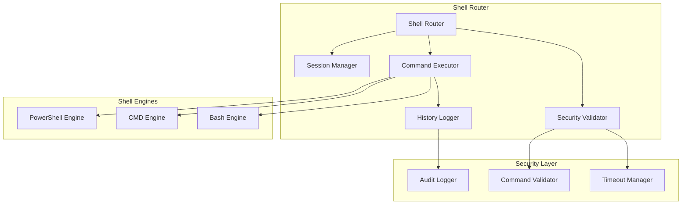

# TRAE Backend System Documentation

## Table of Contents

1. [System Overview](#system-overview)
2. [C4 Architektur Diagramme](#c4-architektur-diagramme)
3. [API Endpunkt Referenz](#api-endpunkt-referenz)
4. [Datenmodelle und Schemas](#datenmodelle-und-schemas)
5. [Service Architektur](#service-architektur)
6. [Frontend-Backend Integration](#frontend-backend-integration)
7. [Konfiguration und Deployment](#konfiguration-und-deployment)

---

## System Overview

### Was kann das TRAE Backend?

Das TRAE (Trusted Remote Automation Environment) Backend ist ein umfassendes FastAPI-basiertes System für Desktop-Automatisierung, OCR-Verarbeitung und Workflow-Management. Es bietet folgende Hauptfunktionalitäten:

**🖥️ Desktop Automation & Streaming**
- Live Desktop Streaming über WebSockets
- Screenshot-Erfassung und -Verarbeitung
- Maus- und Tastatur-Automatisierung
- Multi-Monitor-Unterstützung

**🔍 OCR & Computer Vision**
- Tesseract und EasyOCR Integration
- Zonendefinierte OCR-Verarbeitung
- Snapshot-basierte Automatisierung
- Template-System für wiederverwendbare OCR-Konfigurationen

**⚙️ Workflow Management**
- Node-basierte Workflow-Definition
- Graph-Execution-Engine
- Konfigurierbare Node-Templates
- JSON-Schema-Validierung

**🔌 Integration & APIs**
- RESTful API-Endpunkte
- WebSocket-Kommunikation
- Proxmox VM-Integration
- n8n Webhook-Unterstützung

**💻 Shell & PowerShell Integration**
- PowerShell-Befehlsausführung
- CMD-Befehlsausführung
- Bash-Unterstützung (WSL)
- Session-Management
- Umgebungsvariablen-Verwaltung
- Prozessverwaltung
- Sicherheitsprüfungen für gefährliche Befehle

**📊 Monitoring & Health Checks**
- Service-Health-Monitoring
- Detaillierte Logging-Funktionalität
- Performance-Metriken
- Fehlerbehandlung und Recovery

---

## C4 Architektur Diagramme

### 1. Context Diagramm - System Kontext

```
┌─────────────────────────────────────────────────────────────────────────────────┐
│                              TRAE System Context                               │
├─────────────────────────────────────────────────────────────────────────────────┤
│                                                                                 │
│  ┌─────────────┐    HTTP/WS     ┌─────────────────────┐    SSH/API    ┌──────┐ │
│  │   Frontend  │◄──────────────►│    TRAE Backend     │◄─────────────►│ VM   │ │
│  │   (React)   │                │    (FastAPI)        │               │ Host │ │
│  └─────────────┘                └─────────────────────┘               └──────┘ │
│                                           │                                     │
│                                           │ HTTP                                │
│                                           ▼                                     │
│                                  ┌─────────────────┐                           │
│                                  │   n8n Webhook   │                           │
│                                  │   Integration   │                           │
│                                  └─────────────────┘                           │
│                                                                                 │
│  External Dependencies:                                                         │
│  • Tesseract OCR Engine                                                        │
│  • EasyOCR Library                                                             │
│  • PyAutoGUI for Desktop Control                                               │
│  • Proxmox VE API                                                              │
└─────────────────────────────────────────────────────────────────────────────────┘
```

### 2. Container Diagramm - System Container

```
┌─────────────────────────────────────────────────────────────────────────────────┐
│                            TRAE Backend Container                              │
├─────────────────────────────────────────────────────────────────────────────────┤
│                                                                                 │
│  ┌─────────────────┐    ┌─────────────────┐    ┌─────────────────┐             │
│  │   API Gateway   │    │   WebSocket     │    │   Service       │             │
│  │   (FastAPI)     │    │   Handler       │    │   Manager       │             │
│  │                 │    │                 │    │                 │             │
│  │ • Health Check  │    │ • Live Stream   │    │ • Lifecycle     │             │
│  │ • CORS Config   │    │ • Automation    │    │ • Dependencies  │             │
│  │ • Rate Limiting │    │ • File System   │    │ • Error Handling│             │
│  └─────────────────┘    └─────────────────┘    └─────────────────┘             │
│           │                       │                       │                     │
│           └───────────────────────┼───────────────────────┘                     │
│                                   │                                             │
│  ┌─────────────────┐    ┌─────────────────┐    ┌─────────────────┐             │
│  │   Desktop       │    │   Automation    │    │   OCR           │             │
│  │   Service       │    │   Service       │    │   Service       │             │
│  │                 │    │                 │    │                 │             │
│  │ • Screenshot    │    │ • Mouse/Keyboard│    │ • Tesseract     │             │
│  │ • Streaming     │    │ • Click Actions │    │ • EasyOCR       │             │
│  │ • Multi-Monitor │    │ • Coordinates   │    │ • Zone Processing│             │
│  └─────────────────┘    └─────────────────┘    └─────────────────┘             │
│                                                                                 │
│  ┌─────────────────┐    ┌─────────────────┐    ┌─────────────────┐             │
│  │   Workflow      │    │   Node Config   │    │   Snapshot      │             │
│  │   Service       │    │   Service       │    │   Service       │             │
│  │                 │    │                 │    │                 │             │
│  │ • Graph Exec    │    │ • Templates     │    │ • Storage       │             │
│  │ • Node Management│    │ • Validation    │    │ • Metadata      │             │
│  │ • Flow Control  │    │ • CRUD Ops      │    │ • File Handling │             │
│  └─────────────────┘    └─────────────────┘    └─────────────────┘             │
└─────────────────────────────────────────────────────────────────────────────────┘
```

### 3. Component Diagramm - Backend Komponenten

```
┌─────────────────────────────────────────────────────────────────────────────────┐
│                          TRAE Backend Components                               │
├─────────────────────────────────────────────────────────────────────────────────┤
│                                                                                 │
│  ┌─────────────────────────────────────────────────────────────────────────────┐ │
│  │                            Router Layer                                    │ │
│  │  ┌─────────┐ ┌─────────┐ ┌─────────┐ ┌─────────┐ ┌─────────┐ ┌─────────┐  │ │
│  │  │ Health  │ │Desktop  │ │Automation│ │WebSocket│ │NodeConfig│ │Snapshot │  │ │
│  │  │ Router  │ │ Router  │ │ Router  │ │ Router  │ │ Router  │ │ Router  │  │ │
│  │  └─────────┘ └─────────┘ └─────────┘ └─────────┘ └─────────┘ └─────────┘  │ │
│  └─────────────────────────────────────────────────────────────────────────────┘ │
│                                        │                                       │
│  ┌─────────────────────────────────────────────────────────────────────────────┐ │
│  │                           Service Layer                                    │ │
│  │  ┌─────────────────┐  ┌─────────────────┐  ┌─────────────────┐            │ │
│  │  │ LiveDesktop     │  │ ClickAutomation │  │ EnhancedOCR     │            │ │
│  │  │ Service         │  │ Service         │  │ Service         │            │ │
│  │  │                 │  │                 │  │                 │            │ │
│  │  │ • Stream Mgmt   │  │ • PyAutoGUI     │  │ • Tesseract     │            │ │
│  │  │ • Screenshot    │  │ • Coordinate    │  │ • EasyOCR       │            │ │
│  │  │ • Config        │  │   Scaling       │  │ • Preprocessing │            │ │
│  │  └─────────────────┘  └─────────────────┘  └─────────────────┘            │ │
│  │                                                                             │ │
│  │  ┌─────────────────┐  ┌─────────────────┐  ┌─────────────────┐            │ │
│  │  │ Node            │  │ Graph Execution │  │ N8N Integration │            │ │
│  │  │ Service         │  │ Service         │  │ Service         │            │ │
│  │  │                 │  │                 │  │                 │            │ │
│  │  │ • Templates     │  │ • Workflow Exec │  │ • Webhook Calls │            │ │
│  │  │ • Validation    │  │ • Node Linking  │  │ • Data Transform│            │ │
│  │  │ • CRUD          │  │ • Error Handling│  │ • Auth Handling │            │ │
│  │  └─────────────────┘  └─────────────────┘  └─────────────────┘            │ │
│  └─────────────────────────────────────────────────────────────────────────────┘ │
│                                        │                                       │
│  ┌─────────────────────────────────────────────────────────────────────────────┐ │
│  │                           Data Layer                                       │ │
│  │  ┌─────────────────┐  ┌─────────────────┐  ┌─────────────────┐            │ │
│  │  │ Snapshot        │  │ Configuration   │  │ Logging         │            │ │
│  │  │ Storage         │  │ Management      │  │ System          │            │ │
│  │  │                 │  │                 │  │                 │            │ │
│  │  │ • File System   │  │ • Settings      │  │ • Structured    │            │ │
│  │  │ • Metadata      │  │ • Environment   │  │ • Error Tracking│            │ │
│  │  │ • Cleanup       │  │ • Validation    │  │ • Performance   │            │ │
│  │  └─────────────────┘  └─────────────────┘  └─────────────────┘            │ │
│  └─────────────────────────────────────────────────────────────────────────────┘ │
└─────────────────────────────────────────────────────────────────────────────────┘
```

---

## API Endpunkt Referenz

### 🏥 Health Check Router (`/api/health`)

#### `GET /api/health/`
**Beschreibung:** Allgemeine Gesundheitsprüfung des Systems
**Response:**
```json
{
  "status": "healthy",
  "timestamp": "2024-01-20T10:30:00Z",
  "version": "1.0.0",
  "uptime": 3600
}
```

#### `GET /api/health/detailed`
**Beschreibung:** Detaillierte Gesundheitsprüfung aller Services
**Response:**
```json
{
  "status": "healthy",
  "services": {
    "live_desktop": {"status": "running", "details": "..."}
  },
  "system_info": {
    "cpu_usage": 15.2,
    "memory_usage": 45.8
  }
}
```

#### `GET /api/health/service/{service_name}`
**Beschreibung:** Gesundheitsprüfung für spezifischen Service
**Parameter:**
- `service_name` (path): Name des Services

#### `POST /api/health/restart/{service_name}`
**Beschreibung:** Neustart eines spezifischen Services
**Parameter:**
- `service_name` (path): Name des Services

### 🖥️ Desktop Router (`/api/desktop`)

#### `GET /api/desktop/streaming/status`
**Beschreibung:** Status des Live-Desktop-Streamings
**Response:**
```json
{
  "streaming_active": true,
  "client_count": 2,
  "fps": 5,
  "quality": 80
}
```

#### `POST /api/desktop/streaming/configure`
**Beschreibung:** Konfiguration des Desktop-Streamings
**Request Body:**
```json
{
  "fps": 10,
  "quality": 90,
  "scale_factor": 0.8
}
```

#### `GET /api/desktop/info`
**Beschreibung:** Bildschirm-Informationen abrufen
**Response:**
```json
{
  "screens": [
    {
      "index": 0,
      "width": 1920,
      "height": 1080,
      "is_primary": true
    }
  ]
}
```

#### `POST /api/desktop/screenshot`
**Beschreibung:** Screenshot erstellen
**Request Body:**
```json
{
  "monitor": 0,
  "region": {"x": 0, "y": 0, "width": 800, "height": 600},
  "quality": 85
}
```

#### `GET /api/desktop/frame`
**Beschreibung:** Aktuellen Desktop-Frame abrufen

### 🤖 Automation Router (`/api/automation`)

#### `GET /api/automation/status`
**Beschreibung:** Status der Automatisierungsdienste
**Response:**
```json
{
  "success": true,
  "data": {
    "automation_mode": "local",
    "screen_size": {"width": 1920, "height": 1080},
    "scale_factor": 1.0,
    "easyocr_available": true,
    "tesseract_available": true
  }
}
```

#### `GET /api/automation/capabilities`
**Beschreibung:** Verfügbare Automatisierungsfähigkeiten
**Response:**
```json
{
  "mouse_actions": ["click", "move", "drag", "scroll"],
  "keyboard_actions": ["type", "press", "hotkey"],
  "ocr_engines": ["tesseract", "easyocr"],
  "screenshot_formats": ["png", "jpeg"]
}
```

#### `POST /api/automation/mouse/click`
**Beschreibung:** Mausklick ausführen
**Request Body:**
```json
{
  "x": 100,
  "y": 200,
  "button": "left",
  "clicks": 1,
  "duration": 0.1,
  "scale_coordinates": true
}
```

#### `POST /api/automation/keyboard/type`
**Beschreibung:** Text eingeben
**Request Body:**
```json
{
  "text": "Hello World",
  "interval": 0.01
}
```

### 🔌 WebSocket Router (`/api/ws`)

#### `GET /api/ws/health`
**Beschreibung:** WebSocket-Service Gesundheitsprüfung

#### `GET /api/ws/echo`
**Beschreibung:** Echo-Test für WebSocket-Verbindung

#### WebSocket Endpunkte:
- `/ws/desktop-stream` - Live Desktop Streaming
- `/ws/workflow-automation` - Workflow-Automatisierung

### ⚙️ Node Configs Router (`/api/node-configs`)

#### `GET /api/node-configs/`
**Beschreibung:** Alle Node-Konfigurationen abrufen

#### `POST /api/node-configs/`
**Beschreibung:** Neue Node-Konfiguration erstellen
**Request Body:**
```json
{
  "node_type": "click_action",
  "config": {
    "x": 100,
    "y": 200,
    "button": "left"
  }
}
```

#### `GET /api/node-configs/{config_id}`
**Beschreibung:** Spezifische Node-Konfiguration abrufen

#### `PUT /api/node-configs/{config_id}`
**Beschreibung:** Node-Konfiguration aktualisieren

#### `DELETE /api/node-configs/{config_id}`
**Beschreibung:** Node-Konfiguration löschen

#### `GET /api/node-configs/templates/{node_type}`
**Beschreibung:** JSON-Template für Node-Typ abrufen
**Verfügbare Node-Typen:**
- `manual_trigger`
- `webhook_trigger`
- `click_action`
- `type_action`
- `http_request_action`
- `if_condition`
- `delay`
- `n8n_webhook`
- `send_to_filesystem`

### 💻 Shell Router (`/api/shell`)

#### `POST /api/shell/powershell`
**Beschreibung:** PowerShell-Befehl ausführen
**Request Body:**
```json
{
  "command": "Get-Date",
  "session_id": "optional-session-id",
  "timeout": 30,
  "working_directory": "C:\\temp"
}
```
**Response:**
```json
{
  "success": true,
  "output": "Samstag, 25. Januar 2025 14:30:00",
  "error": null,
  "exit_code": 0,
  "execution_time": 0.15,
  "is_safe": true
}
```

#### `POST /api/shell/cmd`
**Beschreibung:** CMD-Befehl ausführen
**Request Body:**
```json
{
  "command": "echo Hello World",
  "session_id": "optional-session-id",
  "timeout": 30
}
```

#### `POST /api/shell/bash`
**Beschreibung:** Bash-Befehl ausführen (WSL-Unterstützung)
**Request Body:**
```json
{
  "command": "ls -la",
  "session_id": "optional-session-id",
  "timeout": 30
}
```

#### `GET /api/shell/sessions`
**Beschreibung:** Alle aktiven Shell-Sessions auflisten
**Response:**
```json
{
  "success": true,
  "sessions": [
    {
      "session_id": "3ce3ecfc-f2ec-4f5f-bc22-afd7c41b9f64",
      "name": "test_session",
      "shell_type": "powershell",
      "working_directory": "C:\\temp",
      "created_at": "2025-01-25T14:30:00Z",
      "last_activity": "2025-01-25T14:35:00Z"
    }
  ]
}
```

#### `POST /api/shell/sessions`
**Beschreibung:** Neue Shell-Session erstellen
**Request Body:**
```json
{
  "name": "my_session",
  "shell_type": "powershell",
  "working_directory": "C:\\temp"
}
```

#### `DELETE /api/shell/sessions/{session_id}`
**Beschreibung:** Shell-Session löschen
**Parameter:**
- `session_id` (path): ID der Session

#### `GET /api/shell/history/{session_id}`
**Beschreibung:** Befehlsverlauf einer Session abrufen
**Parameter:**
- `session_id` (path): ID der Session
**Response:**
```json
{
  "success": true,
  "history": [
    {
      "command": "Get-Date",
      "timestamp": "2025-01-25T14:30:00Z",
      "exit_code": 0,
      "output": "..."
    }
  ]
}
```

#### `GET /api/shell/env`
**Beschreibung:** Umgebungsvariablen abrufen
**Response:**
```json
{
  "success": true,
  "variables": {
    "PATH": "C:\\Windows\\System32;...",
    "USERNAME": "user"
  }
}
```

#### `POST /api/shell/env`
**Beschreibung:** Umgebungsvariable setzen
**Request Body:**
```json
{
  "name": "MY_VAR",
  "value": "my_value",
  "session_id": "optional-session-id"
}
```

#### `POST /api/shell/cd`
**Beschreibung:** Arbeitsverzeichnis ändern
**Request Body:**
```json
{
  "path": "C:\\new\\directory",
  "session_id": "optional-session-id"
}
```

#### `GET /api/shell/processes`
**Beschreibung:** Laufende Prozesse auflisten
**Response:**
```json
{
  "success": true,
  "processes": [
    {
      "pid": 1234,
      "name": "notepad.exe",
      "cpu_percent": 0.1,
      "memory_percent": 0.5,
      "status": "running"
    }
  ]
}
```

#### `POST /api/shell/processes/kill`
**Beschreibung:** Prozess beenden
**Request Body:**
```json
{
  "pid": 1234,
  "force": false
}
```

#### `POST /api/shell/processes/suspend`
**Beschreibung:** Prozess anhalten
**Request Body:**
```json
{
  "pid": 1234
}
```

#### `POST /api/shell/processes/resume`
**Beschreibung:** Prozess fortsetzen
**Request Body:**
```json
{
  "pid": 1234
}
```

### 📸 Snapshots Router (`/api/snapshots`)

#### `GET /api/snapshots/list`
**Beschreibung:** Alle verfügbaren Snapshots auflisten
**Response:**
```json
{
  "snapshots": ["snapshot_001", "snapshot_002"],
  "count": 2
}
```

#### `POST /api/snapshots/create`
**Beschreibung:** Neuen Snapshot erstellen
**Request Body:**
```json
{
  "monitor": 0,
  "region": {"x": 0, "y": 0, "width": 800, "height": 600},
  "quality": 85
}
```

#### `GET /api/snapshots/{snapshot_id}`
**Beschreibung:** Spezifischen Snapshot abrufen

#### `POST /api/snapshots/ocr/execute`
**Beschreibung:** OCR auf Snapshot ausführen
**Request Body:**
```json
{
  "snapshot_id": "snapshot_001",
  "zones": [
    {
      "id": "zone1",
      "name": "Title",
      "x": 100,
      "y": 50,
      "width": 200,
      "height": 30,
      "language": "eng",
      "confidence_threshold": 0.8
    }
  ]
}
```

#### `POST /api/snapshots/click/execute`
**Beschreibung:** Klick-Aktionen auf Snapshot ausführen
**Request Body:**
```json
{
  "snapshot_id": "snapshot_001",
  "actions": [
    {
      "id": "action1",
      "name": "Click Button",
      "x": 150,
      "y": 300,
      "action_type": "click",
      "button": "left",
      "delay_ms": 100
    }
  ],
  "sequential": true,
  "delay_between_actions": 500
}
```

### 🔄 Workflows Router (`/api/workflows`)

#### `GET /api/workflows/status`
**Beschreibung:** Workflow-Service Status

#### `GET /api/workflows/`
**Beschreibung:** Alle Workflows abrufen

#### `POST /api/workflows/`
**Beschreibung:** Neuen Workflow erstellen
**Request Body:**
```json
{
  "name": "My Workflow",
  "description": "Automated task workflow",
  "nodes": [
    {
      "id": "node1",
      "type": "manual_trigger",
      "position": {"x": 100, "y": 100},
      "data": {}
    }
  ],
  "edges": []
}
```

#### `GET /api/workflows/{workflow_id}`
**Beschreibung:** Spezifischen Workflow abrufen

#### `PUT /api/workflows/{workflow_id}`
**Beschreibung:** Workflow aktualisieren

#### `DELETE /api/workflows/{workflow_id}`
**Beschreibung:** Workflow löschen

---

## Datenmodelle und Schemas

### Core Request/Response Models

#### AutomationResponse
```python
class AutomationResponse(BaseModel):
    success: bool
    message: str
    data: Optional[Dict[str, Any]] = None
    timestamp: float
```

#### SuccessResponse
```python
class SuccessResponse(BaseModel):
    success: bool = True
    message: str
    data: Optional[Dict[str, Any]] = None
    timestamp: str
```

#### ErrorResponse
```python
class ErrorResponse(BaseModel):
    error: str
    error_code: str
    details: Optional[Dict[str, Any]] = None
    timestamp: str
```

### Automation Models

#### MouseClickRequest
```python
class MouseClickRequest(BaseModel):
    x: int = Field(..., description="X coordinate")
    y: int = Field(..., description="Y coordinate")
    button: str = Field("left", description="Mouse button (left, right, middle)")
    clicks: int = Field(1, description="Number of clicks")
    duration: float = Field(0.1, description="Duration of click in seconds")
    scale_coordinates: bool = Field(True, description="Whether to scale coordinates")
```

#### KeyboardTypeRequest
```python
class KeyboardTypeRequest(BaseModel):
    text: str = Field(..., description="Text to type")
    interval: float = Field(0.01, description="Interval between keystrokes")
```

### Snapshot Models

#### SnapshotRequest
```python
class SnapshotRequest(BaseModel):
    monitor: int = Field(0, description="Monitor index (0 = primary)")
    region: Optional[Dict[str, int]] = Field(None, description="Optional region")
    quality: int = Field(85, ge=1, le=100, description="Image quality (1-100)")
```

#### OCRZoneConfig
```python
class OCRZoneConfig(BaseModel):
    id: str = Field(..., description="Unique zone identifier")
    name: str = Field(..., description="Human-readable zone name")
    x: int = Field(..., ge=0, description="X coordinate")
    y: int = Field(..., ge=0, description="Y coordinate")
    width: int = Field(..., gt=0, description="Zone width")
    height: int = Field(..., gt=0, description="Zone height")
    language: str = Field("eng", description="OCR language code")
    confidence_threshold: float = Field(0.8, ge=0.0, le=1.0)
```

#### ClickActionConfig
```python
class ClickActionConfig(BaseModel):
    id: str = Field(..., description="Unique action identifier")
    name: str = Field(..., description="Human-readable action name")
    x: int = Field(..., ge=0, description="X coordinate")
    y: int = Field(..., ge=0, description="Y coordinate")
    action_type: str = Field(..., description="Action type (click, double_click, right_click)")
    button: str = Field("left", description="Mouse button")
    delay_ms: int = Field(100, ge=0, description="Delay before action (ms)")
```

### Workflow Models

#### WorkflowNode
```python
class WorkflowNode(BaseModel):
    id: str
    type: str
    position: Dict[str, float] = Field(default_factory=dict)
    data: Dict[str, Any] = Field(default_factory=dict)
```

#### WorkflowEdge
```python
class WorkflowEdge(BaseModel):
    id: str
    source: str
    target: str
    source_handle: Optional[str] = None
    target_handle: Optional[str] = None
```

#### WorkflowDefinition
```python
class WorkflowDefinition(BaseModel):
    id: Optional[str] = None
    name: str = "Untitled Workflow"
    description: Optional[str] = None
    nodes: List[WorkflowNode] = Field(default_factory=list)
    edges: List[WorkflowEdge] = Field(default_factory=list)
    metadata: Dict[str, Any] = Field(default_factory=dict)
```

### Node Configuration Models

#### NodeConfigBase
```python
class NodeConfigBase(BaseModel):
    id: Optional[str] = None
    node_type: str
    config: Dict[str, Any] = Field(default_factory=dict)
    metadata: Optional[Dict[str, Any]] = None
```

### Shell Models

#### ShellCommandRequest
```python
class ShellCommandRequest(BaseModel):
    command: str = Field(..., description="Command to execute")
    session_id: Optional[str] = Field(None, description="Optional session ID")
    timeout: int = Field(30, ge=1, le=300, description="Timeout in seconds")
    working_directory: Optional[str] = Field(None, description="Working directory")
```

#### ShellCommandResponse
```python
class ShellCommandResponse(BaseModel):
    success: bool
    output: str
    error: Optional[str] = None
    exit_code: int
    execution_time: float
    is_safe: bool
    session_id: Optional[str] = None
```

#### ShellSessionRequest
```python
class ShellSessionRequest(BaseModel):
    name: str = Field(..., description="Session name")
    shell_type: str = Field("powershell", description="Shell type (powershell, cmd, bash)")
    working_directory: Optional[str] = Field(None, description="Initial working directory")
```

#### ShellSessionInfo
```python
class ShellSessionInfo(BaseModel):
    session_id: str
    name: str
    shell_type: str
    working_directory: str
    created_at: str
    last_activity: str
```

#### EnvironmentVariableRequest
```python
class EnvironmentVariableRequest(BaseModel):
    name: str = Field(..., description="Variable name")
    value: str = Field(..., description="Variable value")
    session_id: Optional[str] = Field(None, description="Optional session ID")
```

#### ChangeDirectoryRequest
```python
class ChangeDirectoryRequest(BaseModel):
    path: str = Field(..., description="New directory path")
    session_id: Optional[str] = Field(None, description="Optional session ID")
```

#### ProcessInfo
```python
class ProcessInfo(BaseModel):
    pid: int
    name: str
    cpu_percent: float
    memory_percent: float
    status: str
```

#### ProcessActionRequest
```python
class ProcessActionRequest(BaseModel):
    pid: int = Field(..., description="Process ID")
    force: bool = Field(False, description="Force action (for kill operations)")
```

---

## Service Architektur

### Service Manager

Der `ServiceManager` ist das zentrale System für die Verwaltung aller Backend-Services:

```python
class ServiceManager:
    def __init__(self):
        self.services: Dict[str, Any] = {}
        self.initialized = False
    
    async def initialize(self):
        # Initialisiert alle Services
        pass
    
    def get_service(self, service_name: str) -> Optional[Any]:
        # Gibt Service zurück
        pass
    
    async def cleanup(self):
        # Bereinigt alle Services
        pass
```

### Verfügbare Services

1. **LiveDesktopService**
   - Desktop-Streaming-Management
   - Screenshot-Funktionalität
   - Multi-Monitor-Unterstützung

2. **ClickAutomationService**
   - Maus- und Tastatur-Automatisierung
   - Koordinaten-Skalierung
   - PyAutoGUI-Integration

3. **EnhancedOCRService**
   - Tesseract und EasyOCR Integration
   - Preprocessing-Pipeline
   - Multi-Language-Support

4. **NodeService**
   - Node-Template-Management
   - Konfiguration-Validierung
   - CRUD-Operationen

5. **GraphExecutionService**
   - Workflow-Ausführung
   - Node-Linking
   - Error-Handling

6. **N8NIntegrationService**
   - Webhook-Integration
   - Daten-Transformation
   - Authentifizierung

7. **ShellService**
   - PowerShell/CMD/Bash-Befehlsausführung
   - Session-Management
   - Umgebungsvariablen-Verwaltung
   - Prozessverwaltung
   - Sicherheitsprüfungen für gefährliche Befehle

### Konfigurationssystem

Das Backend verwendet ein umfassendes Konfigurationssystem basierend auf Pydantic Settings:

```python
class Settings(BaseSettings):
    # Application Settings
    app_name: str = "TRAE Backend"
    debug: bool = False
    
    # Server Settings
    host: str = "0.0.0.0"
    port: int = 8000
    
    # Service Settings
    enable_ocr: bool = True
    enable_desktop_streaming: bool = True
    enable_click_automation: bool = True
    
    # OCR Settings
    ocr_languages: List[str] = ["eng", "deu", "fra"]
    ocr_confidence_threshold: float = 0.7
    
    # WebSocket Settings
    websocket_timeout: int = 300
    max_websocket_connections: int = 100
```

---

## Frontend-Backend Integration

### WebSocket-Kommunikation

#### Desktop Streaming
```javascript
// Frontend WebSocket Connection
const ws = new WebSocket('ws://localhost:8007/ws/desktop-stream');

ws.onmessage = (event) => {
  const data = JSON.parse(event.data);
  if (data.type === 'frame') {
    // Update desktop display
    updateDesktopFrame(data.image_data);
  }
};

// Request desktop stream
ws.send(JSON.stringify({
  type: 'start_stream',
  config: {
    fps: 5,
    quality: 80,
    scale_factor: 1.0
  }
}));
```

#### Workflow Automation
```javascript
// Workflow execution via WebSocket
const workflowWs = new WebSocket('ws://localhost:8007/ws/workflow-automation');

workflowWs.send(JSON.stringify({
  type: 'execute_workflow',
  workflow_id: 'workflow_123',
  parameters: {
    input_data: 'test'
  }
}));
```

### REST API Integration

#### Automation Control
```javascript
// Mouse click automation
const clickResponse = await fetch('/api/automation/mouse/click', {
  method: 'POST',
  headers: {
    'Content-Type': 'application/json',
  },
  body: JSON.stringify({
    x: 100,
    y: 200,
    button: 'left',
    clicks: 1
  })
});

const result = await clickResponse.json();
if (result.success) {
  console.log('Click executed successfully');
}
```

#### OCR Processing
```javascript
// Create snapshot and perform OCR
const snapshotResponse = await fetch('/api/snapshots/create', {
  method: 'POST',
  headers: {
    'Content-Type': 'application/json',
  },
  body: JSON.stringify({
    monitor: 0,
    quality: 85
  })
});

const snapshot = await snapshotResponse.json();

// Execute OCR on snapshot
const ocrResponse = await fetch('/api/snapshots/ocr/execute', {
  method: 'POST',
  headers: {
    'Content-Type': 'application/json',
  },
  body: JSON.stringify({
    snapshot_id: snapshot.snapshot_id,
    zones: [
      {
        id: 'title_zone',
        name: 'Title',
        x: 100,
        y: 50,
        width: 200,
        height: 30,
        language: 'eng'
      }
    ]
  })
});
```

### Error Handling

```javascript
// Standardized error handling
const handleApiError = (response) => {
  if (!response.ok) {
    if (response.status === 404) {
      throw new Error('Resource not found');
    } else if (response.status === 500) {
      throw new Error('Internal server error');
    } else {
      throw new Error(`API error: ${response.status}`);
    }
  }
  return response.json();
};

// Usage
try {
  const response = await fetch('/api/health/');
  const data = await handleApiError(response);
  console.log('Health check:', data);
} catch (error) {
  console.error('API call failed:', error.message);
}
```

---

## Konfiguration und Deployment

### Umgebungsvariablen

```bash
# Application Settings
APP_NAME="TRAE Backend"
DEBUG=false
ENVIRONMENT=production

# Server Settings
HOST=0.0.0.0
PORT=8007
RELOAD=false
WORKERS=4

# CORS Settings
CORS_ORIGINS="http://localhost:3000,http://localhost:5174"
CORS_CREDENTIALS=true

# Service Settings
ENABLE_OCR=true
ENABLE_DESKTOP_STREAMING=true
ENABLE_CLICK_AUTOMATION=true
ENABLE_WEBSOCKETS=true

# OCR Settings
OCR_LANGUAGES="eng,deu,fra,spa"
OCR_CONFIDENCE_THRESHOLD=0.7
OCR_TIMEOUT=30

# WebSocket Settings
WEBSOCKET_TIMEOUT=300
MAX_WEBSOCKET_CONNECTIONS=100
WEBSOCKET_PING_INTERVAL=60

# Security Settings
JWT_SECRET_KEY="your-super-secret-jwt-key"
API_KEY_ENABLED=true
RATE_LIMIT_ENABLED=true
RATE_LIMIT_REQUESTS_PER_MINUTE=60

# Proxmox Integration
PROXMOX_HOST="78.46.234.142"
PROXMOX_PORT=8006
PROXMOX_USERNAME="root@pam"
PROXMOX_PASSWORD="your-password"
```

### Startup Command
## 🐚 Shell Integration

### Shell Router (`/api/shell`)

Provides comprehensive shell and command execution capabilities:

#### Available Endpoints:

**Session Management:**
- `GET /api/shell/sessions` - List all active shell sessions
- `POST /api/shell/sessions` - Create new shell session
- `DELETE /api/shell/sessions/{session_id}` - Terminate shell session

**Command Execution:**
- `POST /api/shell/powershell` - Execute PowerShell commands
- `POST /api/shell/cmd` - Execute CMD commands
- `POST /api/shell/bash` - Execute Bash commands (WSL support)

**Environment Management:**
- `GET /api/shell/env` - Get environment variables
- `POST /api/shell/env` - Set environment variables
- `POST /api/shell/cd` - Change working directory

**Process Management:**
- `GET /api/shell/processes` - List running processes
- `POST /api/shell/processes/kill` - Terminate processes

**History & Monitoring:**
- `GET /api/shell/history/{session_id}` - Get command history
- `GET /api/shell/status` - Get shell service status

#### Security Features:
- Command validation and sanitization
- Dangerous command blocking
- Execution timeouts
- Session isolation
- Audit logging

#### C4 Component Diagram - Shell Integration:


#### Example Usage:
```bash
# Execute PowerShell command
curl -X POST http://localhost:8007/api/shell/powershell \
  -H "Content-Type: application/json" \
  -d '{"command": "Get-Date", "timeout": 5}'

# List active sessions
curl -X GET http://localhost:8007/api/shell/sessions
```

#TODO: STREAMING INTO DOCKER FIND A SOLUTION OTHERWISE THE STREAMING SHOWS DOCKER Optional START VM ON DOCKER WITH PROGRAMM BUT ADDTIONAL SETUPS THEN NESSECARY WHICH CAUSING MORE MAINTAINACE 
```bash
# Development
uvicorn app.main:create_app --factory --host 0.0.0.0 --port 8007 --reload

# Production
uvicorn app.main:create_app --factory --host 0.0.0.0 --port 8007 --workers 4
```

### Docker Deployment

```dockerfile
FROM python:3.11-slim

WORKDIR /app

# Install system dependencies
RUN apt-get update && apt-get install -y \
    tesseract-ocr \
    tesseract-ocr-deu \
    tesseract-ocr-fra \
    && rm -rf /var/lib/apt/lists/*

# Copy requirements and install Python dependencies
COPY requirements.txt .
RUN pip install --no-cache-dir -r requirements.txt

# Copy application code
COPY . .

# Expose port
EXPOSE 8007

# Start application
CMD ["uvicorn", "app.main:create_app", "--factory", "--host", "0.0.0.0", "--port", "8007"]
```

### Monitoring und Logging

Das Backend bietet umfassendes Logging und Monitoring:

```python
# Logging Configuration
logging.basicConfig(
    level=logging.INFO,
    format="%(asctime)s - %(name)s - %(levelname)s - %(message)s",
    handlers=[
        logging.FileHandler("logs/backend.log"),
        logging.StreamHandler()
    ]
)

# Health Check Endpoints
# GET /api/health/ - Basic health check
# GET /api/health/detailed - Detailed system status
# GET /api/health/service/{service_name} - Service-specific health
```

---

## Fazit

Das TRAE Backend ist ein leistungsstarkes, modulares System für Desktop-Automatisierung und OCR-Verarbeitung. Es bietet:

✅ **Umfassende API-Abdeckung** - Alle wichtigen Funktionen über REST und WebSocket APIs
✅ **Modulare Architektur** - Klar getrennte Services und Komponenten
✅ **Robuste Fehlerbehandlung** - Strukturierte Error-Responses und Logging
✅ **Skalierbare Konfiguration** - Umgebungsbasierte Einstellungen
✅ **Real-time Kommunikation** - WebSocket-Support für Live-Streaming
✅ **Erweiterbare Node-Templates** - Flexibles Workflow-System
✅ **Multi-Platform Support** - Windows, Linux und Docker-Deployment

Das System ist bereit für Produktionsumgebungen und bietet eine solide Grundlage für komplexe Automatisierungsworkflows.