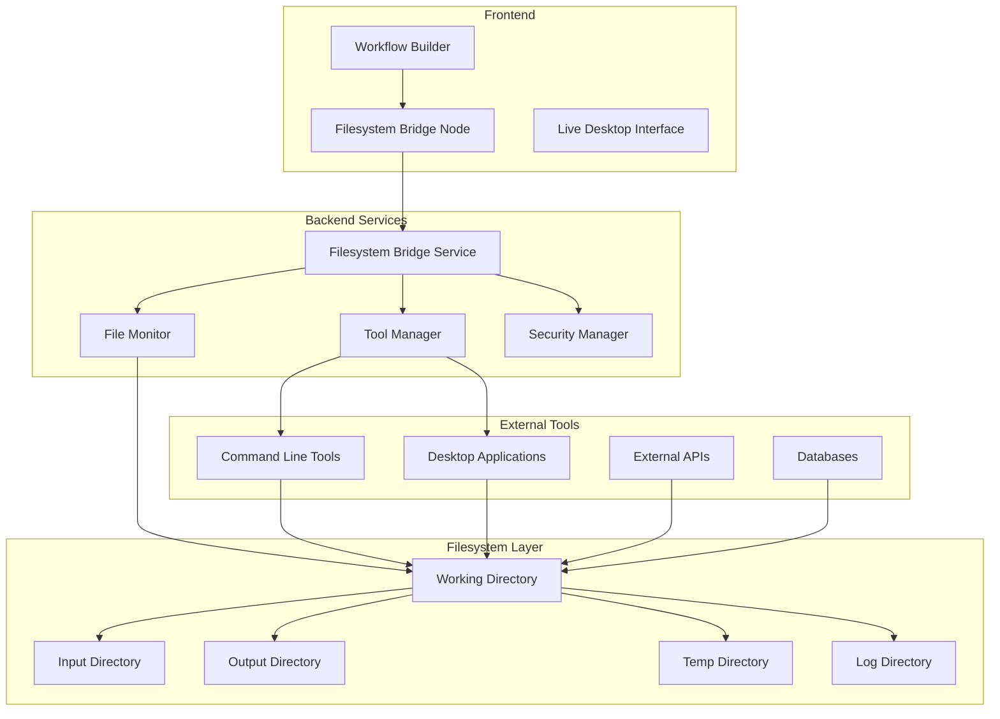

# Filesystem Bridge Architecture

## Overview

The filesystem bridge architecture enables seamless integration of external tools and applications into the Trusted Login System through filesystem-based communication. This architecture provides a flexible, scalable solution for connecting desktop applications, command-line tools, and other external systems.

## Architecture Principles

### 🎯 Design Goals
- **Tool-Agnostik**: Unterstützung beliebiger externer Tools
- **Dateisystem-basiert**: Verwendung des Dateisystems als Kommunikationsmedium
- **Real-time Monitoring**: Live-Überwachung von Dateisystem-Änderungen
- **Sicherheit**: Sichere Isolation und Zugriffskontrolle
- **Skalierbarkeit**: Unterstützung mehrerer paralleler Tool-Integrationen

### 🏗️ Architecture Components



## Filesystem-Bridge-Service

### Core-Service

```python
class FilesystemBridgeService:
    """
    Hauptservice für Filesystem-Bridge-Integration
    """
    
    def __init__(self):
        self.file_monitor = FileMonitor()
        self.tool_manager = ToolManager()
        self.security_manager = SecurityManager()
        self.working_directories = {}
        self.active_bridges = {}
        self.event_bus = EventBus()
        
        # Konfiguration
        self.config = {
            'base_path': Path('./filesystem_bridge'),
            'max_concurrent_tools': 10,
            'file_watch_interval': 0.5,
            'cleanup_interval': 3600,  # 1 Stunde
            'max_file_size': 100 * 1024 * 1024,  # 100MB
            'allowed_extensions': ['.txt', '.json', '.csv', '.xml', '.log']
        }
    
    async def create_bridge(self, bridge_config: dict) -> FilesystemBridge:
        """
        Erstellt neue Filesystem-Bridge
        """
        bridge_id = str(uuid.uuid4())
        
        # Working Directory erstellen
        working_dir = await self._create_working_directory(bridge_id, bridge_config)
        
        # Security-Kontext einrichten
        security_context = await self.security_manager.create_context(
            bridge_id=bridge_id,
            tool_config=bridge_config.get('tool_config', {}),
            permissions=bridge_config.get('permissions', {})
        )
        
        # Bridge-Instanz erstellen
        bridge = FilesystemBridge(
            bridge_id=bridge_id,
            working_dir=working_dir,
            security_context=security_context,
            config=bridge_config
        )
        
        # File-Monitoring aktivieren
        await self.file_monitor.start_monitoring(
            bridge_id=bridge_id,
            directory=working_dir,
            callback=self._handle_file_change
        )
        
        # Bridge registrieren
        self.active_bridges[bridge_id] = bridge
        
        # Event senden
        await self.event_bus.emit('bridge_created', {
            'bridge_id': bridge_id,
            'config': bridge_config
        })
        
        return bridge
    
    async def execute_tool(self, bridge_id: str, tool_config: dict, input_data: dict) -> ToolExecutionResult:
        """
        Führt externes Tool über Filesystem-Bridge aus
        """
        if bridge_id not in self.active_bridges:
            raise ValueError(f"Bridge {bridge_id} not found")
        
        bridge = self.active_bridges[bridge_id]
        
        try:
            # Input-Dateien vorbereiten
            input_files = await self._prepare_input_files(bridge, input_data)
            
            # Tool ausführen
            execution_result = await self.tool_manager.execute_tool(
                tool_config=tool_config,
                working_dir=bridge.working_dir,
                input_files=input_files,
                security_context=bridge.security_context
            )
            
            # Output-Dateien verarbeiten
            output_data = await self._process_output_files(bridge, execution_result)
            
            # Cleanup
            await self._cleanup_temp_files(bridge, execution_result.temp_files)
            
            return ToolExecutionResult(
                success=execution_result.success,
                output_data=output_data,
                execution_time=execution_result.execution_time,
                logs=execution_result.logs
            )
            
        except Exception as e:
            logger.error(f"Tool execution failed for bridge {bridge_id}: {e}")
            raise ToolExecutionError(f"Tool execution failed: {str(e)}")
    
    async def _create_working_directory(self, bridge_id: str, config: dict) -> Path:
        """
        Erstellt Working Directory für Bridge
        """
        base_path = self.config['base_path']
        working_dir = base_path / bridge_id
        
        # Verzeichnisstruktur erstellen
        directories = {
            'input': working_dir / 'input',
            'output': working_dir / 'output',
            'temp': working_dir / 'temp',
            'logs': working_dir / 'logs',
            'config': working_dir / 'config'
        }
        
        for dir_name, dir_path in directories.items():
            dir_path.mkdir(parents=True, exist_ok=True)
            
            # Permissions setzen
            await self._set_directory_permissions(dir_path, config.get('permissions', {}))
        
        # Konfigurationsdatei erstellen
        config_file = directories['config'] / 'bridge_config.json'
        with open(config_file, 'w') as f:
            json.dump(config, f, indent=2)
        
        self.working_directories[bridge_id] = working_dir
        return working_dir
    
    async def _handle_file_change(self, bridge_id: str, file_path: Path, event_type: str):
        """
        Behandelt Dateisystem-Änderungen
        """
        if bridge_id not in self.active_bridges:
            return
        
        bridge = self.active_bridges[bridge_id]
        
        # Security-Check
        if not await self.security_manager.validate_file_access(
            file_path=file_path,
            security_context=bridge.security_context,
            operation=event_type
        ):
            logger.warning(f"Unauthorized file access attempt: {file_path}")
            return
        
        # Event verarbeiten
        await self._process_file_event(bridge, file_path, event_type)
        
        # WebSocket-Event senden
        await self.event_bus.emit('file_changed', {
            'bridge_id': bridge_id,
            'file_path': str(file_path),
            'event_type': event_type,
            'timestamp': datetime.now().isoformat()
        })

class FilesystemBridge:
    """
    Einzelne Filesystem-Bridge-Instanz
    """
    
    def __init__(self, bridge_id: str, working_dir: Path, security_context: SecurityContext, config: dict):
        self.bridge_id = bridge_id
        self.working_dir = working_dir
        self.security_context = security_context
        self.config = config
        self.created_at = datetime.now()
        self.last_activity = datetime.now()
        self.status = BridgeStatus.ACTIVE
        
        # Verzeichnis-Referenzen
        self.input_dir = working_dir / 'input'
        self.output_dir = working_dir / 'output'
        self.temp_dir = working_dir / 'temp'
        self.logs_dir = working_dir / 'logs'
        self.config_dir = working_dir / 'config'
    
    async def write_input_file(self, filename: str, content: any, format: str = 'json') -> Path:
        """
        Schreibt Input-Datei für externes Tool
        """
        file_path = self.input_dir / filename
        
        if format == 'json':
            with open(file_path, 'w', encoding='utf-8') as f:
                json.dump(content, f, indent=2, ensure_ascii=False)
        elif format == 'text':
            with open(file_path, 'w', encoding='utf-8') as f:
                f.write(str(content))
        elif format == 'csv':
            import pandas as pd
            if isinstance(content, list):
                df = pd.DataFrame(content)
                df.to_csv(file_path, index=False)
        else:
            raise ValueError(f"Unsupported format: {format}")
        
        self.last_activity = datetime.now()
        return file_path
    
    async def read_output_file(self, filename: str, format: str = 'json') -> any:
        """
        Liest Output-Datei von externem Tool
        """
        file_path = self.output_dir / filename
        
        if not file_path.exists():
            raise FileNotFoundError(f"Output file not found: {filename}")
        
        if format == 'json':
            with open(file_path, 'r', encoding='utf-8') as f:
                return json.load(f)
        elif format == 'text':
            with open(file_path, 'r', encoding='utf-8') as f:
                return f.read()
        elif format == 'csv':
            import pandas as pd
            df = pd.read_csv(file_path)
            return df.to_dict('records')
        else:
            raise ValueError(f"Unsupported format: {format}")
    
    async def cleanup(self):
        """
        Bereinigt Bridge-Ressourcen
        """
        import shutil
        
        try:
            # Working Directory löschen
            if self.working_dir.exists():
                shutil.rmtree(self.working_dir)
            
            self.status = BridgeStatus.CLEANED_UP
            
        except Exception as e:
            logger.error(f"Cleanup failed for bridge {self.bridge_id}: {e}")
            raise
```

## File-Monitor

### File-Watching-System

```python
class FileMonitor:
    """
    Überwacht Dateisystem-Änderungen in Real-time
    """
    
    def __init__(self):
        self.watchers = {}
        self.event_handlers = {}
        self.is_monitoring = False
        
    async def start_monitoring(self, bridge_id: str, directory: Path, callback: callable):
        """
        Startet File-Monitoring für Bridge
        """
        from watchdog.observers import Observer
        from watchdog.events import FileSystemEventHandler
        
        class BridgeFileHandler(FileSystemEventHandler):
            def __init__(self, bridge_id: str, callback: callable):
                self.bridge_id = bridge_id
                self.callback = callback
                super().__init__()
            
            def on_created(self, event):
                if not event.is_directory:
                    asyncio.create_task(self.callback(self.bridge_id, Path(event.src_path), 'created'))
            
            def on_modified(self, event):
                if not event.is_directory:
                    asyncio.create_task(self.callback(self.bridge_id, Path(event.src_path), 'modified'))
            
            def on_deleted(self, event):
                if not event.is_directory:
                    asyncio.create_task(self.callback(self.bridge_id, Path(event.src_path), 'deleted'))
            
            def on_moved(self, event):
                if not event.is_directory:
                    asyncio.create_task(self.callback(self.bridge_id, Path(event.dest_path), 'moved'))
        
        # Event-Handler erstellen
        event_handler = BridgeFileHandler(bridge_id, callback)
        self.event_handlers[bridge_id] = event_handler
        
        # Observer erstellen und starten
        observer = Observer()
        observer.schedule(event_handler, str(directory), recursive=True)
        observer.start()
        
        self.watchers[bridge_id] = observer
        logger.info(f"Started file monitoring for bridge {bridge_id} in {directory}")
    
    async def stop_monitoring(self, bridge_id: str):
        """
        Stoppt File-Monitoring für Bridge
        """
        if bridge_id in self.watchers:
            observer = self.watchers[bridge_id]
            observer.stop()
            observer.join()
            
            del self.watchers[bridge_id]
            del self.event_handlers[bridge_id]
            
            logger.info(f"Stopped file monitoring for bridge {bridge_id}")
    
    async def get_directory_status(self, directory: Path) -> dict:
        """
        Gibt Status eines Verzeichnisses zurück
        """
        if not directory.exists():
            return {'exists': False}
        
        files = []
        total_size = 0
        
        for file_path in directory.rglob('*'):
            if file_path.is_file():
                stat = file_path.stat()
                files.append({
                    'name': file_path.name,
                    'path': str(file_path.relative_to(directory)),
                    'size': stat.st_size,
                    'modified': datetime.fromtimestamp(stat.st_mtime).isoformat(),
                    'created': datetime.fromtimestamp(stat.st_ctime).isoformat()
                })
                total_size += stat.st_size
        
        return {
            'exists': True,
            'file_count': len(files),
            'total_size': total_size,
            'files': files,
            'last_scan': datetime.now().isoformat()
        }
```

## Tool-Manager

### External Tool Integration

```python
class ToolManager:
    """
    Verwaltet externe Tool-Integrationen
    """
    
    def __init__(self):
        self.tool_registry = {}
        self.execution_queue = asyncio.Queue()
        self.active_executions = {}
        self.tool_templates = self._load_tool_templates()
    
    def register_tool(self, tool_config: dict):
        """
        Registriert externes Tool
        """
        tool_id = tool_config['id']
        tool = ExternalTool(
            tool_id=tool_id,
            name=tool_config['name'],
            command=tool_config['command'],
            input_format=tool_config.get('input_format', 'json'),
            output_format=tool_config.get('output_format', 'json'),
            timeout=tool_config.get('timeout', 300),
            environment=tool_config.get('environment', {}),
            validation=tool_config.get('validation', {})
        )
        
        self.tool_registry[tool_id] = tool
        logger.info(f"Registered tool: {tool_id}")
    
    async def execute_tool(self, tool_config: dict, working_dir: Path, input_files: dict, security_context: SecurityContext) -> ToolExecutionResult:
        """
        Führt externes Tool aus
        """
        tool_id = tool_config.get('tool_id')
        
        if tool_id and tool_id in self.tool_registry:
            tool = self.tool_registry[tool_id]
        else:
            # Ad-hoc Tool erstellen
            tool = self._create_adhoc_tool(tool_config)
        
        execution_id = str(uuid.uuid4())
        
        try:
            # Execution-Kontext erstellen
            execution_context = ToolExecutionContext(
                execution_id=execution_id,
                tool=tool,
                working_dir=working_dir,
                input_files=input_files,
                security_context=security_context,
                started_at=datetime.now()
            )
            
            self.active_executions[execution_id] = execution_context
            
            # Tool ausführen
            result = await self._execute_tool_process(execution_context)
            
            # Execution abschließen
            execution_context.completed_at = datetime.now()
            execution_context.result = result
            
            return result
            
        except Exception as e:
            logger.error(f"Tool execution failed: {e}")
            raise ToolExecutionError(str(e))
        
        finally:
            # Cleanup
            if execution_id in self.active_executions:
                del self.active_executions[execution_id]
    
    async def _execute_tool_process(self, context: ToolExecutionContext) -> ToolExecutionResult:
        """
        Führt Tool-Prozess aus
        """
        tool = context.tool
        working_dir = context.working_dir
        
        # Command vorbereiten
        command = self._prepare_command(tool, working_dir, context.input_files)
        
        # Environment vorbereiten
        env = os.environ.copy()
        env.update(tool.environment)
        
        # Security-Kontext anwenden
        if context.security_context.restricted_mode:
            env = self._apply_security_restrictions(env, context.security_context)
        
        start_time = time.time()
        
        try:
            # Prozess starten
            process = await asyncio.create_subprocess_shell(
                command,
                cwd=working_dir,
                env=env,
                stdout=asyncio.subprocess.PIPE,
                stderr=asyncio.subprocess.PIPE
            )
            
            # Timeout-Handler
            try:
                stdout, stderr = await asyncio.wait_for(
                    process.communicate(),
                    timeout=tool.timeout
                )
            except asyncio.TimeoutError:
                process.kill()
                await process.wait()
                raise ToolExecutionError(f"Tool execution timed out after {tool.timeout} seconds")
            
            execution_time = time.time() - start_time
            
            # Ergebnis verarbeiten
            return ToolExecutionResult(
                success=process.returncode == 0,
                return_code=process.returncode,
                stdout=stdout.decode('utf-8') if stdout else '',
                stderr=stderr.decode('utf-8') if stderr else '',
                execution_time=execution_time,
                command=command
            )
            
        except Exception as e:
            execution_time = time.time() - start_time
            return ToolExecutionResult(
                success=False,
                error=str(e),
                execution_time=execution_time,
                command=command
            )
    
    def _prepare_command(self, tool: ExternalTool, working_dir: Path, input_files: dict) -> str:
        """
        Bereitet Tool-Command vor
        """
        command = tool.command
        
        # Platzhalter ersetzen
        replacements = {
            '{working_dir}': str(working_dir),
            '{input_dir}': str(working_dir / 'input'),
            '{output_dir}': str(working_dir / 'output'),
            '{temp_dir}': str(working_dir / 'temp'),
            '{logs_dir}': str(working_dir / 'logs')
        }
        
        # Input-Dateien hinzufügen
        for key, file_path in input_files.items():
            replacements[f'{{{key}}}'] = str(file_path)
        
        for placeholder, value in replacements.items():
            command = command.replace(placeholder, value)
        
        return command
    
    def _load_tool_templates(self) -> dict:
        """
        Lädt vordefinierte Tool-Templates
        """
        return {
            'python_script': {
                'command': 'python {script_path} --input {input_dir} --output {output_dir}',
                'input_format': 'json',
                'output_format': 'json',
                'timeout': 300
            },
            'node_script': {
                'command': 'node {script_path} --input {input_dir} --output {output_dir}',
                'input_format': 'json',
                'output_format': 'json',
                'timeout': 300
            },
            'shell_command': {
                'command': '{command}',
                'input_format': 'text',
                'output_format': 'text',
                'timeout': 60
            },
            'docker_container': {
                'command': 'docker run --rm -v {working_dir}:/workspace {image} {args}',
                'input_format': 'json',
                'output_format': 'json',
                'timeout': 600
            }
        }

class ExternalTool:
    """
    Externes Tool-Definition
    """
    
    def __init__(self, tool_id: str, name: str, command: str, input_format: str, output_format: str, timeout: int, environment: dict, validation: dict):
        self.tool_id = tool_id
        self.name = name
        self.command = command
        self.input_format = input_format
        self.output_format = output_format
        self.timeout = timeout
        self.environment = environment
        self.validation = validation
        self.created_at = datetime.now()

class ToolExecutionResult:
    """
    Tool-Execution-Ergebnis
    """
    
    def __init__(self, success: bool, return_code: int = None, stdout: str = '', stderr: str = '', execution_time: float = 0, command: str = '', error: str = None, output_data: dict = None, logs: list = None, temp_files: list = None):
        self.success = success
        self.return_code = return_code
        self.stdout = stdout
        self.stderr = stderr
        self.execution_time = execution_time
        self.command = command
        self.error = error
        self.output_data = output_data or {}
        self.logs = logs or []
        self.temp_files = temp_files or []
        self.timestamp = datetime.now()
```

## Security-Manager

### Sicherheits-Framework

```python
class SecurityManager:
    """
    Verwaltet Sicherheit für Filesystem-Bridge
    """
    
    def __init__(self):
        self.security_policies = self._load_security_policies()
        self.access_logs = []
        self.blocked_operations = set()
    
    async def create_context(self, bridge_id: str, tool_config: dict, permissions: dict) -> SecurityContext:
        """
        Erstellt Security-Kontext für Bridge
        """
        # Basis-Permissions
        base_permissions = {
            'read_files': True,
            'write_files': True,
            'execute_commands': False,
            'network_access': False,
            'system_access': False
        }
        
        # Tool-spezifische Permissions
        tool_permissions = self._evaluate_tool_permissions(tool_config)
        
        # User-definierte Permissions
        final_permissions = {**base_permissions, **tool_permissions, **permissions}
        
        # Restricted Mode prüfen
        restricted_mode = self._should_use_restricted_mode(tool_config, final_permissions)
        
        # Allowed Paths definieren
        allowed_paths = self._get_allowed_paths(bridge_id, final_permissions)
        
        return SecurityContext(
            bridge_id=bridge_id,
            permissions=final_permissions,
            restricted_mode=restricted_mode,
            allowed_paths=allowed_paths,
            created_at=datetime.now()
        )
    
    async def validate_file_access(self, file_path: Path, security_context: SecurityContext, operation: str) -> bool:
        """
        Validiert Dateizugriff
        """
        # Path-Validation
        if not self._is_path_allowed(file_path, security_context.allowed_paths):
            self._log_security_violation(
                security_context.bridge_id,
                f"Unauthorized path access: {file_path}",
                operation
            )
            return False
        
        # Operation-Validation
        if operation in ['write', 'delete'] and not security_context.permissions.get('write_files', False):
            self._log_security_violation(
                security_context.bridge_id,
                f"Unauthorized write operation: {operation}",
                str(file_path)
            )
            return False
        
        if operation == 'read' and not security_context.permissions.get('read_files', False):
            self._log_security_violation(
                security_context.bridge_id,
                f"Unauthorized read operation: {operation}",
                str(file_path)
            )
            return False
        
        # File-Extension-Validation
        if not self._is_extension_allowed(file_path):
            self._log_security_violation(
                security_context.bridge_id,
                f"Unauthorized file extension: {file_path.suffix}",
                str(file_path)
            )
            return False
        
        return True
    
    async def validate_command_execution(self, command: str, security_context: SecurityContext) -> bool:
        """
        Validiert Command-Execution
        """
        if not security_context.permissions.get('execute_commands', False):
            self._log_security_violation(
                security_context.bridge_id,
                f"Command execution not allowed: {command}",
                'execute'
            )
            return False
        
        # Gefährliche Commands prüfen
        dangerous_commands = ['rm', 'del', 'format', 'fdisk', 'mkfs', 'dd']
        command_lower = command.lower()
        
        for dangerous in dangerous_commands:
            if dangerous in command_lower:
                self._log_security_violation(
                    security_context.bridge_id,
                    f"Dangerous command blocked: {command}",
                    'execute'
                )
                return False
        
        return True
    
    def _is_path_allowed(self, file_path: Path, allowed_paths: list) -> bool:
        """
        Prüft ob Pfad erlaubt ist
        """
        file_path = file_path.resolve()
        
        for allowed_path in allowed_paths:
            allowed_path = Path(allowed_path).resolve()
            try:
                file_path.relative_to(allowed_path)
                return True
            except ValueError:
                continue
        
        return False
    
    def _is_extension_allowed(self, file_path: Path) -> bool:
        """
        Prüft ob Dateiendung erlaubt ist
        """
        allowed_extensions = ['.txt', '.json', '.csv', '.xml', '.log', '.yaml', '.yml', '.md']
        return file_path.suffix.lower() in allowed_extensions
    
    def _log_security_violation(self, bridge_id: str, message: str, context: str):
        """
        Protokolliert Sicherheitsverletzung
        """
        violation = {
            'bridge_id': bridge_id,
            'message': message,
            'context': context,
            'timestamp': datetime.now().isoformat(),
            'severity': 'HIGH'
        }
        
        self.access_logs.append(violation)
        logger.warning(f"Security violation: {message}")

class SecurityContext:
    """
    Security-Kontext für Bridge
    """
    
    def __init__(self, bridge_id: str, permissions: dict, restricted_mode: bool, allowed_paths: list, created_at: datetime):
        self.bridge_id = bridge_id
        self.permissions = permissions
        self.restricted_mode = restricted_mode
        self.allowed_paths = allowed_paths
        self.created_at = created_at
```

## API-Endpunkte

### Bridge-Management

```python
# Bridge-Endpunkte
@router.post("/bridges", response_model=BridgeResponse)
async def create_bridge(bridge_config: BridgeConfig, current_user: User = Depends(get_current_user)):
    """
    Erstellt neue Filesystem-Bridge
    """
    try:
        bridge = await filesystem_bridge_service.create_bridge(bridge_config.dict())
        
        return BridgeResponse(
            bridge_id=bridge.bridge_id,
            status=bridge.status,
            working_dir=str(bridge.working_dir),
            created_at=bridge.created_at,
            config=bridge.config
        )
    except Exception as e:
        raise HTTPException(status_code=400, detail=str(e))

@router.get("/bridges/{bridge_id}", response_model=BridgeResponse)
async def get_bridge(bridge_id: str, current_user: User = Depends(get_current_user)):
    """
    Ruft Bridge-Informationen ab
    """
    bridge = await filesystem_bridge_service.get_bridge(bridge_id)
    if not bridge:
        raise HTTPException(status_code=404, detail="Bridge not found")
    
    return BridgeResponse(
        bridge_id=bridge.bridge_id,
        status=bridge.status,
        working_dir=str(bridge.working_dir),
        created_at=bridge.created_at,
        last_activity=bridge.last_activity,
        config=bridge.config
    )

@router.delete("/bridges/{bridge_id}")
async def delete_bridge(bridge_id: str, current_user: User = Depends(get_current_user)):
    """
    Löscht Filesystem-Bridge
    """
    success = await filesystem_bridge_service.delete_bridge(bridge_id)
    if not success:
        raise HTTPException(status_code=404, detail="Bridge not found")
    
    return {"message": "Bridge deleted successfully"}

@router.get("/bridges", response_model=List[BridgeResponse])
async def list_bridges(current_user: User = Depends(get_current_user)):
    """
    Listet alle aktiven Bridges auf
    """
    bridges = await filesystem_bridge_service.list_bridges()
    
    return [
        BridgeResponse(
            bridge_id=bridge.bridge_id,
            status=bridge.status,
            working_dir=str(bridge.working_dir),
            created_at=bridge.created_at,
            last_activity=bridge.last_activity,
            config=bridge.config
        )
        for bridge in bridges
    ]
```

### Tool-Execution

```python
# Tool-Execution-Endpunkte
@router.post("/bridges/{bridge_id}/execute", response_model=ToolExecutionResponse)
async def execute_tool(
    bridge_id: str,
    execution_request: ToolExecutionRequest,
    current_user: User = Depends(get_current_user)
):
    """
    Führt Tool über Filesystem-Bridge aus
    """
    try:
        result = await filesystem_bridge_service.execute_tool(
            bridge_id=bridge_id,
            tool_config=execution_request.tool_config,
            input_data=execution_request.input_data
        )
        
        return ToolExecutionResponse(
            success=result.success,
            execution_time=result.execution_time,
            output_data=result.output_data,
            logs=result.logs,
            error=result.error
        )
    except Exception as e:
        raise HTTPException(status_code=400, detail=str(e))

@router.get("/bridges/{bridge_id}/status", response_model=BridgeStatusResponse)
async def get_bridge_status(
    bridge_id: str,
    current_user: User = Depends(get_current_user)
):
    """
    Ruft Bridge-Status ab
    """
    status = await filesystem_bridge_service.get_bridge_status(bridge_id)
    if not status:
        raise HTTPException(status_code=404, detail="Bridge not found")
    
    return BridgeStatusResponse(**status)

@router.get("/bridges/{bridge_id}/files", response_model=DirectoryStatusResponse)
async def get_bridge_files(
    bridge_id: str,
    directory: str = "all",
    current_user: User = Depends(get_current_user)
):
    """
    Ruft Dateistatus der Bridge ab
    """
    files_status = await filesystem_bridge_service.get_files_status(bridge_id, directory)
    
    return DirectoryStatusResponse(**files_status)
```

### File-Operations

```python
# File-Operations-Endpunkte
@router.post("/bridges/{bridge_id}/files/upload")
async def upload_file(
    bridge_id: str,
    file: UploadFile = File(...),
    directory: str = "input",
    current_user: User = Depends(get_current_user)
):
    """
    Lädt Datei in Bridge-Verzeichnis hoch
    """
    try:
        file_path = await filesystem_bridge_service.upload_file(
            bridge_id=bridge_id,
            file=file,
            directory=directory
        )
        
        return {"message": "File uploaded successfully", "file_path": str(file_path)}
    except Exception as e:
        raise HTTPException(status_code=400, detail=str(e))

@router.get("/bridges/{bridge_id}/files/download/{file_path:path}")
async def download_file(
    bridge_id: str,
    file_path: str,
    current_user: User = Depends(get_current_user)
):
    """
    Lädt Datei aus Bridge-Verzeichnis herunter
    """
    try:
        file_content = await filesystem_bridge_service.download_file(bridge_id, file_path)
        
        return StreamingResponse(
            io.BytesIO(file_content),
            media_type="application/octet-stream",
            headers={"Content-Disposition": f"attachment; filename={Path(file_path).name}"}
        )
    except Exception as e:
        raise HTTPException(status_code=404, detail=str(e))
```

## Frontend-Integration

### React-Komponenten

```typescript
// FilesystemBridgeNode.tsx
import React, { useState, useEffect } from 'react';
import { NodeProps } from 'reactflow';
import { Card, CardContent, CardHeader, CardTitle } from '@/components/ui/card';
import { Button } from '@/components/ui/button';
import { Input } from '@/components/ui/input';
import { Select, SelectContent, SelectItem, SelectTrigger, SelectValue } from '@/components/ui/select';
import { Badge } from '@/components/ui/badge';
import { FileIcon, PlayIcon, StopIcon, SettingsIcon } from 'lucide-react';
import { useFilesystemBridge } from '@/hooks/useFilesystemBridge';

interface FilesystemBridgeNodeData {
  bridgeId?: string;
  toolConfig: {
    toolId: string;
    command: string;
    inputFormat: string;
    outputFormat: string;
    timeout: number;
  };
  inputData: Record<string, any>;
  status: 'idle' | 'running' | 'completed' | 'error';
}

export const FilesystemBridgeNode: React.FC<NodeProps<FilesystemBridgeNodeData>> = ({
  id,
  data,
  selected
}) => {
  const [isConfigOpen, setIsConfigOpen] = useState(false);
  const [localConfig, setLocalConfig] = useState(data.toolConfig);
  
  const {
    createBridge,
    executeTool,
    getBridgeStatus,
    deleteBridge,
    isLoading,
    error
  } = useFilesystemBridge();
  
  const handleExecute = async () => {
    try {
      if (!data.bridgeId) {
        // Bridge erstellen
        const bridge = await createBridge({
          toolConfig: localConfig,
          permissions: {
            read_files: true,
            write_files: true,
            execute_commands: true
          }
        });
        
        // Bridge-ID speichern
        data.bridgeId = bridge.bridge_id;
      }
      
      // Tool ausführen
      const result = await executeTool(data.bridgeId, {
        tool_config: localConfig,
        input_data: data.inputData
      });
      
      // Ergebnis verarbeiten
      data.status = result.success ? 'completed' : 'error';
      
    } catch (err) {
      console.error('Tool execution failed:', err);
      data.status = 'error';
    }
  };
  
  const handleStop = async () => {
    if (data.bridgeId) {
      await deleteBridge(data.bridgeId);
      data.bridgeId = undefined;
      data.status = 'idle';
    }
  };
  
  const getStatusColor = () => {
    switch (data.status) {
      case 'running': return 'bg-blue-500';
      case 'completed': return 'bg-green-500';
      case 'error': return 'bg-red-500';
      default: return 'bg-gray-500';
    }
  };
  
  return (
    <Card className={`w-80 ${selected ? 'ring-2 ring-blue-500' : ''}`}>
      <CardHeader className="pb-2">
        <div className="flex items-center justify-between">
          <CardTitle className="text-sm flex items-center gap-2">
            <FileIcon className="w-4 h-4" />
            Filesystem Bridge
          </CardTitle>
          <div className="flex items-center gap-2">
            <Badge className={getStatusColor()}>
              {data.status}
            </Badge>
            <Button
              variant="ghost"
              size="sm"
              onClick={() => setIsConfigOpen(!isConfigOpen)}
            >
              <SettingsIcon className="w-4 h-4" />
            </Button>
          </div>
        </div>
      </CardHeader>
      
      <CardContent className="space-y-4">
        {isConfigOpen && (
          <div className="space-y-3 p-3 bg-gray-50 rounded">
            <div>
              <label className="text-xs font-medium">Tool ID</label>
              <Input
                value={localConfig.toolId}
                onChange={(e) => setLocalConfig({...localConfig, toolId: e.target.value})}
                placeholder="python_script"
              />
            </div>
            
            <div>
              <label className="text-xs font-medium">Command</label>
              <Input
                value={localConfig.command}
                onChange={(e) => setLocalConfig({...localConfig, command: e.target.value})}
                placeholder="python script.py --input {input_dir} --output {output_dir}"
              />
            </div>
            
            <div className="grid grid-cols-2 gap-2">
              <div>
                <label className="text-xs font-medium">Input Format</label>
                <Select
                  value={localConfig.inputFormat}
                  onValueChange={(value) => setLocalConfig({...localConfig, inputFormat: value})}
                >
                  <SelectTrigger>
                    <SelectValue />
                  </SelectTrigger>
                  <SelectContent>
                    <SelectItem value="json">JSON</SelectItem>
                    <SelectItem value="text">Text</SelectItem>
                    <SelectItem value="csv">CSV</SelectItem>
                  </SelectContent>
                </Select>
              </div>
              
              <div>
                <label className="text-xs font-medium">Output Format</label>
                <Select
                  value={localConfig.outputFormat}
                  onValueChange={(value) => setLocalConfig({...localConfig, outputFormat: value})}
                >
                  <SelectTrigger>
                    <SelectValue />
                  </SelectTrigger>
                  <SelectContent>
                    <SelectItem value="json">JSON</SelectItem>
                    <SelectItem value="text">Text</SelectItem>
                    <SelectItem value="csv">CSV</SelectItem>
                  </SelectContent>
                </Select>
              </div>
            </div>
            
            <div>
              <label className="text-xs font-medium">Timeout (seconds)</label>
              <Input
                type="number"
                value={localConfig.timeout}
                onChange={(e) => setLocalConfig({...localConfig, timeout: parseInt(e.target.value)})}
              />
            </div>
          </div>
        )}
        
        <div className="flex gap-2">
          <Button
            onClick={handleExecute}
            disabled={isLoading || data.status === 'running'}
            className="flex-1"
          >
            <PlayIcon className="w-4 h-4 mr-2" />
            Execute
          </Button>
          
          {data.status === 'running' && (
            <Button
              onClick={handleStop}
              variant="destructive"
              disabled={isLoading}
            >
              <StopIcon className="w-4 h-4" />
            </Button>
          )}
        </div>
        
        {error && (
          <div className="text-xs text-red-600 bg-red-50 p-2 rounded">
            {error}
          </div>
        )}
        
        {data.bridgeId && (
          <div className="text-xs text-gray-500">
            Bridge ID: {data.bridgeId.slice(0, 8)}...
          </div>
        )}
      </CardContent>
    </Card>
  );
};
```

### Custom Hook

```typescript
// useFilesystemBridge.ts
import { useState } from 'react';
import { api } from '@/lib/api';

interface BridgeConfig {
  toolConfig: {
    toolId: string;
    command: string;
    inputFormat: string;
    outputFormat: string;
    timeout: number;
  };
  permissions: {
    read_files: boolean;
    write_files: boolean;
    execute_commands: boolean;
  };
}

interface ToolExecutionRequest {
  tool_config: any;
  input_data: Record<string, any>;
}

interface BridgeResponse {
  bridge_id: string;
  status: string;
  working_dir: string;
  created_at: string;
  config: any;
}

interface ToolExecutionResponse {
  success: boolean;
  execution_time: number;
  output_data: Record<string, any>;
  logs: string[];
  error?: string;
}

export const useFilesystemBridge = () => {
  const [isLoading, setIsLoading] = useState(false);
  const [error, setError] = useState<string | null>(null);
  
  const createBridge = async (config: BridgeConfig): Promise<BridgeResponse> => {
    setIsLoading(true);
    setError(null);
    
    try {
      const response = await api.post('/bridges', config);
      return response.data;
    } catch (err: any) {
      const errorMessage = err.response?.data?.detail || 'Failed to create bridge';
      setError(errorMessage);
      throw new Error(errorMessage);
    } finally {
      setIsLoading(false);
    }
  };
  
  const executeTool = async (bridgeId: string, request: ToolExecutionRequest): Promise<ToolExecutionResponse> => {
    setIsLoading(true);
    setError(null);
    
    try {
      const response = await api.post(`/bridges/${bridgeId}/execute`, request);
      return response.data;
    } catch (err: any) {
      const errorMessage = err.response?.data?.detail || 'Tool execution failed';
      setError(errorMessage);
      throw new Error(errorMessage);
    } finally {
      setIsLoading(false);
    }
  };
  
  const getBridgeStatus = async (bridgeId: string) => {
    try {
      const response = await api.get(`/bridges/${bridgeId}/status`);
      return response.data;
    } catch (err: any) {
      const errorMessage = err.response?.data?.detail || 'Failed to get bridge status';
      setError(errorMessage);
      throw new Error(errorMessage);
    }
  };
  
  const deleteBridge = async (bridgeId: string) => {
    setIsLoading(true);
    setError(null);
    
    try {
      await api.delete(`/bridges/${bridgeId}`);
    } catch (err: any) {
      const errorMessage = err.response?.data?.detail || 'Failed to delete bridge';
      setError(errorMessage);
      throw new Error(errorMessage);
    } finally {
      setIsLoading(false);
    }
  };
  
  const uploadFile = async (bridgeId: string, file: File, directory: string = 'input') => {
    setIsLoading(true);
    setError(null);
    
    try {
      const formData = new FormData();
      formData.append('file', file);
      formData.append('directory', directory);
      
      const response = await api.post(`/bridges/${bridgeId}/files/upload`, formData, {
        headers: {
          'Content-Type': 'multipart/form-data'
        }
      });
      
      return response.data;
    } catch (err: any) {
      const errorMessage = err.response?.data?.detail || 'File upload failed';
      setError(errorMessage);
      throw new Error(errorMessage);
    } finally {
      setIsLoading(false);
    }
  };
  
  return {
    createBridge,
    executeTool,
    getBridgeStatus,
    deleteBridge,
    uploadFile,
    isLoading,
    error
  };
};
```

## WebSocket-Integration

### Real-time File Monitoring

```typescript
// useFilesystemBridgeWebSocket.ts
import { useEffect, useState } from 'react';
import { useWebSocket } from '@/hooks/useWebSocket';

interface FileChangeEvent {
  bridge_id: string;
  file_path: string;
  event_type: 'created' | 'modified' | 'deleted' | 'moved';
  timestamp: string;
}

interface BridgeStatusEvent {
  bridge_id: string;
  status: string;
  message?: string;
}

export const useFilesystemBridgeWebSocket = (bridgeId?: string) => {
  const [fileChanges, setFileChanges] = useState<FileChangeEvent[]>([]);
  const [bridgeStatus, setBridgeStatus] = useState<string>('unknown');
  
  const { socket, isConnected } = useWebSocket();
  
  useEffect(() => {
    if (!socket || !isConnected) return;
    
    // File-Change-Events abonnieren
    const handleFileChange = (event: FileChangeEvent) => {
      if (!bridgeId || event.bridge_id === bridgeId) {
        setFileChanges(prev => [...prev.slice(-49), event]); // Letzte 50 Events behalten
      }
    };
    
    // Bridge-Status-Events abonnieren
    const handleBridgeStatus = (event: BridgeStatusEvent) => {
      if (!bridgeId || event.bridge_id === bridgeId) {
        setBridgeStatus(event.status);
      }
    };
    
    socket.on('file_changed', handleFileChange);
    socket.on('bridge_status', handleBridgeStatus);
    
    // Bridge-spezifische Events abonnieren
    if (bridgeId) {
      socket.emit('subscribe_bridge', { bridge_id: bridgeId });
    }
    
    return () => {
      socket.off('file_changed', handleFileChange);
      socket.off('bridge_status', handleBridgeStatus);
      
      if (bridgeId) {
        socket.emit('unsubscribe_bridge', { bridge_id: bridgeId });
      }
    };
  }, [socket, isConnected, bridgeId]);
  
  return {
    fileChanges,
    bridgeStatus,
    isConnected
  };
};
```

## Monitoring und Logging

### Performance-Monitoring

```python
class FilesystemBridgeMonitor:
    """
    Monitoring für Filesystem-Bridge-Performance
    """
    
    def __init__(self):
        self.metrics = {
            'active_bridges': 0,
            'total_executions': 0,
            'failed_executions': 0,
            'average_execution_time': 0,
            'file_operations': 0,
            'security_violations': 0
        }
        
        self.performance_history = []
        self.alert_thresholds = {
            'max_execution_time': 300,  # 5 Minuten
            'max_failed_rate': 0.1,     # 10% Fehlerrate
            'max_security_violations': 5  # 5 Violations pro Stunde
        }
    
    async def record_execution(self, bridge_id: str, execution_time: float, success: bool):
        """
        Zeichnet Tool-Execution auf
        """
        self.metrics['total_executions'] += 1
        
        if not success:
            self.metrics['failed_executions'] += 1
        
        # Durchschnittliche Ausführungszeit aktualisieren
        current_avg = self.metrics['average_execution_time']
        total_executions = self.metrics['total_executions']
        
        self.metrics['average_execution_time'] = (
            (current_avg * (total_executions - 1) + execution_time) / total_executions
        )
        
        # Performance-History aktualisieren
        self.performance_history.append({
            'bridge_id': bridge_id,
            'execution_time': execution_time,
            'success': success,
            'timestamp': datetime.now()
        })
        
        # Alte Einträge bereinigen (letzte 24 Stunden behalten)
        cutoff_time = datetime.now() - timedelta(hours=24)
        self.performance_history = [
            entry for entry in self.performance_history
            if entry['timestamp'] > cutoff_time
        ]
        
        # Alerts prüfen
        await self._check_performance_alerts(execution_time, success)
    
    async def record_security_violation(self, bridge_id: str, violation_type: str):
        """
        Zeichnet Sicherheitsverletzung auf
        """
        self.metrics['security_violations'] += 1
        
        # Alert senden wenn Schwellenwert überschritten
        violations_last_hour = len([
            entry for entry in self.performance_history
            if entry.get('violation_type') and 
               entry['timestamp'] > datetime.now() - timedelta(hours=1)
        ])
        
        if violations_last_hour >= self.alert_thresholds['max_security_violations']:
            await self._send_security_alert(bridge_id, violation_type, violations_last_hour)
    
    async def get_metrics_summary(self) -> dict:
        """
        Gibt Metriken-Zusammenfassung zurück
        """
        # Fehlerrate berechnen
        error_rate = (
            self.metrics['failed_executions'] / max(self.metrics['total_executions'], 1)
        )
        
        # Performance-Trends berechnen
        recent_executions = [
            entry for entry in self.performance_history
            if entry['timestamp'] > datetime.now() - timedelta(hours=1)
        ]
        
        recent_avg_time = (
            sum(entry['execution_time'] for entry in recent_executions) / 
            max(len(recent_executions), 1)
        )
        
        return {
            'current_metrics': self.metrics,
            'error_rate': error_rate,
            'recent_average_execution_time': recent_avg_time,
            'executions_last_hour': len(recent_executions),
            'health_status': self._calculate_health_status(error_rate, recent_avg_time)
        }
    
    def _calculate_health_status(self, error_rate: float, avg_execution_time: float) -> str:
        """
        Berechnet Gesundheitsstatus
        """
        if error_rate > self.alert_thresholds['max_failed_rate']:
            return 'critical'
        elif avg_execution_time > self.alert_thresholds['max_execution_time']:
            return 'warning'
        else:
            return 'healthy'
    
    async def _check_performance_alerts(self, execution_time: float, success: bool):
        """
        Prüft Performance-Alerts
        """
        if execution_time > self.alert_thresholds['max_execution_time']:
            await self._send_performance_alert('slow_execution', {
                'execution_time': execution_time,
                'threshold': self.alert_thresholds['max_execution_time']
            })
        
        # Fehlerrate prüfen
        if self.metrics['total_executions'] >= 10:  # Mindestens 10 Executions
            error_rate = self.metrics['failed_executions'] / self.metrics['total_executions']
            if error_rate > self.alert_thresholds['max_failed_rate']:
                await self._send_performance_alert('high_error_rate', {
                    'error_rate': error_rate,
                    'threshold': self.alert_thresholds['max_failed_rate']
                })
    
    async def _send_performance_alert(self, alert_type: str, data: dict):
        """
        Sendet Performance-Alert
        """
        logger.warning(f"Performance alert: {alert_type} - {data}")
        
        # Hier könnte Integration mit Alerting-System erfolgen
        # z.B. Slack, Email, PagerDuty, etc.
    
    async def _send_security_alert(self, bridge_id: str, violation_type: str, count: int):
        """
        Sendet Security-Alert
        """
        logger.critical(f"Security alert: {violation_type} for bridge {bridge_id} - {count} violations")
        
        # Hier könnte Integration mit Security-Monitoring erfolgen
```

## Zusammenfassung

Die Filesystem-Bridge-Architektur bietet:

### ✅ **Kernfunktionalitäten**
- **Tool-agnostische Integration**: Unterstützung beliebiger externer Tools
- **Dateisystem-basierte Kommunikation**: Sichere, isolierte Datenübertragung
- **Real-time Monitoring**: Live-Überwachung von Dateisystem-Änderungen
- **Sicherheits-Framework**: Umfassende Zugriffskontrolle und Isolation
- **Performance-Monitoring**: Detaillierte Metriken und Alerting

### 🔧 **Technische Highlights**
- **Modulare Architektur**: Klar getrennte Services und Komponenten
- **WebSocket-Integration**: Real-time Updates für Frontend
- **Security-First**: Umfassende Sicherheitsvalidierung
- **Skalierbare Lösung**: Unterstützung mehrerer paralleler Bridges
- **Monitoring & Alerting**: Proaktive Überwachung und Benachrichtigungen

### 🚀 **Integration**
- **Backend-Services**: Vollständige API-Integration
- **Frontend-Komponenten**: React-basierte UI-Komponenten
- **WebSocket-Events**: Real-time Kommunikation
- **Monitoring-Dashboard**: Performance- und Sicherheits-Metriken

Diese Architektur ermöglicht die nahtlose Integration externer Tools in das Trusted Login System und schafft eine flexible, sichere Grundlage für erweiterte Workflow-Automatisierung.