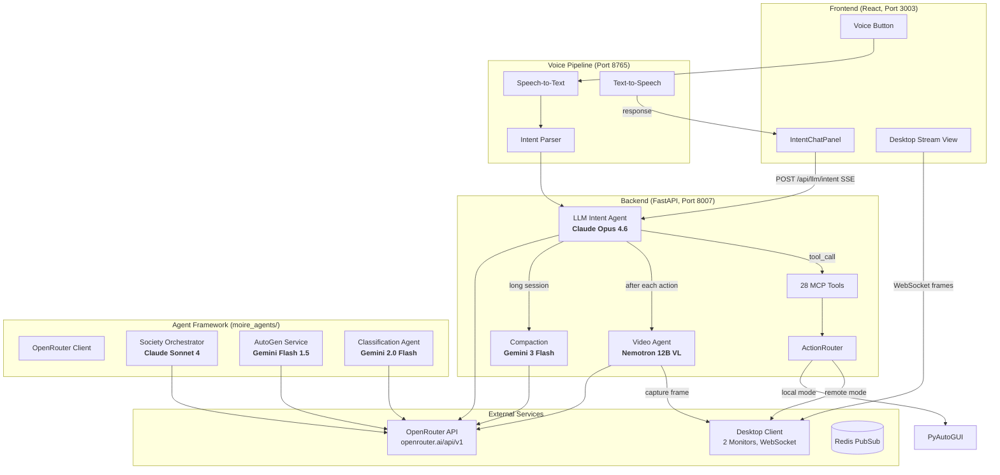
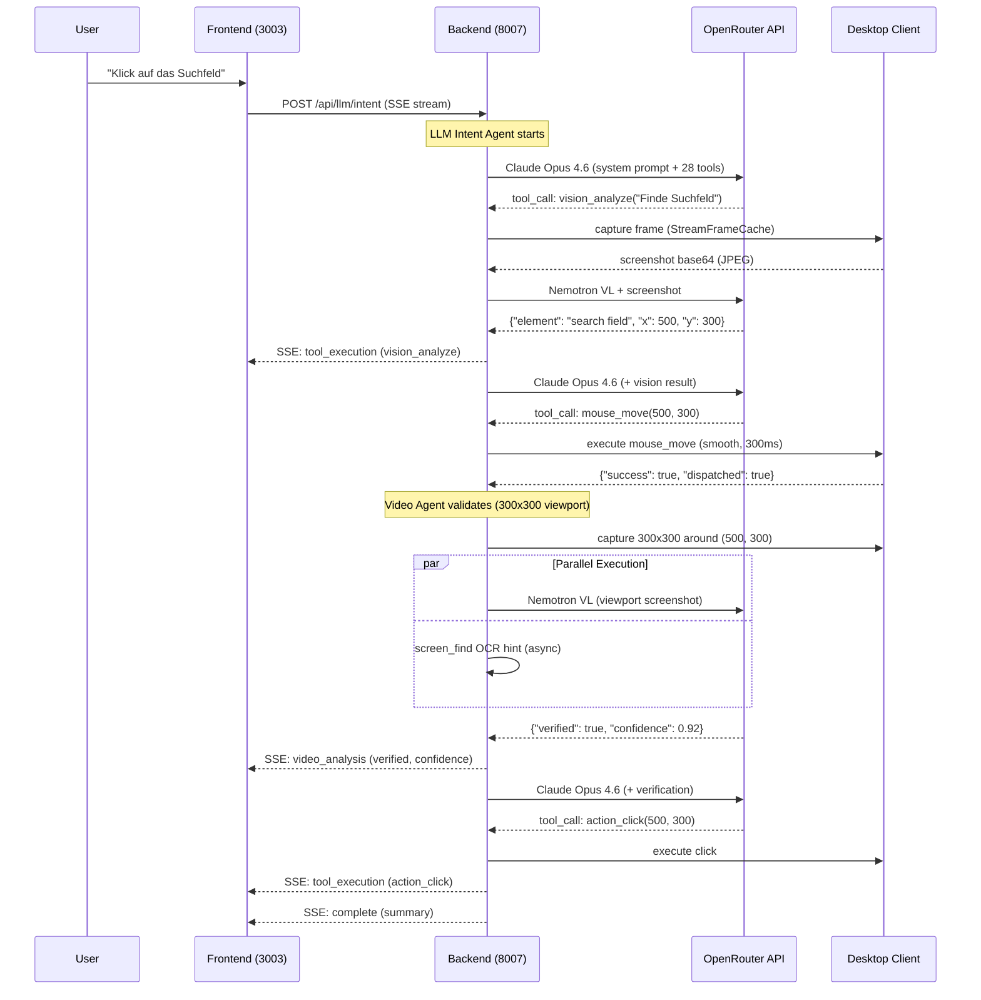
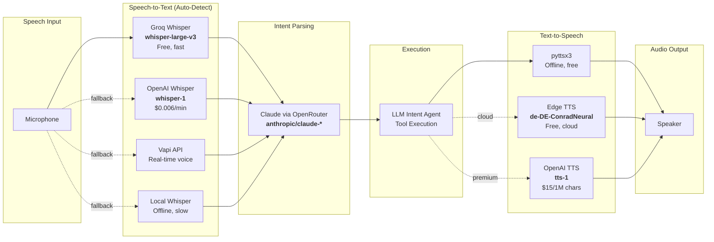
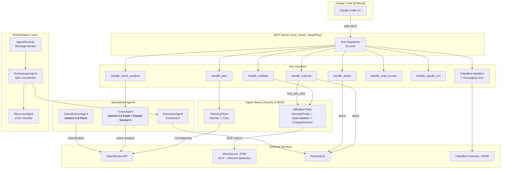
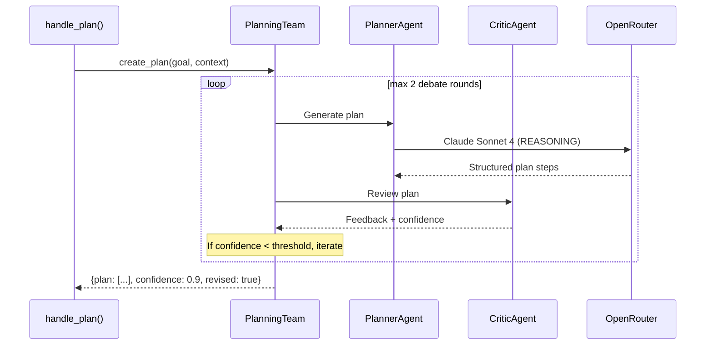
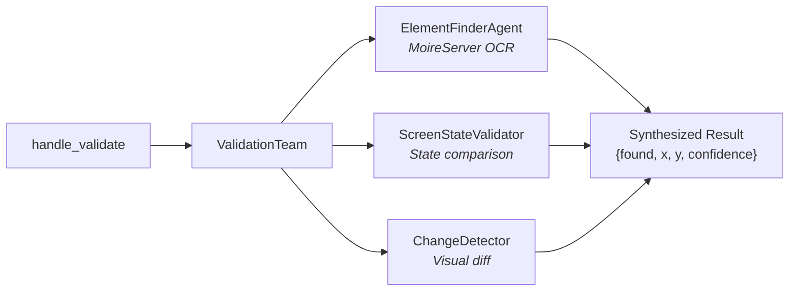

# LLM Architecture Overview

This document maps every AI/LLM model used across the Moire Desktop Automation platform, their roles, configuration, and how they interact.

**All LLM calls are routed through [OpenRouter](https://openrouter.ai)** as a unified API gateway, using a single `OPENROUTER_API_KEY`.

---

## Active Models (Production Configuration)

These are the models currently configured in `.env`:

| Role | Model | Provider | Env Variable | Pricing |
|------|-------|----------|-------------|---------|
| **Main Brain** | `anthropic/claude-opus-4.6` | Anthropic | `LLM_MODEL` | ~$15/1M input, $75/1M output |
| **Vision Agent** | `nvidia/nemotron-nano-12b-v2-vl:free` | NVIDIA | `VISION_MODEL` | Free |
| **Memory Compaction** | `google/gemini-3-flash-preview` | Google | `COMPACTION_MODEL` | ~$0.10/1M input |
| **Fast Fallback** | `google/gemini-2.5-flash:nitro` | Google | `OPENAI_MODEL` | ~$0.15/1M input |

---

## System Architecture



---

## Request Flow (Typical Desktop Automation)



---

## All Models Reference

### Core Pipeline (llm_intent.py)

| Component | Model | File | Config |
|-----------|-------|------|--------|
| **Main Agent Brain** | `anthropic/claude-opus-4.6` | `backend/app/routers/llm_intent.py:145` | `LLM_MODEL` env var |
| **Video Agent** | `nvidia/nemotron-nano-12b-v2-vl:free` | `backend/app/services/video_agent.py:28` | `VISION_MODEL` env var |
| **Compaction** | `google/gemini-3-flash-preview` | `backend/app/routers/llm_intent.py:153` | `COMPACTION_MODEL` env var |

### OpenRouter Client Library (moire_agents/core/)

| ModelType | Model | Purpose |
|-----------|-------|---------|
| `REASONING` | `anthropic/claude-sonnet-4` | Planning, complex reasoning |
| `VISION` | `anthropic/claude-sonnet-4` | Vision analysis with Claude |
| `VISION_FAST` | `google/gemini-2.0-flash-exp:free` | Free fast vision alternative |
| `QUICK` | `anthropic/claude-3.5-sonnet` | Simple quick actions |

**File**: `backend/moire_agents/core/openrouter_client.py:48-52`

### AutoGen Multi-Agent Service

| Component | Default Model | File |
|-----------|---------------|------|
| **Default Agent** | `google/gemini-flash-1.5` | `backend/autogen_service/config.py:64` |
| **Vision Agent** | `google/gemini-flash-1.5` | `backend/autogen_service/config.py:71` |
| **Coordinator** | `gpt-4o` | `backend/autogen_service/agents/coordinator.py:126` |
| **Automation Agent** | `gpt-4o` | `backend/autogen_service/agents/automation_agent.py:137` |
| **OCR Agent** | `gpt-4o` | `backend/autogen_service/agents/ocr_agent.py:119` |
| **VideoSurfer** | `gpt-4o` | `backend/autogen_service/agents/video_surfer_agent.py:47` |

**Env vars**: `AUTOGEN_MODEL`, `AUTOGEN_VISION_MODEL`

### Society Orchestrator

| Component | Model | File |
|-----------|-------|------|
| **Orchestrator Brain** | `anthropic/claude-sonnet-4` | `backend/moire_agents/agents/society_orchestrator.py:647` |

### Classification Agent

| Component | Model | File |
|-----------|-------|------|
| **UI Element Classifier** | `google/gemini-2.0-flash-001` | `backend/moire_agents/agents/classification_agent.py:93` |

### Subagents (Worker Bridge)

| Subagent | Model | File |
|----------|-------|------|
| **Planning** | `openai/gpt-4o-mini` | `backend/moire_agents/agents/subagents/planning_subagent.py:406` |
| **Background** | `openai/gpt-4o-mini` | `backend/moire_agents/agents/subagents/background_subagent.py:211` |
| **Vision** | `openai/gpt-4o-mini` | `backend/moire_agents/agents/subagents/vision_subagent.py:365` |

### Vision Agent (Direct Anthropic)

| Component | Model | File |
|-----------|-------|------|
| **UI Detection** | `claude-sonnet-4-20250514` | `backend/moire_agents/agents/vision_agent.py:130` |
| **Fallback** | `gpt-4o` via OpenRouter | `backend/moire_agents/agents/vision_agent.py:241` |

---

## Voice Pipeline



### STT Auto-Detection Priority

1. **Groq Whisper** (if `GROQ_API_KEY` set) - Free, fast, recommended
2. **OpenAI Whisper** (if `OPENAI_API_KEY` set) - Reliable, paid
3. **Vapi** (if `VAPI_API_KEY` set) - Real-time streaming
4. **Local Whisper** (fallback) - Offline, slower

**File**: `backend/moire_agents/voice/speech_to_text.py:32-37`

### TTS Options

| Engine | Quality | Latency | Cost | German Support |
|--------|---------|---------|------|----------------|
| pyttsx3 | Basic | Instant | Free | System voices |
| Edge TTS | Good | ~200ms | Free | de-DE-ConradNeural, de-DE-KatjaNeural |
| OpenAI TTS | Best | ~500ms | $15/1M chars | alloy, nova, shimmer voices |

**File**: `backend/moire_agents/voice/text_to_speech.py:26-30`

---

## API Key Matrix

| API Key | Required | Used By | Features Affected |
|---------|----------|---------|-------------------|
| `OPENROUTER_API_KEY` | **Yes** | All LLM calls | Everything - main brain, vision, compaction, agents |
| `VAPI_API_KEY` | Optional | Voice Server | Real-time voice commands |
| `GROQ_API_KEY` | Optional | Speech-to-Text | Free Whisper STT |
| `OPENAI_API_KEY` | Optional | Whisper STT, OpenAI TTS | Fallback STT, premium TTS |
| `ANTHROPIC_API_KEY` | Optional | Direct Anthropic API | Legacy direct Claude access |
| `AUTOGEN_MODEL` | Optional | AutoGen Service | Override AutoGen default model |

---

## Configuration Reference

### Primary Settings (`.env`)

```bash
# Required
OPENROUTER_API_KEY=sk-or-v1-...     # All LLM inference via OpenRouter

# Model Selection
LLM_MODEL=anthropic/claude-opus-4.6                  # Main agent brain
VISION_MODEL=nvidia/nemotron-nano-12b-v2-vl:free      # Screenshot analysis
COMPACTION_MODEL=google/gemini-3-flash-preview         # Session compression
OPENAI_MODEL=google/gemini-2.5-flash:nitro             # Fast fallback

# Video Agent
VIDEO_AGENT_DEFAULT=true             # Enable visual verification after each action

# Execution Mode
EXECUTION_MODE=remote                # "local" = pyautogui, "remote" = desktop client
REMOTE_FRAME_MAX_AGE_MS=500          # Max frame age for StreamFrameCache
REMOTE_ACTION_TIMEOUT=30             # Timeout for desktop client ACK
```

### Backend Settings (`backend/app/config.py:81-84`)

```python
class Settings(BaseSettings):
    llm_model: str = Field(default="anthropic/claude-opus-4", env="LLM_MODEL")
    vision_model: str = Field(default="nvidia/nemotron-nano-12b-v2-vl:free", env="VISION_MODEL")
    compaction_model: str = Field(default="anthropic/claude-sonnet-4", env="COMPACTION_MODEL")
    video_agent_default: bool = Field(default=True, env="VIDEO_AGENT_DEFAULT")
```

### AutoGen Settings (`backend/autogen_service/config.py:64-74`)

```python
model_name: str = os.getenv("AUTOGEN_MODEL", os.getenv("OPENAI_MODEL", "google/gemini-flash-1.5"))
vision_model: str = os.getenv("AUTOGEN_VISION_MODEL", os.getenv("AUTOGEN_MODEL", "google/gemini-flash-1.5"))
```

### OpenRouter Client ModelTypes (`backend/moire_agents/core/openrouter_client.py:48-52`)

```python
class ModelType(Enum):
    REASONING = "anthropic/claude-sonnet-4"
    VISION = "anthropic/claude-sonnet-4"
    VISION_FAST = "google/gemini-2.0-flash-exp:free"
    QUICK = "anthropic/claude-3.5-sonnet"
```

---

## Cost Estimation (per 1000 requests)

| Component | Model | Est. Cost / 1K requests |
|-----------|-------|------------------------|
| Main Brain (avg 2K in, 1K out) | Claude Opus 4.6 | ~$105 |
| Vision Agent (avg 1K in + image) | Nemotron 12B VL | Free |
| Compaction (avg 4K in, 500 out) | Gemini 3 Flash | ~$0.45 |
| Video Agent per frame | Nemotron 12B VL | Free |
| STT (avg 10s audio) | Groq Whisper | Free |
| TTS (avg 100 chars) | Edge TTS | Free |
| Classification | Gemini 2.0 Flash | Free |

**Note**: Costs are approximate based on OpenRouter pricing as of Feb 2026. Free-tier models have daily rate limits (typically 50-200 requests/day).

---

## MCP Server & Agent System

The MCP (Model Context Protocol) server at `backend/moire_agents/mcp_server_handoff.py` exposes 32 tools to Claude Code and orchestrates a multi-layered agent system internally.

### MCP Server Architecture



### Tool Categories (32 Tools)

| Category | Tools | Handler | Agent Used |
|----------|-------|---------|------------|
| **Planning** | `handoff_plan` | `handle_plan()` | PlanningTeam (Planner + Critic, Claude Sonnet 4) |
| **Validation** | `handoff_validate` | `handle_validate()` | ValidationTeam (ElementFinder via MoireServer OCR) |
| **Execution** | `handoff_execute` | `handle_execute()` | Direct PyAutoGUI + ValidationTeam for `find_and_click` |
| **Direct Action** | `handoff_action` | `handle_action()` | Direct PyAutoGUI (hotkey, type, press, click, scroll) |
| **Vision** | `vision_analyze` | `handle_vision_analyze()` | VisionAgent (Gemini 2.0 Flash / Claude Sonnet 4) |
| **Screen/OCR** | `handoff_read_screen`, `handoff_get_focus`, `handoff_scroll` | Direct | Tesseract OCR / MoireServer fallback |
| **Claude CLI** | `claude_cli_run`, `claude_cli_skill`, `claude_cli_status` | ClaudeCLIWrapper | System Claude installation |
| **Messaging** | 7x `clawdbot_*` tools | ClawdbotBridge | Clawdbot Gateway (WhatsApp, Telegram, etc.) |
| **Status** | `handoff_status` | Direct | Runtime stats |

### Agent Teams (Society of Mind Pattern)

The system uses a **Society of Mind** pattern where teams of agents debate and validate each other's work.

#### PlanningTeam

Creates action plans through Planner-Critic debate.



- **PlannerAgent**: Generates action steps using `OpenRouterClient` (Claude Sonnet 4)
- **CriticAgent**: Reviews feasibility, identifies issues, adjusts confidence
- **File**: `backend/moire_agents/agents/handoff/planning_team.py`

#### ValidationTeam

Validates UI elements from multiple perspectives in parallel.



- **ElementFinderAgent**: Connects to MoireServer (port 8766), captures screen, finds elements by text via OCR
- **ScreenStateValidator**: Checks screen state changes after actions
- **ChangeDetector**: Compares screenshots for visual differences
- **Synthesis**: Weighted vote across all validators, confidence threshold 0.6
- **File**: `backend/moire_agents/agents/handoff/validation_team.py`

### Handoff Agent System

The handoff pattern enables agents to delegate tasks to each other via an `AgentRuntime` message broker.

| Agent | File | Role | Delegates To |
|-------|------|------|--------------|
| **OrchestratorAgent** | `handoff/orchestrator_agent.py` | Entry point, task coordinator | ExecutionAgent, VisionHandoffAgent, RecoveryAgent |
| **ExecutionAgent** | `handoff/execution_agent.py` | Keyboard/mouse via PyAutoGUI | Returns to Orchestrator |
| **VisionHandoffAgent** | `handoff/vision_handoff_agent.py` | Element detection via MoireServer | Returns coordinates |
| **RecoveryAgent** | `handoff/orchestrator_agent.py` | Error recovery, fallback strategies | Retries or escalates |
| **AgentRuntime** | `handoff/runtime.py` | Central message broker, session tracking | Routes between agents |

**Base Classes** (`handoff/base_agent.py`, `handoff/team_agent.py`):

- `BaseHandoffAgent`: Abstract base with tool registration, progress reporting, handoff delegation
- `TeamAgent`: Base for multi-agent teams with synthesis strategies (FIRST_SUCCESS, MAJORITY_VOTE, WEIGHTED_VOTE, CONSENSUS, DEBATE)

### Handler-to-Agent Routing

```text
handle_plan(goal)
  --> PlanningTeam.create_plan()
      --> PlannerAgent (Claude Sonnet 4 via OpenRouter)
      --> CriticAgent (validates plan)
      = {plan: [...], confidence, revised}

handle_validate(target)
  --> ValidationTeam.validate_element()
      --> ElementFinderAgent (MoireServer OCR, port 8766)
      --> ScreenStateValidator
      --> ChangeDetector
      = {found, x, y, confidence, matched_text}

handle_execute(plan_steps)
  --> Direct PyAutoGUI execution per step
  --> For "find_and_click" steps:
      --> ValidationTeam.validate_element() to locate element
      --> PyAutoGUI.click(x, y)
  = {results: [...], success}

handle_vision_analyze(prompt, mode, viewport)
  --> VisionAgent.analyze_with_prompt()
      --> Screenshot from StreamFrameCache / pyautogui
      --> Optional viewport crop (PIL)
      --> OpenRouter (Gemini 2.0 Flash or Claude Sonnet 4)
  = {analysis, mode, viewport_offset}

handle_action(type, params)
  --> Direct PyAutoGUI (hotkey, write, press, click, scroll, sleep)
  = {success, action_type}
```

### Worker Bridge (Alternative Execution Path)

The worker bridge (`backend/moire_agents/worker_bridge/`) provides a gRPC-based distributed execution path as an alternative to the direct handoff system.

| Worker | File | Model | Role |
|--------|------|-------|------|
| **PlannerWorker** | `workers/planner_worker.py` | Claude Sonnet 4 (OpenRouter) | LLM-powered plan generation |
| **ExecutionWorker** | `workers/execution_worker.py` | - | Action execution with validation loop |
| **ValidationWorker** | `workers/validation_worker.py` | CNN + LLM (weighted: LLM 0.7, CNN 0.3) | Parallel validation |
| **ClassificationWorker** | `workers/classification_worker.py` | Gemini 2.0 Flash | UI element classification |

**Host**: `worker_bridge/host.py` - gRPC runtime on port 50051, routes messages to Classification, Validation, Execution topics.

### Claude Desktop Bridge

**File**: `backend/moire_agents/agents/handoff/claude_desktop_bridge.py`

Two-way communication with Claude Desktop for task delegation:

| Report Type | Direction | Purpose |
|------------|-----------|---------|
| `STATUS` | Agent -> Claude Desktop | Progress updates |
| `COMPLETION` | Agent -> Claude Desktop | Task finished |
| `ERROR` | Agent -> Claude Desktop | Error reporting |
| `REQUEST` | Agent -> Claude Desktop | Request automation action |
| `DATA` | Agent -> Claude Desktop | Return processed data |

**Request Actions**: `save_file`, `open_url`, `run_command`, `capture_screen`, `click_element`, `type_text`, `notify_user`

### Society Orchestrator (Hierarchical Multi-Agent)

**File**: `backend/moire_agents/agents/society_orchestrator.py`

Advanced orchestration using nested inner/outer teams:

```
SocietyOrchestrator (Claude Sonnet 4)
  |
  +-- Inner Teams (parallel)
  |   +-- PlanningTeam (Planner + Critic)
  |   +-- ReflectionTeam (Vision + GoalChecker)
  |
  +-- Outer Team (coordinates inner teams)
  |
  +-- Memory (SQLite persistence)
      +-- Conversation history
      +-- Task memory
      +-- UI element cache
      +-- Action pattern learning
```

---

## Architecture Notes

1. **Single API Gateway**: All LLM calls route through OpenRouter, simplifying key management and enabling easy model switching.

2. **Cost Optimization**: Vision and classification use free models (Nemotron, Gemini Flash). Only the main brain uses premium Claude Opus.

3. **Fallback Chains**: Voice pipeline auto-detects available API keys and falls back to offline engines (pyttsx3, local Whisper).

4. **Progressive Viewport Narrowing**: The Video Agent captures zoomed viewports (300x300px) around action targets for precise validation, combined with async OCR hints from `screen_find`.

5. **Fire-and-Forget Actions**: Click, type, and scroll actions are dispatched asynchronously to the desktop client without waiting for LLM confirmation, reducing latency.

6. **Remote Execution Mode**: In `EXECUTION_MODE=remote`, all desktop actions are delegated to the Python desktop client via WebSocket, enabling brain-in-cloud architectures.
