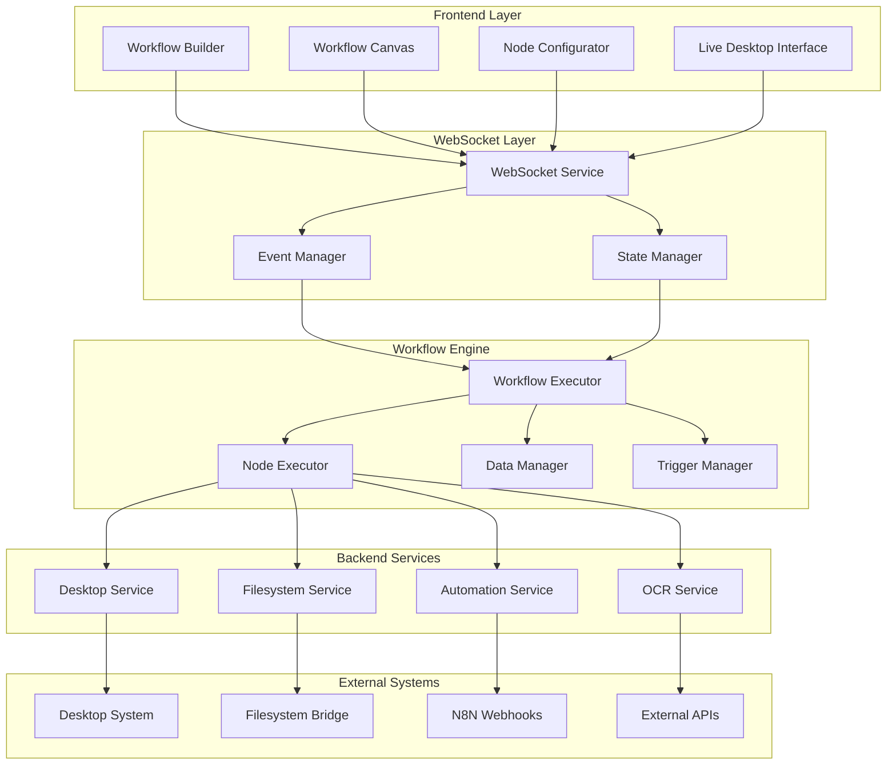
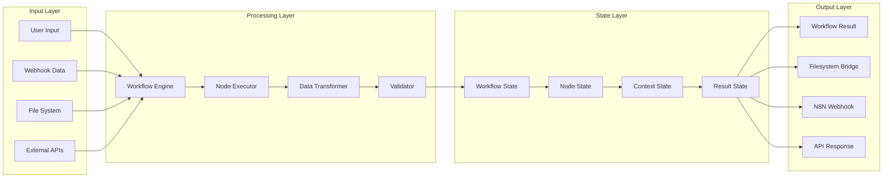

# Workflow Architecture Documentation

## Overview

This documentation describes the complete architecture of the workflow system in the Trusted Login System, including data flow, component interactions, and execution models.

## Table of Contents

1. [Architecture Overview](#architecture-overview)
2. [Workflow-Engine-Architektur](#workflow-engine-architektur)
3. [Node-basierte Architektur](#node-basierte-architektur)
4. [Datenfluss-Architektur](#datenfluss-architektur)
5. [Execution-Engine](#execution-engine)
6. [WebSocket-Architektur](#websocket-architektur)
7. [State-Management](#state-management)
8. [Event-System](#event-system)
9. [Fehlerbehandlung](#fehlerbehandlung)
10. [Performance-Optimierung](#performance-optimierung)

## Architecture Overview

### Systemkomponenten



### Architektur-Prinzipien

1. **Event-Driven Architecture**: Asynchrone Kommunikation über Events
2. **Node-basierte Workflows**: Modulare, wiederverwendbare Workflow-Komponenten
3. **Real-time Communication**: WebSocket-basierte Echtzeitkommunikation
4. **Microservice-Pattern**: Lose gekoppelte, spezialisierte Services
5. **State Management**: Zentralisierte Zustandsverwaltung

## Workflow-Engine-Architektur

### Core-Komponenten

```python
class WorkflowEngine:
    """
    Zentrale Workflow-Engine
    """
    
    def __init__(self):
        self.executor = WorkflowExecutor()
        self.node_registry = NodeRegistry()
        self.state_manager = WorkflowStateManager()
        self.event_bus = EventBus()
        self.trigger_manager = TriggerManager()
        self.data_manager = DataManager()
    
    async def execute_workflow(self, workflow_config: dict, context: dict = None) -> dict:
        """
        Führt Workflow aus
        """
        execution_id = str(uuid.uuid4())
        
        # Workflow-State initialisieren
        workflow_state = await self.state_manager.initialize_workflow(
            execution_id, workflow_config, context
        )
        
        # Execution starten
        result = await self.executor.execute(
            workflow_state, 
            self.node_registry,
            self.event_bus
        )
        
        return result
```

### Workflow-Executor

```python
class WorkflowExecutor:
    """
    Führt Workflows aus
    """
    
    def __init__(self):
        self.node_executor = NodeExecutor()
        self.dependency_resolver = DependencyResolver()
        self.execution_monitor = ExecutionMonitor()
    
    async def execute(self, workflow_state: WorkflowState, node_registry: NodeRegistry, event_bus: EventBus) -> dict:
        """
        Führt Workflow-Execution aus
        """
        execution_id = workflow_state.execution_id
        nodes = workflow_state.nodes
        
        # Execution-Plan erstellen
        execution_plan = await self.dependency_resolver.create_execution_plan(nodes)
        
        # Monitoring starten
        await self.execution_monitor.start_monitoring(execution_id)
        
        try:
            # Nodes in korrekter Reihenfolge ausführen
            for execution_step in execution_plan:
                await self._execute_step(execution_step, workflow_state, node_registry, event_bus)
            
            return {
                'execution_id': execution_id,
                'status': 'completed',
                'result': workflow_state.get_final_result()
            }
            
        except Exception as e:
            await self._handle_execution_error(execution_id, e, event_bus)
            return {
                'execution_id': execution_id,
                'status': 'failed',
                'error': str(e)
            }
        
        finally:
            await self.execution_monitor.stop_monitoring(execution_id)
    
    async def _execute_step(self, step: ExecutionStep, workflow_state: WorkflowState, node_registry: NodeRegistry, event_bus: EventBus):
        """
        Führt einzelnen Execution-Step aus
        """
        if step.type == 'parallel':
            # Parallele Ausführung
            tasks = []
            for node_id in step.node_ids:
                task = self._execute_node(node_id, workflow_state, node_registry, event_bus)
                tasks.append(task)
            
            await asyncio.gather(*tasks)
            
        elif step.type == 'sequential':
            # Sequenzielle Ausführung
            for node_id in step.node_ids:
                await self._execute_node(node_id, workflow_state, node_registry, event_bus)
    
    async def _execute_node(self, node_id: str, workflow_state: WorkflowState, node_registry: NodeRegistry, event_bus: EventBus):
        """
        Führt einzelnen Node aus
        """
        node = workflow_state.get_node(node_id)
        node_handler = node_registry.get_handler(node.type)
        
        # Input-Daten sammeln
        input_data = await self._collect_input_data(node, workflow_state)
        
        # Node ausführen
        result = await self.node_executor.execute_node(
            node, node_handler, input_data, workflow_state.context
        )
        
        # Ergebnis speichern
        workflow_state.set_node_result(node_id, result)
        
        # Event senden
        await event_bus.emit('node_completed', {
            'execution_id': workflow_state.execution_id,
            'node_id': node_id,
            'result': result
        })
```

## Node-basierte Architektur

### Node-Kategorien

```python
class NodeCategory(Enum):
    TRIGGER = "trigger"      # Workflow-Auslöser
    CONFIG = "config"        # Konfiguration
    INTERFACE = "interface"  # Benutzeroberflächen
    ACTION = "action"        # Aktionen
    LOGIC = "logic"          # Logik und Kontrolle
    RESULT = "result"        # Ergebnisse
```

### Node-Interface

```python
class NodeInterface(ABC):
    """
    Basis-Interface für alle Nodes
    """
    
    @abstractmethod
    async def execute(self, config: dict, context: dict, inputs: dict) -> NodeResult:
        """
        Führt Node aus
        """
        pass
    
    @abstractmethod
    def validate_config(self, config: dict) -> ValidationResult:
        """
        Validiert Node-Konfiguration
        """
        pass
    
    @abstractmethod
    def get_input_schema(self) -> dict:
        """
        Gibt Input-Schema zurück
        """
        pass
    
    @abstractmethod
    def get_output_schema(self) -> dict:
        """
        Gibt Output-Schema zurück
        """
        pass
```

### Node-Implementierungen

#### Trigger Nodes

```python
class ManualTriggerNode(NodeInterface):
    """
    Manueller Trigger für Workflow-Start
    """
    
    async def execute(self, config: dict, context: dict, inputs: dict) -> NodeResult:
        # Wartet auf manuellen Trigger
        trigger_data = await self._wait_for_trigger(context.get('trigger_id'))
        
        return NodeResult(
            success=True,
            data=trigger_data,
            outputs={'triggered': True, 'trigger_data': trigger_data}
        )

class WebhookTriggerNode(NodeInterface):
    """
    Webhook-basierter Trigger
    """
    
    async def execute(self, config: dict, context: dict, inputs: dict) -> NodeResult:
        webhook_url = config.get('webhook_url')
        
        # Webhook registrieren
        webhook_data = await self._register_webhook(webhook_url)
        
        return NodeResult(
            success=True,
            data=webhook_data,
            outputs={'webhook_registered': True, 'webhook_data': webhook_data}
        )
```

#### Action Nodes

```python
class ClickActionNode(NodeInterface):
    """
    Desktop-Klick-Aktion
    """
    
    async def execute(self, config: dict, context: dict, inputs: dict) -> NodeResult:
        coordinates = config.get('coordinates', {})
        click_type = config.get('click_type', 'left')
        
        # Desktop Service aufrufen
        desktop_service = context['services']['desktop']
        result = await desktop_service.click(
            x=coordinates.get('x'),
            y=coordinates.get('y'),
            click_type=click_type
        )
        
        return NodeResult(
            success=result.success,
            data=result.data,
            outputs={'clicked': result.success, 'coordinates': coordinates}
        )

class TypeTextActionNode(NodeInterface):
    """
    Text-Eingabe-Aktion
    """
    
    async def execute(self, config: dict, context: dict, inputs: dict) -> NodeResult:
        text = config.get('text', '')
        delay = config.get('delay', 0.1)
        
        # Text aus Inputs übernehmen falls vorhanden
        if 'text' in inputs:
            text = inputs['text']
        
        # Desktop Service aufrufen
        desktop_service = context['services']['desktop']
        result = await desktop_service.type_text(text, delay)
        
        return NodeResult(
            success=result.success,
            data=result.data,
            outputs={'typed': result.success, 'text': text}
        )
```

#### Logic Nodes

```python
class IfConditionNode(NodeInterface):
    """
    Bedingungs-Node für Workflow-Kontrolle
    """
    
    async def execute(self, config: dict, context: dict, inputs: dict) -> NodeResult:
        condition = config.get('condition', {})
        
        # Bedingung evaluieren
        result = await self._evaluate_condition(condition, inputs, context)
        
        return NodeResult(
            success=True,
            data={'condition_met': result},
            outputs={
                'condition_met': result,
                'true_path': result,
                'false_path': not result
            }
        )
    
    async def _evaluate_condition(self, condition: dict, inputs: dict, context: dict) -> bool:
        """
        Evaluiert Bedingung
        """
        condition_type = condition.get('type')
        
        if condition_type == 'equals':
            left = self._resolve_value(condition.get('left'), inputs, context)
            right = self._resolve_value(condition.get('right'), inputs, context)
            return left == right
        
        elif condition_type == 'contains':
            text = self._resolve_value(condition.get('text'), inputs, context)
            search = self._resolve_value(condition.get('search'), inputs, context)
            return search in text
        
        elif condition_type == 'greater_than':
            left = self._resolve_value(condition.get('left'), inputs, context)
            right = self._resolve_value(condition.get('right'), inputs, context)
            return float(left) > float(right)
        
        return False

class DelayNode(NodeInterface):
    """
    Verzögerungs-Node
    """
    
    async def execute(self, config: dict, context: dict, inputs: dict) -> NodeResult:
        delay_seconds = config.get('delay_seconds', 1.0)
        
        # Verzögerung aus Inputs übernehmen falls vorhanden
        if 'delay_seconds' in inputs:
            delay_seconds = float(inputs['delay_seconds'])
        
        await asyncio.sleep(delay_seconds)
        
        return NodeResult(
            success=True,
            data={'delayed_for': delay_seconds},
            outputs={'delay_completed': True, 'delay_seconds': delay_seconds}
        )
```

## Datenfluss-Architektur

### Datenfluss-Modell



### Data-Manager

```python
class DataManager:
    """
    Verwaltet Datenfluss zwischen Nodes
    """
    
    def __init__(self):
        self.transformers = {}
        self.validators = {}
        self.data_cache = {}
    
    async def transform_data(self, data: any, from_schema: dict, to_schema: dict) -> any:
        """
        Transformiert Daten zwischen verschiedenen Schemas
        """
        transformer_key = f"{from_schema['type']}_{to_schema['type']}"
        
        if transformer_key in self.transformers:
            transformer = self.transformers[transformer_key]
            return await transformer.transform(data)
        
        # Standard-Transformation
        return await self._default_transform(data, from_schema, to_schema)
    
    async def validate_data(self, data: any, schema: dict) -> ValidationResult:
        """
        Validiert Daten gegen Schema
        """
        validator = self.validators.get(schema['type'])
        
        if validator:
            return await validator.validate(data, schema)
        
        # Standard-Validierung
        return await self._default_validate(data, schema)
    
    async def cache_data(self, key: str, data: any, ttl: int = 3600):
        """
        Cached Daten für Wiederverwendung
        """
        self.data_cache[key] = {
            'data': data,
            'timestamp': time.time(),
            'ttl': ttl
        }
    
    async def get_cached_data(self, key: str) -> any:
        """
        Gibt gecachte Daten zurück
        """
        if key in self.data_cache:
            cache_entry = self.data_cache[key]
            
            # TTL prüfen
            if time.time() - cache_entry['timestamp'] < cache_entry['ttl']:
                return cache_entry['data']
            else:
                # Abgelaufene Daten entfernen
                del self.data_cache[key]
        
        return None
```

### Datentypen und Schemas

```python
class DataType(Enum):
    STRING = "string"
    NUMBER = "number"
    BOOLEAN = "boolean"
    OBJECT = "object"
    ARRAY = "array"
    FILE = "file"
    IMAGE = "image"
    COORDINATES = "coordinates"
    SCREENSHOT = "screenshot"
    OCR_RESULT = "ocr_result"

class DataSchema:
    """
    Schema-Definition für Datenvalidierung
    """
    
    def __init__(self, data_type: DataType, properties: dict = None, required: list = None):
        self.type = data_type
        self.properties = properties or {}
        self.required = required or []
    
    def validate(self, data: any) -> ValidationResult:
        """
        Validiert Daten gegen Schema
        """
        errors = []
        
        # Typ-Validierung
        if not self._validate_type(data):
            errors.append(f"Expected type {self.type.value}, got {type(data).__name__}")
        
        # Property-Validierung
        if self.type == DataType.OBJECT and isinstance(data, dict):
            for prop, schema in self.properties.items():
                if prop in self.required and prop not in data:
                    errors.append(f"Required property '{prop}' is missing")
                
                if prop in data:
                    prop_result = schema.validate(data[prop])
                    if not prop_result.is_valid:
                        errors.extend([f"{prop}.{error}" for error in prop_result.errors])
        
        return ValidationResult(len(errors) == 0, errors)
```

## Execution-Engine

### Execution-Context

```python
class ExecutionContext:
    """
    Execution-Kontext für Workflow-Ausführung
    """
    
    def __init__(self, execution_id: str, workflow_config: dict, user_context: dict = None):
        self.execution_id = execution_id
        self.workflow_config = workflow_config
        self.user_context = user_context or {}
        self.services = {}
        self.variables = {}
        self.node_results = {}
        self.execution_state = ExecutionState.PENDING
        self.start_time = None
        self.end_time = None
    
    def set_service(self, name: str, service: any):
        """
        Registriert Service im Kontext
        """
        self.services[name] = service
    
    def get_service(self, name: str) -> any:
        """
        Gibt Service zurück
        """
        return self.services.get(name)
    
    def set_variable(self, name: str, value: any):
        """
        Setzt Variable im Kontext
        """
        self.variables[name] = value
    
    def get_variable(self, name: str, default: any = None) -> any:
        """
        Gibt Variable zurück
        """
        return self.variables.get(name, default)
    
    def set_node_result(self, node_id: str, result: NodeResult):
        """
        Speichert Node-Ergebnis
        """
        self.node_results[node_id] = result
    
    def get_node_result(self, node_id: str) -> NodeResult:
        """
        Gibt Node-Ergebnis zurück
        """
        return self.node_results.get(node_id)
```

### Dependency-Resolver

```python
class DependencyResolver:
    """
    Löst Node-Abhängigkeiten auf und erstellt Execution-Plan
    """
    
    def __init__(self):
        self.dependency_graph = {}
    
    async def create_execution_plan(self, nodes: list) -> list:
        """
        Erstellt Execution-Plan basierend auf Node-Abhängigkeiten
        """
        # Dependency-Graph erstellen
        graph = self._build_dependency_graph(nodes)
        
        # Topologische Sortierung
        sorted_nodes = self._topological_sort(graph)
        
        # Execution-Steps erstellen
        execution_steps = self._create_execution_steps(sorted_nodes, graph)
        
        return execution_steps
    
    def _build_dependency_graph(self, nodes: list) -> dict:
        """
        Erstellt Dependency-Graph aus Node-Konfigurationen
        """
        graph = {node['id']: {'node': node, 'dependencies': [], 'dependents': []} for node in nodes}
        
        for node in nodes:
            node_id = node['id']
            
            # Input-Abhängigkeiten analysieren
            for input_config in node.get('inputs', []):
                source_node_id = input_config.get('source_node_id')
                if source_node_id and source_node_id in graph:
                    graph[node_id]['dependencies'].append(source_node_id)
                    graph[source_node_id]['dependents'].append(node_id)
        
        return graph
    
    def _topological_sort(self, graph: dict) -> list:
        """
        Führt topologische Sortierung durch
        """
        in_degree = {node_id: len(info['dependencies']) for node_id, info in graph.items()}
        queue = [node_id for node_id, degree in in_degree.items() if degree == 0]
        result = []
        
        while queue:
            current = queue.pop(0)
            result.append(current)
            
            for dependent in graph[current]['dependents']:
                in_degree[dependent] -= 1
                if in_degree[dependent] == 0:
                    queue.append(dependent)
        
        if len(result) != len(graph):
            raise ValueError("Circular dependency detected in workflow")
        
        return result
    
    def _create_execution_steps(self, sorted_nodes: list, graph: dict) -> list:
        """
        Erstellt Execution-Steps mit Parallelisierung
        """
        steps = []
        processed = set()
        
        while len(processed) < len(sorted_nodes):
            # Nodes finden, die parallel ausgeführt werden können
            parallel_nodes = []
            
            for node_id in sorted_nodes:
                if node_id not in processed:
                    # Prüfen ob alle Abhängigkeiten erfüllt sind
                    dependencies_met = all(
                        dep in processed for dep in graph[node_id]['dependencies']
                    )
                    
                    if dependencies_met:
                        parallel_nodes.append(node_id)
            
            if parallel_nodes:
                if len(parallel_nodes) == 1:
                    steps.append(ExecutionStep('sequential', parallel_nodes))
                else:
                    steps.append(ExecutionStep('parallel', parallel_nodes))
                
                processed.update(parallel_nodes)
            else:
                break
        
        return steps
```

## WebSocket-Architektur

### WebSocket-Service

```python
class WorkflowWebSocketService:
    """
    WebSocket-Service für Real-time Workflow-Kommunikation
    """
    
    def __init__(self):
        self.connections = {}
        self.workflow_subscriptions = {}
        self.event_bus = EventBus()
        self.message_handlers = {
            'workflow_execute': self._handle_workflow_execute,
            'workflow_stop': self._handle_workflow_stop,
            'node_configure': self._handle_node_configure,
            'live_desktop_connect': self._handle_live_desktop_connect,
            'subscribe_workflow': self._handle_subscribe_workflow
        }
    
    async def connect(self, websocket: WebSocket, user_id: str):
        """
        Neue WebSocket-Verbindung
        """
        await websocket.accept()
        connection_id = str(uuid.uuid4())
        
        self.connections[connection_id] = {
            'websocket': websocket,
            'user_id': user_id,
            'subscriptions': set(),
            'connected_at': datetime.now()
        }
        
        # Willkommensnachricht senden
        await self._send_message(connection_id, {
            'type': 'connection_established',
            'connection_id': connection_id,
            'timestamp': datetime.now().isoformat()
        })
        
        return connection_id
    
    async def disconnect(self, connection_id: str):
        """
        WebSocket-Verbindung trennen
        """
        if connection_id in self.connections:
            connection = self.connections[connection_id]
            
            # Subscriptions entfernen
            for subscription in connection['subscriptions']:
                if subscription in self.workflow_subscriptions:
                    self.workflow_subscriptions[subscription].discard(connection_id)
            
            del self.connections[connection_id]
    
    async def handle_message(self, connection_id: str, message: dict):
        """
        Verarbeitet eingehende WebSocket-Nachrichten
        """
        message_type = message.get('type')
        
        if message_type in self.message_handlers:
            handler = self.message_handlers[message_type]
            await handler(connection_id, message)
        else:
            await self._send_error(connection_id, f"Unknown message type: {message_type}")
    
    async def _handle_workflow_execute(self, connection_id: str, message: dict):
        """
        Startet Workflow-Execution
        """
        workflow_config = message.get('workflow_config')
        context = message.get('context', {})
        
        if not workflow_config:
            await self._send_error(connection_id, "Workflow configuration is required")
            return
        
        # Workflow-Engine aufrufen
        workflow_engine = WorkflowEngine()
        
        try:
            # Execution starten
            result = await workflow_engine.execute_workflow(workflow_config, context)
            
            await self._send_message(connection_id, {
                'type': 'workflow_execution_started',
                'execution_id': result.get('execution_id'),
                'status': result.get('status')
            })
            
        except Exception as e:
            await self._send_error(connection_id, f"Workflow execution failed: {str(e)}")
    
    async def _handle_live_desktop_connect(self, connection_id: str, message: dict):
        """
        Verbindet Live Desktop Interface
        """
        desktop_config = message.get('config', {})
        
        # Desktop Service konfigurieren
        desktop_service = DesktopService()
        await desktop_service.configure_live_mode(desktop_config)
        
        # Live-Updates aktivieren
        await self._subscribe_to_desktop_events(connection_id)
        
        await self._send_message(connection_id, {
            'type': 'live_desktop_connected',
            'status': 'active'
        })
    
    async def broadcast_workflow_event(self, workflow_id: str, event: dict):
        """
        Sendet Workflow-Event an alle Subscriber
        """
        if workflow_id in self.workflow_subscriptions:
            subscribers = self.workflow_subscriptions[workflow_id]
            
            for connection_id in subscribers:
                if connection_id in self.connections:
                    await self._send_message(connection_id, {
                        'type': 'workflow_event',
                        'workflow_id': workflow_id,
                        'event': event
                    })
```

### WebSocket-Message-Protokoll

```typescript
// Frontend WebSocket Client
interface WebSocketMessage {
  type: string;
  data?: any;
  timestamp?: string;
}

// Message Types
type MessageType = 
  | 'workflow_execute'
  | 'workflow_stop'
  | 'node_configure'
  | 'live_desktop_connect'
  | 'subscribe_workflow'
  | 'workflow_event'
  | 'node_completed'
  | 'execution_progress'
  | 'desktop_screenshot'
  | 'error';

// Workflow Execution Message
interface WorkflowExecuteMessage extends WebSocketMessage {
  type: 'workflow_execute';
  data: {
    workflow_config: WorkflowConfig;
    context?: Record<string, any>;
  };
}

// Node Configuration Message
interface NodeConfigureMessage extends WebSocketMessage {
  type: 'node_configure';
  data: {
    node_id: string;
    node_type: string;
    config: Record<string, any>;
  };
}

// Live Desktop Message
interface LiveDesktopMessage extends WebSocketMessage {
  type: 'live_desktop_connect';
  data: {
    config: {
      screenshot_interval?: number;
      mouse_tracking?: boolean;
      keyboard_tracking?: boolean;
    };
  };
}
```

## State-Management

### Workflow-State-Manager

```python
class WorkflowStateManager:
    """
    Verwaltet Workflow-Zustand während der Execution
    """
    
    def __init__(self):
        self.active_workflows = {}
        self.workflow_history = {}
        self.state_persistence = StatePersistence()
    
    async def initialize_workflow(self, execution_id: str, workflow_config: dict, context: dict = None) -> WorkflowState:
        """
        Initialisiert neuen Workflow-State
        """
        workflow_state = WorkflowState(
            execution_id=execution_id,
            workflow_config=workflow_config,
            context=context or {},
            status=ExecutionStatus.PENDING,
            created_at=datetime.now()
        )
        
        # Nodes initialisieren
        for node_config in workflow_config.get('nodes', []):
            node_state = NodeState(
                node_id=node_config['id'],
                node_type=node_config['type'],
                config=node_config.get('config', {}),
                status=NodeStatus.PENDING
            )
            workflow_state.add_node_state(node_state)
        
        # State speichern
        self.active_workflows[execution_id] = workflow_state
        await self.state_persistence.save_workflow_state(workflow_state)
        
        return workflow_state
    
    async def update_node_state(self, execution_id: str, node_id: str, status: NodeStatus, result: NodeResult = None):
        """
        Aktualisiert Node-State
        """
        if execution_id in self.active_workflows:
            workflow_state = self.active_workflows[execution_id]
            node_state = workflow_state.get_node_state(node_id)
            
            if node_state:
                node_state.status = status
                node_state.updated_at = datetime.now()
                
                if result:
                    node_state.result = result
                    node_state.execution_time = result.execution_time
                
                # State persistieren
                await self.state_persistence.save_node_state(node_state)
    
    async def complete_workflow(self, execution_id: str, final_result: dict):
        """
        Schließt Workflow ab
        """
        if execution_id in self.active_workflows:
            workflow_state = self.active_workflows[execution_id]
            workflow_state.status = ExecutionStatus.COMPLETED
            workflow_state.final_result = final_result
            workflow_state.completed_at = datetime.now()
            
            # In Historie verschieben
            self.workflow_history[execution_id] = workflow_state
            del self.active_workflows[execution_id]
            
            # Final state persistieren
            await self.state_persistence.save_workflow_state(workflow_state)

class WorkflowState:
    """
    Workflow-State-Objekt
    """
    
    def __init__(self, execution_id: str, workflow_config: dict, context: dict, status: ExecutionStatus, created_at: datetime):
        self.execution_id = execution_id
        self.workflow_config = workflow_config
        self.context = context
        self.status = status
        self.created_at = created_at
        self.updated_at = created_at
        self.completed_at = None
        self.node_states = {}
        self.variables = {}
        self.final_result = None
    
    def add_node_state(self, node_state: 'NodeState'):
        """
        Fügt Node-State hinzu
        """
        self.node_states[node_state.node_id] = node_state
    
    def get_node_state(self, node_id: str) -> 'NodeState':
        """
        Gibt Node-State zurück
        """
        return self.node_states.get(node_id)
    
    def set_variable(self, name: str, value: any):
        """
        Setzt Workflow-Variable
        """
        self.variables[name] = value
        self.updated_at = datetime.now()
    
    def get_variable(self, name: str, default: any = None) -> any:
        """
        Gibt Workflow-Variable zurück
        """
        return self.variables.get(name, default)

class NodeState:
    """
    Node-State-Objekt
    """
    
    def __init__(self, node_id: str, node_type: str, config: dict, status: NodeStatus):
        self.node_id = node_id
        self.node_type = node_type
        self.config = config
        self.status = status
        self.created_at = datetime.now()
        self.updated_at = datetime.now()
        self.started_at = None
        self.completed_at = None
        self.result = None
        self.execution_time = None
        self.error = None
```

## Event-System

### Event-Bus

```python
class EventBus:
    """
    Zentraler Event-Bus für Workflow-Events
    """
    
    def __init__(self):
        self.subscribers = defaultdict(list)
        self.event_history = []
        self.event_filters = {}
    
    def subscribe(self, event_type: str, handler: callable, filter_func: callable = None):
        """
        Registriert Event-Handler
        """
        subscription = EventSubscription(
            event_type=event_type,
            handler=handler,
            filter_func=filter_func,
            created_at=datetime.now()
        )
        
        self.subscribers[event_type].append(subscription)
        return subscription
    
    def unsubscribe(self, subscription: EventSubscription):
        """
        Entfernt Event-Handler
        """
        if subscription.event_type in self.subscribers:
            self.subscribers[subscription.event_type].remove(subscription)
    
    async def emit(self, event_type: str, data: dict, source: str = None):
        """
        Sendet Event an alle Subscriber
        """
        event = WorkflowEvent(
            event_type=event_type,
            data=data,
            source=source,
            timestamp=datetime.now(),
            event_id=str(uuid.uuid4())
        )
        
        # Event in Historie speichern
        self.event_history.append(event)
        
        # An Subscriber weiterleiten
        if event_type in self.subscribers:
            for subscription in self.subscribers[event_type]:
                try:
                    # Filter anwenden falls vorhanden
                    if subscription.filter_func and not subscription.filter_func(event):
                        continue
                    
                    # Handler aufrufen
                    if asyncio.iscoroutinefunction(subscription.handler):
                        await subscription.handler(event)
                    else:
                        subscription.handler(event)
                        
                except Exception as e:
                    logger.error(f"Error in event handler: {e}")
    
    def get_event_history(self, event_type: str = None, limit: int = 100) -> list:
        """
        Gibt Event-Historie zurück
        """
        events = self.event_history
        
        if event_type:
            events = [e for e in events if e.event_type == event_type]
        
        return events[-limit:]

class WorkflowEvent:
    """
    Workflow-Event-Objekt
    """
    
    def __init__(self, event_type: str, data: dict, source: str, timestamp: datetime, event_id: str):
        self.event_type = event_type
        self.data = data
        self.source = source
        self.timestamp = timestamp
        self.event_id = event_id

class EventSubscription:
    """
    Event-Subscription-Objekt
    """
    
    def __init__(self, event_type: str, handler: callable, filter_func: callable, created_at: datetime):
        self.event_type = event_type
        self.handler = handler
        self.filter_func = filter_func
        self.created_at = created_at
```

### Event-Types

```python
class WorkflowEventType(Enum):
    # Workflow Events
    WORKFLOW_STARTED = "workflow_started"
    WORKFLOW_COMPLETED = "workflow_completed"
    WORKFLOW_FAILED = "workflow_failed"
    WORKFLOW_PAUSED = "workflow_paused"
    WORKFLOW_RESUMED = "workflow_resumed"
    
    # Node Events
    NODE_STARTED = "node_started"
    NODE_COMPLETED = "node_completed"
    NODE_FAILED = "node_failed"
    NODE_SKIPPED = "node_skipped"
    
    # Desktop Events
    DESKTOP_SCREENSHOT = "desktop_screenshot"
    DESKTOP_CLICK = "desktop_click"
    DESKTOP_TYPE = "desktop_type"
    DESKTOP_OCR = "desktop_ocr"
    
    # System Events
    SYSTEM_ERROR = "system_error"
    SYSTEM_WARNING = "system_warning"
    SYSTEM_INFO = "system_info"
```

## Fehlerbehandlung

### Error-Handler

```python
class WorkflowErrorHandler:
    """
    Zentrale Fehlerbehandlung für Workflows
    """
    
    def __init__(self):
        self.error_strategies = {
            NodeErrorType.TIMEOUT: self._handle_timeout_error,
            NodeErrorType.VALIDATION: self._handle_validation_error,
            NodeErrorType.EXECUTION: self._handle_execution_error,
            NodeErrorType.DEPENDENCY: self._handle_dependency_error
        }
        self.retry_policies = {}
        self.fallback_handlers = {}
    
    async def handle_node_error(self, execution_id: str, node_id: str, error: Exception, context: dict) -> ErrorHandlingResult:
        """
        Behandelt Node-Fehler
        """
        error_type = self._classify_error(error)
        
        # Error-Strategy anwenden
        if error_type in self.error_strategies:
            strategy = self.error_strategies[error_type]
            result = await strategy(execution_id, node_id, error, context)
        else:
            result = await self._handle_generic_error(execution_id, node_id, error, context)
        
        # Error-Event senden
        await self._emit_error_event(execution_id, node_id, error, result)
        
        return result
    
    async def _handle_timeout_error(self, execution_id: str, node_id: str, error: Exception, context: dict) -> ErrorHandlingResult:
        """
        Behandelt Timeout-Fehler
        """
        # Retry-Policy prüfen
        retry_policy = self.retry_policies.get(node_id)
        
        if retry_policy and retry_policy.should_retry():
            return ErrorHandlingResult(
                action=ErrorAction.RETRY,
                delay=retry_policy.get_retry_delay(),
                message="Retrying after timeout"
            )
        
        return ErrorHandlingResult(
            action=ErrorAction.FAIL,
            message=f"Node {node_id} timed out after {retry_policy.max_retries if retry_policy else 0} retries"
        )
    
    async def _handle_validation_error(self, execution_id: str, node_id: str, error: Exception, context: dict) -> ErrorHandlingResult:
        """
        Behandelt Validierungsfehler
        """
        # Validierungsfehler sind meist nicht retry-bar
        return ErrorHandlingResult(
            action=ErrorAction.FAIL,
            message=f"Validation failed for node {node_id}: {str(error)}"
        )
    
    async def _handle_execution_error(self, execution_id: str, node_id: str, error: Exception, context: dict) -> ErrorHandlingResult:
        """
        Behandelt Ausführungsfehler
        """
        # Fallback-Handler prüfen
        if node_id in self.fallback_handlers:
            fallback = self.fallback_handlers[node_id]
            
            try:
                fallback_result = await fallback.execute(context)
                return ErrorHandlingResult(
                    action=ErrorAction.CONTINUE,
                    fallback_result=fallback_result,
                    message="Fallback executed successfully"
                )
            except Exception as fallback_error:
                return ErrorHandlingResult(
                    action=ErrorAction.FAIL,
                    message=f"Both primary and fallback execution failed: {str(error)}, {str(fallback_error)}"
                )
        
        return ErrorHandlingResult(
            action=ErrorAction.FAIL,
            message=f"Execution failed for node {node_id}: {str(error)}"
        )

class ErrorHandlingResult:
    """
    Ergebnis der Fehlerbehandlung
    """
    
    def __init__(self, action: ErrorAction, message: str, delay: float = 0, fallback_result: any = None):
        self.action = action
        self.message = message
        self.delay = delay
        self.fallback_result = fallback_result

class ErrorAction(Enum):
    RETRY = "retry"
    FAIL = "fail"
    CONTINUE = "continue"
    SKIP = "skip"
```

## Performance-Optimierung

### Performance-Monitor

```python
class WorkflowPerformanceMonitor:
    """
    Überwacht und optimiert Workflow-Performance
    """
    
    def __init__(self):
        self.metrics = defaultdict(list)
        self.performance_thresholds = {
            'node_execution_time': 30.0,  # Sekunden
            'workflow_total_time': 300.0,  # Sekunden
            'memory_usage': 500 * 1024 * 1024,  # 500MB
            'cpu_usage': 80.0  # Prozent
        }
        self.optimization_strategies = {
            'slow_node': self._optimize_slow_node,
            'high_memory': self._optimize_memory_usage,
            'high_cpu': self._optimize_cpu_usage
        }
    
    async def monitor_execution(self, execution_id: str, workflow_state: WorkflowState):
        """
        Überwacht Workflow-Execution
        """
        start_time = time.time()
        
        while workflow_state.status in [ExecutionStatus.RUNNING, ExecutionStatus.PENDING]:
            # Performance-Metriken sammeln
            metrics = await self._collect_metrics(execution_id, workflow_state)
            
            # Thresholds prüfen
            violations = self._check_thresholds(metrics)
            
            if violations:
                await self._apply_optimizations(execution_id, violations)
            
            await asyncio.sleep(1)  # 1 Sekunde Monitoring-Intervall
    
    async def _collect_metrics(self, execution_id: str, workflow_state: WorkflowState) -> dict:
        """
        Sammelt Performance-Metriken
        """
        import psutil
        
        # System-Metriken
        cpu_usage = psutil.cpu_percent()
        memory_usage = psutil.virtual_memory().used
        
        # Workflow-Metriken
        total_time = (datetime.now() - workflow_state.created_at).total_seconds()
        
        # Node-Metriken
        node_times = {}
        for node_id, node_state in workflow_state.node_states.items():
            if node_state.execution_time:
                node_times[node_id] = node_state.execution_time
        
        metrics = {
            'cpu_usage': cpu_usage,
            'memory_usage': memory_usage,
            'total_time': total_time,
            'node_times': node_times,
            'timestamp': datetime.now()
        }
        
        self.metrics[execution_id].append(metrics)
        return metrics
    
    def _check_thresholds(self, metrics: dict) -> list:
        """
        Prüft Performance-Thresholds
        """
        violations = []
        
        if metrics['cpu_usage'] > self.performance_thresholds['cpu_usage']:
            violations.append('high_cpu')
        
        if metrics['memory_usage'] > self.performance_thresholds['memory_usage']:
            violations.append('high_memory')
        
        for node_id, execution_time in metrics['node_times'].items():
            if execution_time > self.performance_thresholds['node_execution_time']:
                violations.append(('slow_node', node_id))
        
        return violations
    
    async def _apply_optimizations(self, execution_id: str, violations: list):
        """
        Wendet Performance-Optimierungen an
        """
        for violation in violations:
            if isinstance(violation, tuple):
                strategy_name, context = violation
            else:
                strategy_name = violation
                context = None
            
            if strategy_name in self.optimization_strategies:
                strategy = self.optimization_strategies[strategy_name]
                await strategy(execution_id, context)
```

## Zusammenfassung

Die Workflow-Architektur des Trusted Login Systems bietet:

### ✅ Vollständige Architektur-Abdeckung
- **Event-Driven Design**: Asynchrone, skalierbare Kommunikation
- **Node-basierte Workflows**: Modulare, wiederverwendbare Komponenten
- **Real-time WebSocket**: Live-Updates und Interaktion
- **State Management**: Zuverlässige Zustandsverwaltung

### ✅ Erweiterte Funktionalität
- **Dependency Resolution**: Intelligente Ausführungsplanung
- **Error Handling**: Robuste Fehlerbehandlung mit Retry-Logic
- **Performance Monitoring**: Automatische Optimierung
- **Debug-Interface**: Umfassendes Debugging

### ✅ Integration und Skalierbarkeit
- **Service-Integration**: Nahtlose Backend-Service-Anbindung
- **External APIs**: Flexible externe Integrationen
- **Filesystem Bridge**: Dateisystem-basierte Tool-Integration
- **Monitoring**: Real-time Performance-Überwachung

### 🎯 Nächste Schritte
1. **Schritt 8**: Filesystem-Bridge-Architektur
2. **Schritt 9**: Sicherheitsdokumentation
3. **Schritt 10**: Deployment-Guide

Die Workflow-Architektur schafft eine solide, skalierbare Grundlage für komplexe Automatisierungs-Workflows mit Real-time-Feedback und robuster Fehlerbehandlung.