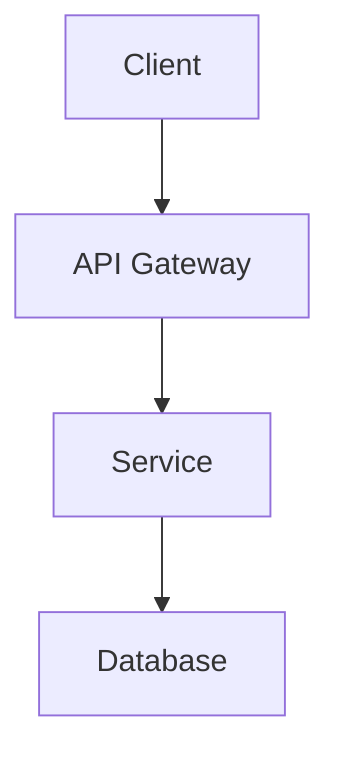
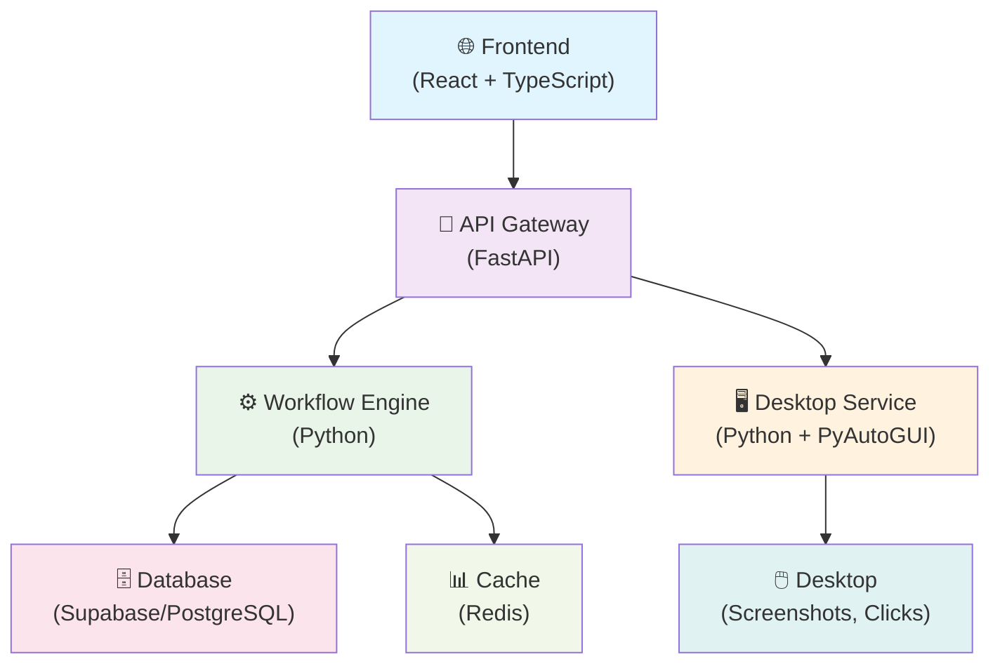
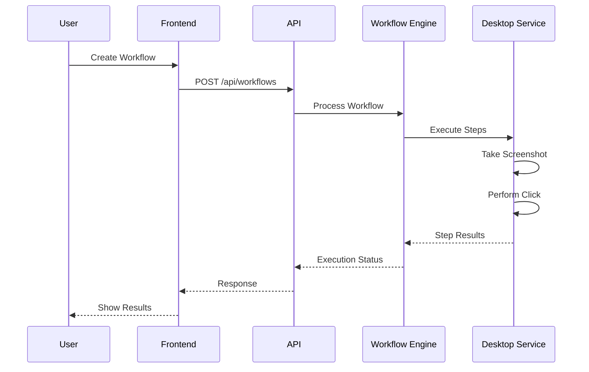
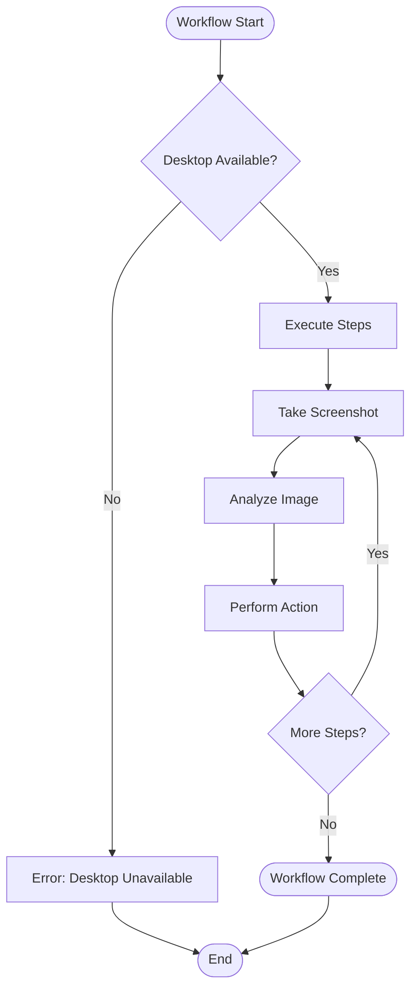
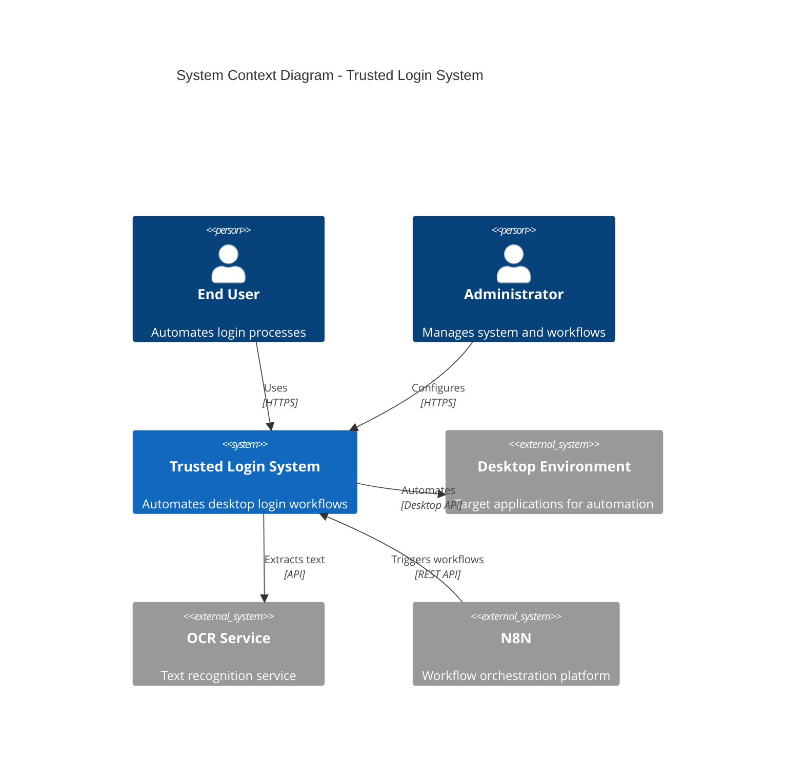
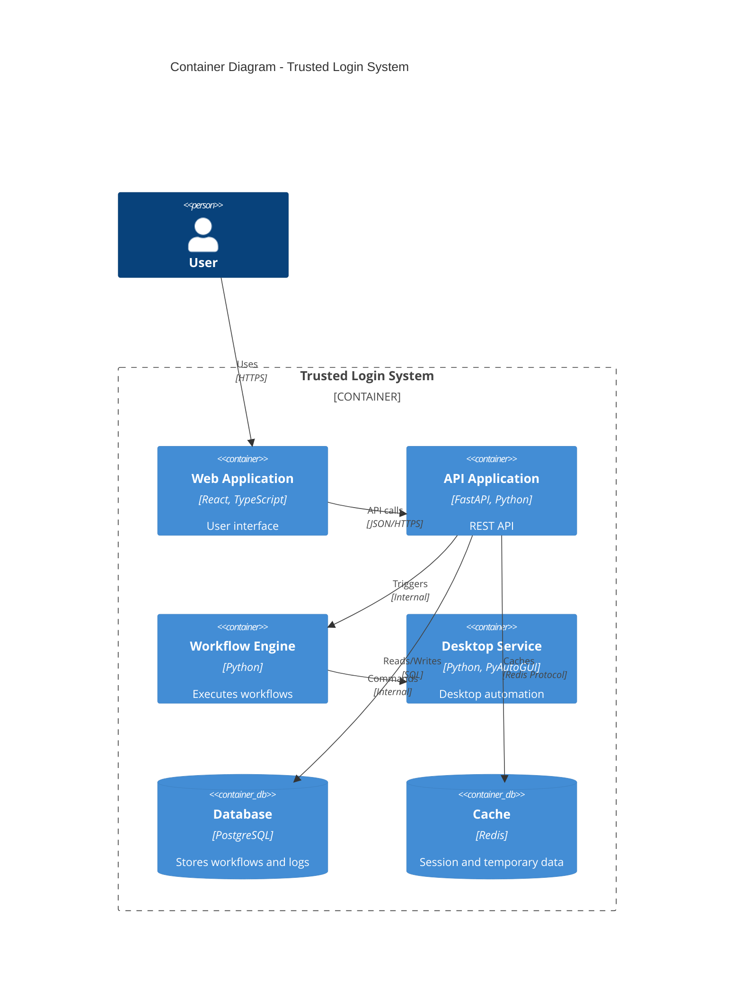
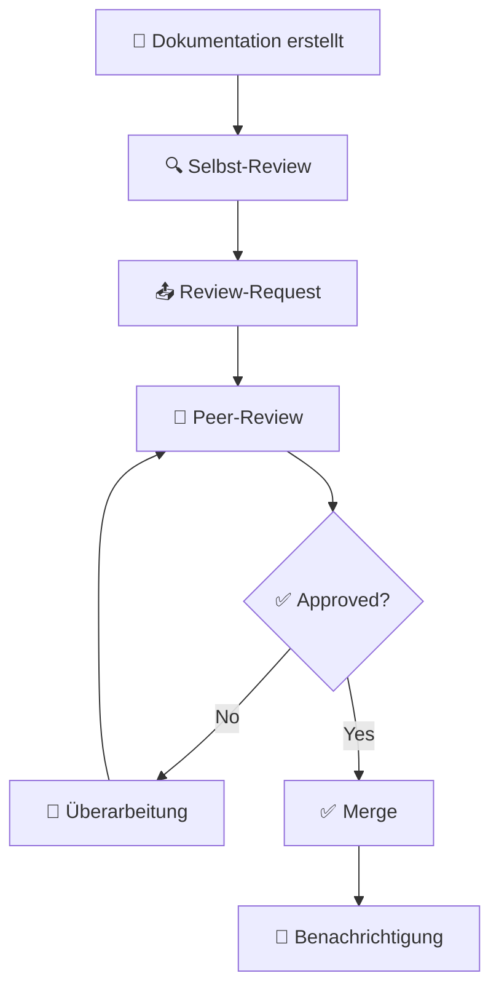

# Documentation Quality Standards

## Overview

This documentation defines the standards, processes, and quality criteria for creating and maintaining project documentation in the Trusted Login System.

## Table of Contents

1. [Dokumentations-Standards](#dokumentations-standards)
2. [Review-Prozesse](#review-prozesse)
3. [Qualitätskriterien](#qualitätskriterien)
4. [Automatisierte Qualitätsprüfung](#automatisierte-qualitätsprüfung)
5. [Kontinuierliche Verbesserung](#kontinuierliche-verbesserung)
6. [Tools und Ressourcen](#tools-und-ressourcen)

## Documentation Standards

### Markdown-Formatierungs-Guidelines

#### Grundlegende Formatierung

```markdown
# Hauptüberschrift (H1) - Nur eine pro Dokument
## Abschnittsüberschrift (H2)
### Unterabschnittsüberschrift (H3)
#### Detailüberschrift (H4)

**Fetttext** für wichtige Begriffe
*Kursivtext* für Betonung
`Inline-Code` für Befehle und Variablen

> Blockquotes für wichtige Hinweise

- Ungeordnete Listen
  - Verschachtelte Elemente
1. Geordnete Listen
   1. Verschachtelte Nummerierung

[Link-Text](URL "Optionaler Titel")

```

#### Code-Blöcke

```markdown
```python
# Python-Code mit Syntax-Highlighting
def example_function():
    return "Hello World"
```

```bash
# Shell-Befehle
npm install
npm run dev
```

```json
{
  "example": "JSON-Konfiguration",
  "version": "1.0.0"
}
```
```

#### Tabellen

```markdown
| Spalte 1 | Spalte 2 | Spalte 3 |
|----------|----------|----------|
| Wert 1   | Wert 2   | Wert 3   |
| Wert 4   | Wert 5   | Wert 6   |
```

### Struktur-Templates

#### API-Dokumentation Template

```markdown
# API-Endpunkt: [Endpunkt-Name]

## Overview
[Kurze Beschreibung des Endpunkts]

## HTTP-Methode und URL
```
[METHOD] /api/v1/endpoint
```

## Parameter

### Path-Parameter
| Parameter | Typ | Beschreibung | Beispiel |
|-----------|-----|--------------|----------|
| id | string | Eindeutige ID | "123" |

### Query-Parameter
| Parameter | Typ | Erforderlich | Beschreibung | Standard |
|-----------|-----|--------------|--------------|----------|
| limit | integer | Nein | Anzahl Ergebnisse | 10 |

### Request Body
```json
{
  "example": "value"
}
```

## Antworten

### Erfolgreiche Antwort (200)
```json
{
  "status": "success",
  "data": {}
}
```

### Fehler-Antworten
- **400 Bad Request**: Ungültige Parameter
- **401 Unauthorized**: Authentifizierung erforderlich
- **404 Not Found**: Ressource nicht gefunden
- **500 Internal Server Error**: Server-Fehler

## Beispiele

### cURL
```bash
curl -X GET "http://localhost:8007/api/v1/endpoint" \
  -H "Authorization: Bearer TOKEN"
```

### JavaScript
```javascript
const response = await fetch('/api/v1/endpoint', {
  method: 'GET',
  headers: {
    'Authorization': 'Bearer TOKEN'
  }
});
```
```

#### Architektur-Dokumentation Template

```markdown
# [Komponenten-Name] Architektur

## Übersicht
[Kurze Beschreibung der Komponente]

## Architektur-Diagramm


## Komponenten

### [Komponenten-Name]
- **Zweck**: [Beschreibung]
- **Technologie**: [Tech-Stack]
- **Abhängigkeiten**: [Liste der Abhängigkeiten]
- **Konfiguration**: [Konfigurationsdetails]

## Datenfluss

1. [Schritt 1 Beschreibung]
2. [Schritt 2 Beschreibung]
3. [Schritt 3 Beschreibung]

## Security Aspects

- [Sicherheitsmaßnahme 1]
- [Sicherheitsmaßnahme 2]

## Performance-Überlegungen

- [Performance-Aspekt 1]
- [Performance-Aspekt 2]

## Deployment

[Deployment-Anweisungen]
```

### Naming-Conventions

#### Dateinamen

```
# Dokumenttypen
README.md                    # Projekt-Übersicht
api_reference.md             # API-Dokumentation
architecture_overview.md     # Architecture overview
deployment_guide.md          # Deployment-Anleitung
developer_onboarding.md      # Entwickler-Einführung
user_documentation.md        # Benutzer-Handbuch
testing_strategy.md          # Test-Strategien
security_guidelines.md       # Sicherheitsrichtlinien
performance_optimization.md  # Performance-Optimierung
troubleshooting_guide.md     # Fehlerbehebung

# Spezifische Komponenten
backend_architecture.md      # Backend-Architektur
frontend_architecture.md     # Frontend-Architektur
database_schema.md           # Datenbank-Schema
workflow_engine.md           # Workflow-Engine
desktop_integration.md       # Desktop-Integration
```

#### Abschnittsnamen

```markdown
# Hauptüberschriften (H1)
- Verwende aussagekräftige, eindeutige Namen
- Keine Artikel (der, die, das)
- Substantive in Singular

## Standardabschnitte (H2)
- Overview
- Installation
- Konfiguration
- Verwendung
- API-Referenz
- Beispiele
- Fehlerbehebung
- FAQ

### Unterabschnitte (H3)
- Spezifische Funktionen
- Detaillierte Schritte
- Code-Beispiele
```

### Code-Beispiel-Standards

#### Python-Code-Beispiele

```python
# Vollständige Beispiele mit Imports
from typing import Dict, List, Optional
from fastapi import FastAPI, HTTPException
from pydantic import BaseModel

# Klassen-Definition mit Docstrings
class WorkflowRequest(BaseModel):
    """Request model for workflow creation.
    
    Attributes:
        name: The workflow name
        steps: List of workflow steps
        schedule: Optional cron schedule
    """
    name: str
    steps: List[Dict]
    schedule: Optional[str] = None

# Funktionen mit Type Hints und Docstrings
async def create_workflow(
    workflow_data: WorkflowRequest,
    user_id: str
) -> Dict[str, str]:
    """Create a new workflow.
    
    Args:
        workflow_data: The workflow configuration
        user_id: The user creating the workflow
        
    Returns:
        Dict containing workflow ID and status
        
    Raises:
        HTTPException: If workflow creation fails
    """
    try:
        # Implementation here
        return {"id": "workflow_123", "status": "created"}
    except Exception as e:
        raise HTTPException(status_code=500, detail=str(e))
```

#### TypeScript/JavaScript-Code-Beispiele

```typescript
// Vollständige Beispiele mit Imports
import React, { useState, useEffect } from 'react';
import { WorkflowService } from '../services/WorkflowService';

// Interface-Definitionen
interface Workflow {
  id: string;
  name: string;
  steps: WorkflowStep[];
  status: 'active' | 'inactive' | 'error';
}

interface WorkflowStep {
  type: 'click' | 'input' | 'wait' | 'screenshot';
  config: Record<string, any>;
}

// React-Komponenten mit TypeScript
const WorkflowList: React.FC = () => {
  const [workflows, setWorkflows] = useState<Workflow[]>([]);
  const [loading, setLoading] = useState<boolean>(true);

  useEffect(() => {
    const fetchWorkflows = async () => {
      try {
        const data = await WorkflowService.getWorkflows();
        setWorkflows(data);
      } catch (error) {
        console.error('Failed to fetch workflows:', error);
      } finally {
        setLoading(false);
      }
    };

    fetchWorkflows();
  }, []);

  if (loading) {
    return <div>Loading workflows...</div>;
  }

  return (
    <div className="workflow-list">
      {workflows.map(workflow => (
        <div key={workflow.id} className="workflow-item">
          <h3>{workflow.name}</h3>
          <span className={`status ${workflow.status}`}>
            {workflow.status}
          </span>
        </div>
      ))}
    </div>
  );
};

export default WorkflowList;
```

### Diagramm-Standards

#### Mermaid-Diagramme

```markdown
# Architektur-Diagramme


# Sequenz-Diagramme


# Flussdiagramme

```

#### C4-Diagramme

```markdown
# System Context Diagram


# Container Diagram

```

## Review-Prozesse

### Dokumentations-Review-Checkliste

#### Inhaltliche Prüfung

- [ ] **Vollständigkeit**
  - [ ] Alle erforderlichen Abschnitte vorhanden
  - [ ] Keine wichtigen Informationen fehlen
  - [ ] Alle Code-Beispiele funktionsfähig
  - [ ] Alle Links funktionieren

- [ ] **Korrektheit**
  - [ ] Technische Informationen sind aktuell
  - [ ] Code-Beispiele sind syntaktisch korrekt
  - [ ] API-Dokumentation entspricht Implementation
  - [ ] Versionsnummern sind aktuell

- [ ] **Verständlichkeit**
  - [ ] Klare, verständliche Sprache
  - [ ] Logische Struktur und Reihenfolge
  - [ ] Angemessene Detailtiefe für Zielgruppe
  - [ ] Beispiele unterstützen das Verständnis

#### Formatierungs-Prüfung

- [ ] **Markdown-Syntax**
  - [ ] Korrekte Überschriften-Hierarchie
  - [ ] Konsistente Formatierung
  - [ ] Korrekte Code-Block-Syntax
  - [ ] Funktionierende Tabellen

- [ ] **Stil-Konsistenz**
  - [ ] Einheitliche Terminologie
  - [ ] Konsistente Naming-Conventions
  - [ ] Einheitliche Code-Stil
  - [ ] Konsistente Diagramm-Stile

#### Technische Prüfung

- [ ] **Code-Qualität**
  - [ ] Code-Beispiele folgen Projekt-Standards
  - [ ] Vollständige Import-Statements
  - [ ] Korrekte Type-Hints (Python/TypeScript)
  - [ ] Angemessene Fehlerbehandlung

- [ ] **Diagramme**
  - [ ] Mermaid-Syntax korrekt
  - [ ] Diagramme sind aussagekräftig
  - [ ] Konsistente Farb- und Stil-Verwendung
  - [ ] Diagramme rendern korrekt

### Peer-Review-Verfahren

#### Review-Rollen

1. **Autor**: Erstellt die Dokumentation
2. **Fachlicher Reviewer**: Prüft inhaltliche Korrektheit
3. **Technischer Reviewer**: Prüft Code-Beispiele und technische Details
4. **Redaktioneller Reviewer**: Prüft Sprache und Formatierung

#### Review-Prozess



#### Review-Timeline

- **Kleine Änderungen** (< 100 Zeilen): 1-2 Werktage
- **Mittlere Änderungen** (100-500 Zeilen): 3-5 Werktage
- **Große Änderungen** (> 500 Zeilen): 1-2 Wochen

### Approval-Workflow

#### Approval-Kriterien

1. **Mindestens 2 Approvals** für neue Dokumentation
2. **Mindestens 1 Approval** für Updates bestehender Dokumentation
3. **Fachlicher Reviewer** muss bei technischen Änderungen approven
4. **Redaktioneller Reviewer** muss bei größeren Textänderungen approven

#### Approval-Matrix

| Dokumenttyp | Fachlich | Technisch | Redaktionell | Gesamt |
|-------------|----------|-----------|--------------|--------|
| API-Docs | ✅ | ✅ | ❌ | 2 |
| Architektur | ✅ | ✅ | ✅ | 3 |
| User-Guide | ✅ | ❌ | ✅ | 2 |
| Code-Beispiele | ✅ | ✅ | ❌ | 2 |
| README-Updates | ❌ | ❌ | ✅ | 1 |

### Versionskontrolle für Dokumentation

#### Git-Workflow

```bash
# Feature-Branch für Dokumentation
git checkout -b docs/update-api-reference

# Änderungen committen
git add .
git commit -m "docs: Update API reference with new endpoints"

# Pull Request erstellen
git push origin docs/update-api-reference
```

#### Commit-Message-Format

```
docs: <kurze Beschreibung>

<detaillierte Beschreibung>

Closes #<issue-nummer>
```

**Beispiele:**
```
docs: Add workflow execution API documentation
docs: Update installation guide for Windows
docs: Fix broken links in architecture overview
docs: Improve code examples in developer guide
```

#### Branching-Strategie

- `main`: Aktuelle, stabile Dokumentation
- `docs/*`: Feature-Branches für Dokumentations-Updates
- `hotfix/docs/*`: Kritische Dokumentations-Fixes

## Qualitätskriterien

### Vollständigkeit-Checkliste

#### Projekt-Dokumentation

- [ ] **README.md**
  - [ ] Projekt-Übersicht
  - [ ] Installation-Anweisungen
  - [ ] Quick-Start-Guide
  - [ ] Link zu detaillierter Dokumentation

- [ ] **API-Dokumentation**
  - [ ] Alle Endpunkte dokumentiert
  - [ ] Request/Response-Beispiele
  - [ ] Fehler-Codes und -Nachrichten
  - [ ] Authentifizierung-Details

- [ ] **Architektur-Dokumentation**
  - [ ] System-Übersicht
  - [ ] Komponenten-Diagramme
  - [ ] Datenfluss-Diagramme
  - [ ] Deployment-Architektur

#### Benutzer-Dokumentation

- [ ] **Installation-Guide**
  - [ ] System-Anforderungen
  - [ ] Schritt-für-Schritt-Installation
  - [ ] Konfiguration
  - [ ] Verifikation

- [ ] **Benutzer-Handbuch**
  - [ ] Erste Schritte
  - [ ] Feature-Übersicht
  - [ ] Detaillierte Anleitungen
  - [ ] Troubleshooting

- [ ] **FAQ**
  - [ ] Häufige Fragen
  - [ ] Bekannte Probleme
  - [ ] Lösungsansätze

#### Entwickler-Dokumentation

- [ ] **Setup-Guide**
  - [ ] Entwicklungsumgebung
  - [ ] Dependencies
  - [ ] Build-Prozess
  - [ ] Test-Ausführung

- [ ] **Code-Standards**
  - [ ] Coding-Guidelines
  - [ ] Review-Prozess
  - [ ] Testing-Standards

- [ ] **Deployment-Guide**
  - [ ] Staging-Deployment
  - [ ] Production-Deployment
  - [ ] Monitoring
  - [ ] Rollback-Verfahren

### Aktualitäts-Bewertung

#### Bewertungskriterien

| Kriterium | Gewichtung | Bewertung |
|-----------|------------|----------|
| Code-Beispiele funktionieren | 30% | 1-5 |
| API-Docs entsprechen Implementation | 25% | 1-5 |
| Links funktionieren | 20% | 1-5 |
| Versionsnummern aktuell | 15% | 1-5 |
| Screenshots aktuell | 10% | 1-5 |

#### Aktualitäts-Score

```
Score = (Σ(Kriterium × Gewichtung)) / 100

5.0 - 4.5: Ausgezeichnet
4.4 - 3.5: Gut
3.4 - 2.5: Befriedigend
2.4 - 1.5: Ausreichend
1.4 - 1.0: Mangelhaft
```

#### Update-Zyklen

- **API-Dokumentation**: Bei jeder API-Änderung
- **Architektur-Dokumentation**: Quartalsweise
- **Benutzer-Dokumentation**: Bei Feature-Releases
- **Installation-Guides**: Bei Dependency-Updates
- **Screenshots**: Bei UI-Änderungen

### Verständlichkeits-Kriterien

#### Zielgruppen-Definition

1. **End-User**: Nicht-technische Benutzer
   - Einfache Sprache
   - Schritt-für-Schritt-Anleitungen
   - Viele Screenshots
   - Glossar für Fachbegriffe

2. **Entwickler**: Technische Implementierer
   - Präzise technische Details
   - Code-Beispiele
   - Architektur-Diagramme
   - API-Referenzen

3. **Administratoren**: System-Betreiber
   - Deployment-Anleitungen
   - Konfiguration-Details
   - Monitoring-Guides
   - Troubleshooting

#### Verständlichkeits-Metriken

- **Flesch-Reading-Ease-Score**: > 60 für End-User-Docs
- **Durchschnittliche Satzlänge**: < 20 Wörter
- **Fachbegriff-Dichte**: < 10% für End-User-Docs
- **Code-zu-Text-Verhältnis**: 30-70% für Developer-Docs

### Konsistenz-Prüfung

#### Terminologie-Konsistenz

```yaml
# Glossar-Datei: docs/glossary.yml
terms:
  workflow:
    definition: "Eine Sequenz von automatisierten Schritten"
    synonyms: ["Ablauf", "Prozess"]
    avoid: ["Workflow", "Flow"]
  
  desktop_service:
    definition: "Service für Desktop-Automatisierung"
    synonyms: ["Desktop-Service"]
    avoid: ["Desktop Service", "DesktopService"]
  
  api_endpoint:
    definition: "HTTP-Endpunkt der API"
    synonyms: ["Endpunkt", "API-Route"]
    avoid: ["Endpoint", "Route"]
```

#### Stil-Konsistenz

- **Überschriften**: Substantive ohne Artikel
- **Listen**: Konsistente Interpunktion
- **Code-Blöcke**: Immer mit Sprach-Annotation
- **Links**: Beschreibende Link-Texte

#### Format-Konsistenz

```markdown
# Konsistente Formatierung

## API-Endpunkte
### GET /api/v1/workflows
**Beschreibung**: Ruft alle Workflows ab
**Parameter**: Keine
**Antwort**: Liste von Workflow-Objekten

## Code-Beispiele
### Python
```python
# Immer mit Kommentaren
response = requests.get('/api/v1/workflows')
data = response.json()
```

### JavaScript
```javascript
// Konsistenter Stil
const response = await fetch('/api/v1/workflows');
const data = await response.json();
```
```

## Automatisierte Qualitätsprüfung

### Linting-Tools für Markdown

#### markdownlint-Konfiguration

```json
// .markdownlint.json
{
  "default": true,
  "MD013": {
    "line_length": 100,
    "code_blocks": false,
    "tables": false
  },
  "MD033": {
    "allowed_elements": ["details", "summary", "br"]
  },
  "MD041": false
}
```

#### Verwendung

```bash
# Installation
npm install -g markdownlint-cli

# Prüfung einzelner Datei
markdownlint README.md

# Prüfung aller Markdown-Dateien
markdownlint docs/**/*.md

# Automatische Korrektur
markdownlint --fix docs/**/*.md
```

#### GitHub Action für markdownlint

```yaml
# .github/workflows/docs-lint.yml
name: Documentation Linting

on:
  pull_request:
    paths:
      - '**/*.md'
      - '.markdownlint.json'

jobs:
  lint-docs:
    runs-on: ubuntu-latest
    steps:
      - uses: actions/checkout@v3
      
      - name: Lint Markdown files
        uses: articulate/actions-markdownlint@v1
        with:
          config: .markdownlint.json
          files: '**/*.md'
```

### Link-Validierung

#### markdown-link-check

```bash
# Installation
npm install -g markdown-link-check

# Prüfung einzelner Datei
markdown-link-check README.md

# Prüfung mit Konfiguration
markdown-link-check -c .markdown-link-check.json docs/**/*.md
```

#### Konfiguration

```json
// .markdown-link-check.json
{
  "ignorePatterns": [
    {
      "pattern": "^http://localhost"
    },
    {
      "pattern": "^https://localhost"
    }
  ],
  "replacementPatterns": [
    {
      "pattern": "^/",
      "replacement": "https://trusted-login-system.com/"
    }
  ],
  "httpHeaders": [
    {
      "urls": ["https://api.example.com"],
      "headers": {
        "Authorization": "Bearer TOKEN"
      }
    }
  ],
  "timeout": "20s",
  "retryOn429": true,
  "retryCount": 3,
  "fallbackRetryDelay": "30s"
}
```

#### GitHub Action für Link-Validierung

```yaml
# .github/workflows/link-check.yml
name: Link Check

on:
  schedule:
    - cron: '0 0 * * 0'  # Wöchentlich
  workflow_dispatch:

jobs:
  link-check:
    runs-on: ubuntu-latest
    steps:
      - uses: actions/checkout@v3
      
      - name: Check links
        uses: gaurav-nelson/github-action-markdown-link-check@v1
        with:
          config-file: '.markdown-link-check.json'
          folder-path: 'docs'
          file-extension: '.md'
```

### Rechtschreibprüfung

#### cspell-Konfiguration

```json
// cspell.json
{
  "version": "0.2",
  "language": "de,en",
  "words": [
    "Supabase",
    "FastAPI",
    "PostgreSQL",
    "PyAutoGUI",
    "TypeScript",
    "Workflow",
    "Screenshot",
    "Mermaid",
    "markdownlint",
    "cspell"
  ],
  "ignorePaths": [
    "node_modules/**",
    "dist/**",
    "build/**",
    "*.min.js",
    "package-lock.json"
  ],
  "overrides": [
    {
      "filename": "**/*.md",
      "language": "de"
    },
    {
      "filename": "**/README.md",
      "language": "en"
    }
  ]
}
```

#### Verwendung

```bash
# Installation
npm install -g cspell

# Prüfung einzelner Datei
cspell README.md

# Prüfung aller Markdown-Dateien
cspell "docs/**/*.md"

# Interaktive Korrektur
cspell "docs/**/*.md" --interactive
```

### Struktur-Validierung

#### Custom Validation Script

```python
#!/usr/bin/env python3
# scripts/validate_docs_structure.py

import os
import re
from pathlib import Path
from typing import List, Dict, Tuple

class DocumentationValidator:
    """Validates documentation structure and content."""
    
    def __init__(self, docs_dir: str):
        self.docs_dir = Path(docs_dir)
        self.errors: List[str] = []
        self.warnings: List[str] = []
    
    def validate_file_structure(self) -> bool:
        """Validate required files exist."""
        required_files = [
            'README.md',
            'api_reference.md',
            'architecture_overview.md',
            'deployment_guide.md',
            'developer_onboarding.md'
        ]
        
        for file in required_files:
            if not (self.docs_dir / file).exists():
                self.errors.append(f"Required file missing: {file}")
        
        return len(self.errors) == 0
    
    def validate_markdown_structure(self, file_path: Path) -> bool:
        """Validate markdown file structure."""
        with open(file_path, 'r', encoding='utf-8') as f:
            content = f.read()
        
        # Check for H1 heading
        h1_pattern = r'^# .+'
        if not re.search(h1_pattern, content, re.MULTILINE):
            self.errors.append(f"{file_path.name}: Missing H1 heading")
        
        # Check for table of contents in longer documents
        if len(content.split('\n')) > 100:
            toc_pattern = r'## (Inhaltsverzeichnis|Table of Contents)'
            if not re.search(toc_pattern, content, re.IGNORECASE):
                self.warnings.append(f"{file_path.name}: Consider adding table of contents")
        
        # Check for code blocks without language specification
        code_block_pattern = r'^```\s*$'
        matches = re.findall(code_block_pattern, content, re.MULTILINE)
        if matches:
            self.warnings.append(f"{file_path.name}: {len(matches)} code blocks without language specification")
        
        return True
    
    def validate_api_documentation(self, file_path: Path) -> bool:
        """Validate API documentation completeness."""
        with open(file_path, 'r', encoding='utf-8') as f:
            content = f.read()
        
        # Check for required sections in API docs
        required_sections = [
            r'## (HTTP-Methode|HTTP Method)',
            r'## (Parameter|Parameters)',
            r'## (Antworten|Responses)',
            r'## (Beispiele|Examples)'
        ]
        
        for section in required_sections:
            if not re.search(section, content, re.IGNORECASE):
                self.warnings.append(f"{file_path.name}: Missing recommended section: {section}")
        
        return True
    
    def run_validation(self) -> Tuple[bool, List[str], List[str]]:
        """Run all validations."""
        success = True
        
        # Validate file structure
        if not self.validate_file_structure():
            success = False
        
        # Validate individual markdown files
        for md_file in self.docs_dir.glob('**/*.md'):
            self.validate_markdown_structure(md_file)
            
            if 'api' in md_file.name.lower():
                self.validate_api_documentation(md_file)
        
        return success, self.errors, self.warnings

def main():
    validator = DocumentationValidator('docs')
    success, errors, warnings = validator.run_validation()
    
    if errors:
        print("❌ Validation Errors:")
        for error in errors:
            print(f"  - {error}")
    
    if warnings:
        print("⚠️ Validation Warnings:")
        for warning in warnings:
            print(f"  - {warning}")
    
    if not errors and not warnings:
        print("✅ All validations passed!")
    
    return 0 if success else 1

if __name__ == '__main__':
    exit(main())
```

#### GitHub Action für Struktur-Validierung

```yaml
# .github/workflows/docs-validation.yml
name: Documentation Validation

on:
  pull_request:
    paths:
      - 'docs/**'
      - 'scripts/validate_docs_structure.py'

jobs:
  validate-structure:
    runs-on: ubuntu-latest
    steps:
      - uses: actions/checkout@v3
      
      - name: Set up Python
        uses: actions/setup-python@v4
        with:
          python-version: '3.9'
      
      - name: Validate documentation structure
        run: python scripts/validate_docs_structure.py
```

## Kontinuierliche Verbesserung

### Feedback-Sammlung

#### Feedback-Kanäle

1. **GitHub Issues**
   - Template für Dokumentations-Feedback
   - Labels: `documentation`, `improvement`, `bug`
   - Automatische Zuweisung an Docs-Team

2. **User Surveys**
   - Quartalsweise Umfragen
   - Bewertung der Dokumentations-Qualität
   - Verbesserungsvorschläge

3. **Analytics**
   - Seitenaufrufe und Verweildauer
   - Häufig gesuchte Begriffe
   - Absprungrate bei Dokumentations-Seiten

#### Feedback-Template

```markdown
---
name: Documentation Feedback
about: Feedback zur Dokumentation
title: '[DOCS] '
labels: documentation
assignees: docs-team
---

## Betroffene Dokumentation
- **Datei/Seite**: 
- **Abschnitt**: 
- **URL**: 

## Art des Feedbacks
- [ ] Fehler/Ungenauigkeit
- [ ] Verbesserungsvorschlag
- [ ] Fehlende Information
- [ ] Verständlichkeitsproblem
- [ ] Sonstiges

## Beschreibung
<!-- Detaillierte Beschreibung des Problems oder Vorschlags -->

## Vorgeschlagene Lösung
<!-- Falls vorhanden, Vorschlag für Verbesserung -->

## Zusätzlicher Kontext
<!-- Screenshots, Links, etc. -->
```

### Metriken und KPIs

#### Dokumentations-Metriken

```python
# scripts/docs_metrics.py

import os
import re
from pathlib import Path
from datetime import datetime, timedelta
from typing import Dict, List

class DocumentationMetrics:
    """Calculate documentation quality metrics."""
    
    def __init__(self, docs_dir: str):
        self.docs_dir = Path(docs_dir)
    
    def calculate_coverage_metrics(self) -> Dict[str, float]:
        """Calculate documentation coverage metrics."""
        total_files = len(list(self.docs_dir.glob('**/*.md')))
        
        # Count files with different quality indicators
        files_with_toc = 0
        files_with_examples = 0
        files_with_diagrams = 0
        
        for md_file in self.docs_dir.glob('**/*.md'):
            with open(md_file, 'r', encoding='utf-8') as f:
                content = f.read()
            
            if re.search(r'## (Inhaltsverzeichnis|Table of Contents)', content, re.IGNORECASE):
                files_with_toc += 1
            
            if re.search(r'```\w+', content):
                files_with_examples += 1
            
            if re.search(r'```mermaid', content):
                files_with_diagrams += 1
        
        return {
            'toc_coverage': files_with_toc / total_files * 100,
            'example_coverage': files_with_examples / total_files * 100,
            'diagram_coverage': files_with_diagrams / total_files * 100
        }
    
    def calculate_freshness_metrics(self) -> Dict[str, float]:
        """Calculate documentation freshness metrics."""
        now = datetime.now()
        outdated_threshold = timedelta(days=90)
        
        total_files = 0
        outdated_files = 0
        
        for md_file in self.docs_dir.glob('**/*.md'):
            total_files += 1
            
            # Get file modification time
            mtime = datetime.fromtimestamp(md_file.stat().st_mtime)
            
            if now - mtime > outdated_threshold:
                outdated_files += 1
        
        return {
            'freshness_score': (total_files - outdated_files) / total_files * 100,
            'outdated_files': outdated_files,
            'total_files': total_files
        }
    
    def generate_report(self) -> str:
        """Generate comprehensive metrics report."""
        coverage = self.calculate_coverage_metrics()
        freshness = self.calculate_freshness_metrics()
        
        report = f"""
# Documentation Quality Report

Generated: {datetime.now().strftime('%Y-%m-%d %H:%M:%S')}

## Coverage Metrics
- Table of Contents Coverage: {coverage['toc_coverage']:.1f}%
- Code Example Coverage: {coverage['example_coverage']:.1f}%
- Diagram Coverage: {coverage['diagram_coverage']:.1f}%

## Freshness Metrics
- Freshness Score: {freshness['freshness_score']:.1f}%
- Outdated Files: {freshness['outdated_files']}/{freshness['total_files']}

## Recommendations
"""
        
        if coverage['toc_coverage'] < 80:
            report += "- Consider adding table of contents to more documents\n"
        
        if coverage['example_coverage'] < 60:
            report += "- Add more code examples to improve understanding\n"
        
        if freshness['freshness_score'] < 80:
            report += "- Review and update outdated documentation\n"
        
        return report
```

#### KPI-Dashboard

```yaml
# docs-kpis.yml
kpis:
  quality:
    - name: "Documentation Coverage"
      target: 90
      current: 85
      trend: "up"
    
    - name: "Link Validity"
      target: 98
      current: 96
      trend: "stable"
    
    - name: "Freshness Score"
      target: 85
      current: 78
      trend: "down"
  
  usage:
    - name: "Page Views (monthly)"
      target: 10000
      current: 8500
      trend: "up"
    
    - name: "Average Session Duration"
      target: "5 min"
      current: "4.2 min"
      trend: "stable"
    
    - name: "Bounce Rate"
      target: "< 40%"
      current: "35%"
      trend: "down"
  
  feedback:
    - name: "User Satisfaction"
      target: 4.5
      current: 4.2
      trend: "up"
    
    - name: "Issue Resolution Time"
      target: "< 3 days"
      current: "2.5 days"
      trend: "stable"
```

### Regelmäßige Audits

#### Audit-Zeitplan

- **Wöchentlich**: Automatisierte Qualitätsprüfungen
- **Monatlich**: Manuelle Review kritischer Dokumentation
- **Quartalsweise**: Umfassender Dokumentations-Audit
- **Jährlich**: Strategische Dokumentations-Planung

#### Audit-Checkliste

```markdown
# Quartalsweiser Dokumentations-Audit

## Datum: [YYYY-MM-DD]
## Auditor: [Name]

### 1. Vollständigkeits-Prüfung
- [ ] Alle erforderlichen Dokumente vorhanden
- [ ] Neue Features dokumentiert
- [ ] Deprecated Features markiert
- [ ] API-Änderungen dokumentiert

### 2. Aktualitäts-Prüfung
- [ ] Code-Beispiele funktionieren
- [ ] Screenshots aktuell
- [ ] Versionsnummern korrekt
- [ ] Links funktionieren

### 3. Qualitäts-Prüfung
- [ ] Rechtschreibung und Grammatik
- [ ] Konsistente Terminologie
- [ ] Angemessene Detailtiefe
- [ ] Logische Struktur

### 4. Benutzerfreundlichkeits-Prüfung
- [ ] Navigation intuitiv
- [ ] Suchfunktion effektiv
- [ ] Mobile Darstellung
- [ ] Barrierefreiheit

### 5. Metriken-Review
- [ ] KPIs analysiert
- [ ] Trends identifiziert
- [ ] Verbesserungspotentiale erkannt
- [ ] Maßnahmen definiert

### Erkenntnisse
[Wichtige Erkenntnisse aus dem Audit]

### Maßnahmen
- [ ] [Maßnahme 1]
- [ ] [Maßnahme 2]
- [ ] [Maßnahme 3]

### Nächster Audit
**Datum**: [YYYY-MM-DD]
**Fokus**: [Spezielle Schwerpunkte]
```

### Update-Zyklen

#### Dokumentations-Kategorien

1. **Kritische Dokumentation** (wöchentliche Updates)
   - API-Referenz
   - Installation-Guides
   - Security-Guidelines

2. **Wichtige Dokumentation** (monatliche Updates)
   - Architektur-Übersicht
   - Developer-Guides
   - User-Manuals

3. **Ergänzende Dokumentation** (quartalsweise Updates)
   - FAQ
   - Troubleshooting-Guides
   - Best-Practices

#### Update-Trigger

- **Code-Änderungen**: Automatische Benachrichtigung bei API-Änderungen
- **Feature-Releases**: Dokumentations-Update vor Release
- **Bug-Fixes**: Dokumentations-Review bei kritischen Fixes
- **User-Feedback**: Priorisierte Updates basierend auf Feedback

## Tools und Ressourcen

### Empfohlene Tools

#### Markdown-Editoren

1. **Typora**
   - WYSIWYG-Editor
   - Live-Preview
   - Diagramm-Unterstützung

2. **Mark Text**
   - Open-Source
   - Real-time Preview
   - Extensible

3. **VS Code mit Extensions**
   - Markdown All in One
   - Markdown Preview Enhanced
   - markdownlint

#### Diagramm-Tools

1. **Mermaid Live Editor**
   - Online-Editor
   - Verschiedene Diagramm-Typen
   - Export-Funktionen

2. **Draw.io (diagrams.net)**
   - Umfangreiche Diagramm-Bibliothek
   - Kollaborative Bearbeitung
   - Integration mit GitHub

3. **PlantUML**
   - Text-basierte Diagramme
   - Versionskontrolle-freundlich
   - Automatische Generierung

#### Qualitätssicherung

1. **markdownlint**
   - Markdown-Linting
   - Konfigurierbare Regeln
   - CI/CD-Integration

2. **markdown-link-check**
   - Link-Validierung
   - Batch-Verarbeitung
   - Konfigurierbare Timeouts

3. **cspell**
   - Rechtschreibprüfung
   - Mehrsprachig
   - Custom Dictionaries

### Nützliche Ressourcen

#### Dokumentations-Frameworks

1. **GitBook**
   - Professionelle Dokumentations-Plattform
   - Kollaborative Bearbeitung
   - Analytics und Feedback

2. **Docusaurus**
   - React-basiert
   - Versionierung
   - Suchfunktion

3. **MkDocs**
   - Python-basiert
   - Themes und Plugins
   - Statische Site-Generierung

#### Style-Guides

1. **Google Developer Documentation Style Guide**
   - Umfassende Richtlinien
   - Best Practices
   - Beispiele

2. **Microsoft Writing Style Guide**
   - Klare Sprach-Richtlinien
   - Technische Kommunikation
   - Accessibility

3. **GitLab Documentation Style Guide**
   - Open-Source-Ansatz
   - Praktische Beispiele
   - Community-getrieben

#### Templates und Beispiele

1. **Awesome README**
   - Sammlung von README-Beispielen
   - Best Practices
   - Templates

2. **Documentation Templates**
   - Verschiedene Dokumenttypen
   - Anpassbare Vorlagen
   - Branchenspezifisch

---

## Anhang

### Checklisten

#### Pre-Publish-Checkliste

- [ ] Inhalt vollständig und korrekt
- [ ] Rechtschreibung und Grammatik geprüft
- [ ] Links funktionieren
- [ ] Code-Beispiele getestet
- [ ] Diagramme rendern korrekt
- [ ] Formatierung konsistent
- [ ] Peer-Review durchgeführt
- [ ] Approval erhalten

#### Post-Publish-Checkliste

- [ ] Dokumentation in Navigation eingebunden
- [ ] Suchindex aktualisiert
- [ ] Stakeholder benachrichtigt
- [ ] Metriken-Tracking aktiviert
- [ ] Feedback-Kanäle überwacht

### Kontakte

- **Dokumentations-Team**: docs@trusted-login-system.com
- **Technical Writing**: technical-writing@trusted-login-system.com
- **Review-Koordination**: reviews@trusted-login-system.com

---

*Letzte Aktualisierung: 2024-01-20*
*Version: 1.0*
*Nächste Review: 2024-04-20*