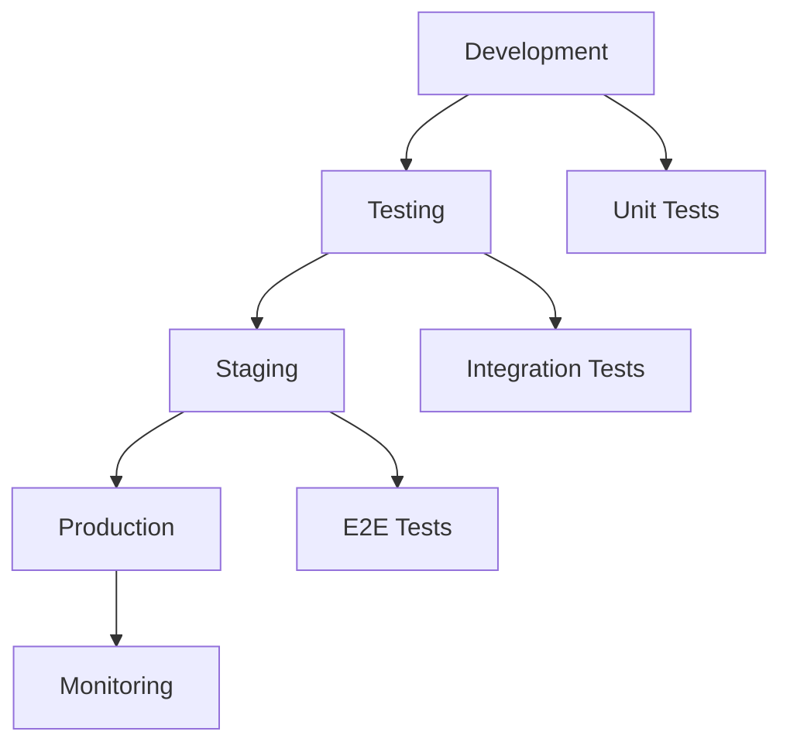

# Testing Documentation - Trusted Login System

## Overview

This comprehensive testing documentation describes the test strategies, procedures, and tools for the Trusted Login System. It covers unit tests, integration tests, end-to-end tests, performance tests, and security tests.

## Table of Contents

1. [Test Strategy](#test-strategy)
2. [Test Pyramid](#test-pyramid)
3. [Unit Testing](#unit-testing)
4. [Integration Testing](#integration-testing)
5. [End-to-End Testing](#end-to-end-testing)
6. [Performance Testing](#performance-testing)
7. [Security Testing](#security-testing)
8. [Test Automation](#test-automation)
9. [Test Data Management](#test-data-management)
10. [Continuous Testing](#continuous-testing)

## Test Strategy

### Objectives

- **Quality Assurance**: Ensuring functionality and reliability
- **Regression Prevention**: Preventing bugs during code changes
- **Performance Validation**: Ensuring optimal system performance
- **Security Validation**: Verifying security measures
- **Usability**: Validating user experience

### Testing Principles

1. **Shift-Left Testing**: Early integration of tests into the development process
2. **Risk-Based Testing**: Focus on critical and high-risk areas
3. **Automation First**: Prefer automated tests where possible
4. **Continuous Testing**: Integration into CI/CD pipeline
5. **Test-Driven Development**: TDD for critical components

### Test Environments



## Test Pyramid

### Structure

```
        /\     E2E Tests (10%)
       /  \    - Browser Tests
      /    \   - User Journey Tests
     /______\  
    /        \ Integration Tests (30%)
   /          \ - API Tests
  /            \ - Service Tests
 /______________\ 
/                \ Unit Tests (60%)
\________________/ - Component Tests
                   - Function Tests
```

### Test Distribution

- **Unit Tests**: 60% - Fast, isolated, high coverage
- **Integration Tests**: 30% - Service interactions, API tests
- **E2E Tests**: 10% - Complete user journeys, critical paths

## Unit Testing

### Backend Unit Tests (Python)

#### Test Setup

```python
# backend/tests/conftest.py
import pytest
from fastapi.testclient import TestClient
from unittest.mock import Mock, patch
from app.main import create_app
from app.core.config import get_settings

@pytest.fixture
def test_client():
    """Create test client with test configuration"""
    app = create_app()
    return TestClient(app)

@pytest.fixture
def mock_supabase():
    """Mock Supabase client for testing"""
    with patch('app.services.supabase_client') as mock:
        yield mock

@pytest.fixture
def sample_user_data():
    """Sample user data for testing"""
    return {
        "id": "test-user-123",
        "email": "test@example.com",
        "role": "user"
    }
```

#### Service Tests

```python
# backend/tests/test_services/test_desktop_service.py
import pytest
from unittest.mock import Mock, patch, MagicMock
from app.services.desktop_service import DesktopService
from app.models.desktop_models import ScreenshotRequest, ClickRequest

class TestDesktopService:
    """Test suite for DesktopService"""
    
    @pytest.fixture
    def desktop_service(self):
        return DesktopService()
    
    @patch('app.services.desktop_service.pyautogui')
    def test_take_screenshot_success(self, mock_pyautogui, desktop_service):
        """Test successful screenshot capture"""
        # Arrange
        mock_image = Mock()
        mock_pyautogui.screenshot.return_value = mock_image
        mock_image.save = Mock()
        
        request = ScreenshotRequest(
            filename="test_screenshot.png",
            quality=80
        )
        
        # Act
        result = desktop_service.take_screenshot(request)
        
        # Assert
        assert result.success is True
        assert "test_screenshot.png" in result.filepath
        mock_pyautogui.screenshot.assert_called_once()
        mock_image.save.assert_called_once()
    
    @patch('app.services.desktop_service.pyautogui')
    def test_click_action_success(self, mock_pyautogui, desktop_service):
        """Test successful click action"""
        # Arrange
        request = ClickRequest(
            x=100,
            y=200,
            button="left",
            clicks=1
        )
        
        # Act
        result = desktop_service.perform_click(request)
        
        # Assert
        assert result.success is True
        mock_pyautogui.click.assert_called_once_with(
            x=100, y=200, button="left", clicks=1
        )
    
    @patch('app.services.desktop_service.pyautogui')
    def test_click_action_failure(self, mock_pyautogui, desktop_service):
        """Test click action failure handling"""
        # Arrange
        mock_pyautogui.click.side_effect = Exception("Click failed")
        request = ClickRequest(x=100, y=200)
        
        # Act
        result = desktop_service.perform_click(request)
        
        # Assert
        assert result.success is False
        assert "Click failed" in result.error_message
```

#### Router Tests

```python
# backend/tests/test_routers/test_health.py
import pytest
from fastapi.testclient import TestClient
from app.main import create_app

class TestHealthRouter:
    """Test suite for Health Router"""
    
    @pytest.fixture
    def client(self):
        app = create_app()
        return TestClient(app)
    
    def test_health_check_success(self, client):
        """Test successful health check"""
        # Act
        response = client.get("/health")
        
        # Assert
        assert response.status_code == 200
        data = response.json()
        assert data["status"] == "healthy"
        assert "timestamp" in data
        assert "version" in data
    
    def test_health_check_detailed(self, client):
        """Test detailed health check"""
        # Act
        response = client.get("/health?detailed=true")
        
        # Assert
        assert response.status_code == 200
        data = response.json()
        assert "system" in data
        assert "services" in data
        assert "database" in data["services"]
```

### Frontend Unit Tests (React/TypeScript)

#### Test Setup

```typescript
// src/test-utils.tsx
import React, { ReactElement } from 'react'
import { render, RenderOptions } from '@testing-library/react'
import { BrowserRouter } from 'react-router-dom'
import { QueryClient, QueryClientProvider } from '@tanstack/react-query'
import { AuthProvider } from '@/contexts/AuthContext'

const AllTheProviders = ({ children }: { children: React.ReactNode }) => {
  const queryClient = new QueryClient({
    defaultOptions: {
      queries: {
        retry: false,
      },
    },
  })

  return (
    <QueryClientProvider client={queryClient}>
      <BrowserRouter>
        <AuthProvider>
          {children}
        </AuthProvider>
      </BrowserRouter>
    </QueryClientProvider>
  )
}

const customRender = (
  ui: ReactElement,
  options?: Omit<RenderOptions, 'wrapper'>,
) => render(ui, { wrapper: AllTheProviders, ...options })

export * from '@testing-library/react'
export { customRender as render }
```

#### Component Tests

```typescript
// src/components/__tests__/WorkflowNode.test.tsx
import { render, screen, fireEvent, waitFor } from '@/test-utils'
import { WorkflowNode } from '@/components/WorkflowNode'
import { NodeType } from '@/types/workflow'

const mockNode = {
  id: 'test-node-1',
  type: NodeType.CLICK,
  position: { x: 100, y: 100 },
  data: {
    label: 'Test Click Node',
    config: {
      x: 200,
      y: 300,
      button: 'left'
    }
  }
}

describe('WorkflowNode', () => {
  it('renders node with correct label', () => {
    render(<WorkflowNode node={mockNode} />)
    
    expect(screen.getByText('Test Click Node')).toBeInTheDocument()
  })
  
  it('handles node selection', async () => {
    const onSelect = jest.fn()
    render(<WorkflowNode node={mockNode} onSelect={onSelect} />)
    
    fireEvent.click(screen.getByRole('button'))
    
    await waitFor(() => {
      expect(onSelect).toHaveBeenCalledWith(mockNode.id)
    })
  })
  
  it('displays node configuration on hover', async () => {
    render(<WorkflowNode node={mockNode} />)
    
    fireEvent.mouseEnter(screen.getByRole('button'))
    
    await waitFor(() => {
      expect(screen.getByText('x: 200')).toBeInTheDocument()
      expect(screen.getByText('y: 300')).toBeInTheDocument()
    })
  })
})
```

#### Hook Tests

```typescript
// src/hooks/__tests__/useWorkflow.test.ts
import { renderHook, act } from '@testing-library/react'
import { useWorkflow } from '@/hooks/useWorkflow'
import { QueryClient, QueryClientProvider } from '@tanstack/react-query'
import { ReactNode } from 'react'

const createWrapper = () => {
  const queryClient = new QueryClient({
    defaultOptions: {
      queries: { retry: false },
      mutations: { retry: false },
    },
  })
  
  return ({ children }: { children: ReactNode }) => (
    <QueryClientProvider client={queryClient}>
      {children}
    </QueryClientProvider>
  )
}

describe('useWorkflow', () => {
  it('initializes with empty workflow', () => {
    const { result } = renderHook(() => useWorkflow(), {
      wrapper: createWrapper(),
    })
    
    expect(result.current.nodes).toEqual([])
    expect(result.current.edges).toEqual([])
    expect(result.current.isExecuting).toBe(false)
  })
  
  it('adds node to workflow', () => {
    const { result } = renderHook(() => useWorkflow(), {
      wrapper: createWrapper(),
    })
    
    act(() => {
      result.current.addNode({
        type: 'click',
        position: { x: 100, y: 100 },
        data: { label: 'Test Node' }
      })
    })
    
    expect(result.current.nodes).toHaveLength(1)
    expect(result.current.nodes[0].data.label).toBe('Test Node')
  })
})
```

## Integration Testing

### API Integration Tests

```python
# backend/tests/test_integration/test_api_integration.py
import pytest
import asyncio
from httpx import AsyncClient
from app.main import create_app

class TestAPIIntegration:
    """Integration tests for API endpoints"""
    
    @pytest.fixture
    async def async_client(self):
        app = create_app()
        async with AsyncClient(app=app, base_url="http://test") as client:
            yield client
    
    @pytest.mark.asyncio
    async def test_workflow_execution_flow(self, async_client):
        """Test complete workflow execution flow"""
        # 1. Create workflow
        workflow_data = {
            "name": "Test Workflow",
            "nodes": [
                {
                    "id": "node1",
                    "type": "click",
                    "config": {"x": 100, "y": 100}
                }
            ],
            "edges": []
        }
        
        response = await async_client.post("/api/workflows", json=workflow_data)
        assert response.status_code == 201
        workflow_id = response.json()["id"]
        
        # 2. Execute workflow
        response = await async_client.post(f"/api/workflows/{workflow_id}/execute")
        assert response.status_code == 200
        execution_id = response.json()["execution_id"]
        
        # 3. Check execution status
        response = await async_client.get(f"/api/executions/{execution_id}")
        assert response.status_code == 200
        assert response.json()["status"] in ["running", "completed"]
    
    @pytest.mark.asyncio
    async def test_desktop_screenshot_integration(self, async_client):
        """Test desktop screenshot integration"""
        # Take screenshot
        response = await async_client.post("/api/desktop/screenshot", json={
            "filename": "test_integration.png",
            "quality": 80
        })
        
        assert response.status_code == 200
        data = response.json()
        assert data["success"] is True
        assert "filepath" in data
        
        # Verify file exists
        response = await async_client.get(f"/api/files/{data['filename']}")
        assert response.status_code == 200
```

### Database Integration Tests

```python
# backend/tests/test_integration/test_database_integration.py
import pytest
from supabase import create_client
from app.core.config import get_settings

class TestDatabaseIntegration:
    """Integration tests for database operations"""
    
    @pytest.fixture
    def supabase_client(self):
        settings = get_settings()
        return create_client(
            settings.SUPABASE_URL,
            settings.SUPABASE_SERVICE_ROLE_KEY
        )
    
    def test_workflow_crud_operations(self, supabase_client):
        """Test CRUD operations for workflows"""
        # Create
        workflow_data = {
            "name": "Test Workflow",
            "description": "Integration test workflow",
            "nodes": [],
            "edges": []
        }
        
        result = supabase_client.table("workflows").insert(workflow_data).execute()
        assert len(result.data) == 1
        workflow_id = result.data[0]["id"]
        
        # Read
        result = supabase_client.table("workflows").select("*").eq("id", workflow_id).execute()
        assert len(result.data) == 1
        assert result.data[0]["name"] == "Test Workflow"
        
        # Update
        update_data = {"name": "Updated Test Workflow"}
        result = supabase_client.table("workflows").update(update_data).eq("id", workflow_id).execute()
        assert result.data[0]["name"] == "Updated Test Workflow"
        
        # Delete
        result = supabase_client.table("workflows").delete().eq("id", workflow_id).execute()
        assert len(result.data) == 1
```

## End-to-End Testing

### Playwright E2E Tests

```typescript
// tests/e2e/workflow-creation.spec.ts
import { test, expect } from '@playwright/test'

test.describe('Workflow Creation', () => {
  test.beforeEach(async ({ page }) => {
    await page.goto('http://localhost:5174')
    // Login if required
    await page.fill('[data-testid="email-input"]', 'test@example.com')
    await page.fill('[data-testid="password-input"]', 'testpassword')
    await page.click('[data-testid="login-button"]')
    await page.waitForURL('**/dashboard')
  })
  
  test('should create a new workflow', async ({ page }) => {
    // Navigate to workflow creation
    await page.click('[data-testid="create-workflow-button"]')
    await expect(page).toHaveURL('**/workflows/new')
    
    // Add workflow name
    await page.fill('[data-testid="workflow-name-input"]', 'E2E Test Workflow')
    
    // Add a click node
    await page.click('[data-testid="add-click-node"]')
    await page.click('[data-testid="workflow-canvas"]', { position: { x: 200, y: 200 } })
    
    // Configure the node
    await page.click('[data-testid="node-config-button"]')
    await page.fill('[data-testid="click-x-input"]', '100')
    await page.fill('[data-testid="click-y-input"]', '150')
    await page.click('[data-testid="save-node-config"]')
    
    // Save workflow
    await page.click('[data-testid="save-workflow-button"]')
    
    // Verify workflow was created
    await expect(page.locator('[data-testid="success-message"]')).toBeVisible()
    await expect(page).toHaveURL('**/workflows')
    await expect(page.locator('text=E2E Test Workflow')).toBeVisible()
  })
  
  test('should execute a workflow', async ({ page }) => {
    // Create a simple workflow first
    await page.click('[data-testid="create-workflow-button"]')
    await page.fill('[data-testid="workflow-name-input"]', 'Execution Test')
    await page.click('[data-testid="add-click-node"]')
    await page.click('[data-testid="workflow-canvas"]', { position: { x: 200, y: 200 } })
    await page.click('[data-testid="save-workflow-button"]')
    
    // Execute the workflow
    await page.click('[data-testid="execute-workflow-button"]')
    
    // Wait for execution to start
    await expect(page.locator('[data-testid="execution-status"]')).toContainText('Running')
    
    // Wait for execution to complete (with timeout)
    await expect(page.locator('[data-testid="execution-status"]')).toContainText('Completed', { timeout: 10000 })
    
    // Verify execution results
    await expect(page.locator('[data-testid="execution-results"]')).toBeVisible()
  })
})
```

### Cross-Browser Testing

```typescript
// playwright.config.ts
import { defineConfig, devices } from '@playwright/test'

export default defineConfig({
  testDir: './tests/e2e',
  fullyParallel: true,
  forbidOnly: !!process.env.CI,
  retries: process.env.CI ? 2 : 0,
  workers: process.env.CI ? 1 : undefined,
  reporter: 'html',
  use: {
    baseURL: 'http://localhost:5174',
    trace: 'on-first-retry',
    screenshot: 'only-on-failure',
  },
  projects: [
    {
      name: 'chromium',
      use: { ...devices['Desktop Chrome'] },
    },
    {
      name: 'firefox',
      use: { ...devices['Desktop Firefox'] },
    },
    {
      name: 'webkit',
      use: { ...devices['Desktop Safari'] },
    },
    {
      name: 'Mobile Chrome',
      use: { ...devices['Pixel 5'] },
    },
    {
      name: 'Mobile Safari',
      use: { ...devices['iPhone 12'] },
    },
  ],
  webServer: {
    command: 'npm run dev',
    url: 'http://localhost:5174',
    reuseExistingServer: !process.env.CI,
  },
})
```

## Performance Testing

### Load Testing mit Artillery

```yaml
# tests/performance/load-test.yml
config:
  target: 'http://localhost:8007'
  phases:
    - duration: 60
      arrivalRate: 10
      name: "Warm up"
    - duration: 120
      arrivalRate: 50
      name: "Load test"
    - duration: 60
      arrivalRate: 100
      name: "Stress test"
  processor: "./test-functions.js"

scenarios:
  - name: "API Health Check"
    weight: 20
    flow:
      - get:
          url: "/health"
          expect:
            - statusCode: 200
            - hasProperty: "status"
  
  - name: "Workflow Execution"
    weight: 60
    flow:
      - post:
          url: "/api/workflows"
          json:
            name: "Load Test Workflow"
            nodes: []
            edges: []
          capture:
            - json: "$.id"
              as: "workflowId"
      - post:
          url: "/api/workflows/{{ workflowId }}/execute"
          expect:
            - statusCode: 200
  
  - name: "Desktop Screenshot"
    weight: 20
    flow:
      - post:
          url: "/api/desktop/screenshot"
          json:
            filename: "load-test-{{ $randomString() }}.png"
            quality: 80
          expect:
            - statusCode: 200
```

### Performance Monitoring

```python
# backend/tests/test_performance/test_performance_monitoring.py
import pytest
import time
import psutil
from fastapi.testclient import TestClient
from app.main import create_app

class TestPerformanceMonitoring:
    """Performance monitoring tests"""
    
    @pytest.fixture
    def client(self):
        app = create_app()
        return TestClient(app)
    
    def test_api_response_time(self, client):
        """Test API response time under normal load"""
        start_time = time.time()
        
        response = client.get("/health")
        
        end_time = time.time()
        response_time = end_time - start_time
        
        assert response.status_code == 200
        assert response_time < 0.5  # Response should be under 500ms
    
    def test_memory_usage_during_workflow_execution(self, client):
        """Test memory usage during workflow execution"""
        process = psutil.Process()
        initial_memory = process.memory_info().rss
        
        # Execute multiple workflows
        for i in range(10):
            workflow_data = {
                "name": f"Performance Test {i}",
                "nodes": [{"type": "click", "config": {"x": 100, "y": 100}}],
                "edges": []
            }
            
            response = client.post("/api/workflows", json=workflow_data)
            assert response.status_code == 201
            
            workflow_id = response.json()["id"]
            response = client.post(f"/api/workflows/{workflow_id}/execute")
            assert response.status_code == 200
        
        final_memory = process.memory_info().rss
        memory_increase = final_memory - initial_memory
        
        # Memory increase should be reasonable (less than 100MB)
        assert memory_increase < 100 * 1024 * 1024
```

## Security Testing

### Authentication Tests

```python
# backend/tests/test_security/test_authentication.py
import pytest
from fastapi.testclient import TestClient
from app.main import create_app

class TestAuthentication:
    """Security tests for authentication"""
    
    @pytest.fixture
    def client(self):
        app = create_app()
        return TestClient(app)
    
    def test_protected_endpoint_without_auth(self, client):
        """Test access to protected endpoint without authentication"""
        response = client.get("/api/workflows")
        assert response.status_code == 401
    
    def test_invalid_token(self, client):
        """Test access with invalid token"""
        headers = {"Authorization": "Bearer invalid_token"}
        response = client.get("/api/workflows", headers=headers)
        assert response.status_code == 401
    
    def test_expired_token(self, client):
        """Test access with expired token"""
        expired_token = "eyJ0eXAiOiJKV1QiLCJhbGciOiJIUzI1NiJ9.eyJleHAiOjE2MzAwMDAwMDB9.invalid"
        headers = {"Authorization": f"Bearer {expired_token}"}
        response = client.get("/api/workflows", headers=headers)
        assert response.status_code == 401
```

### Input Validation Tests

```python
# backend/tests/test_security/test_input_validation.py
import pytest
from fastapi.testclient import TestClient
from app.main import create_app

class TestInputValidation:
    """Security tests for input validation"""
    
    @pytest.fixture
    def client(self):
        app = create_app()
        return TestClient(app)
    
    def test_sql_injection_prevention(self, client):
        """Test SQL injection prevention"""
        malicious_input = "'; DROP TABLE workflows; --"
        
        response = client.post("/api/workflows", json={
            "name": malicious_input,
            "nodes": [],
            "edges": []
        })
        
        # Should either reject the input or sanitize it
        assert response.status_code in [400, 422]  # Bad request or validation error
    
    def test_xss_prevention(self, client):
        """Test XSS prevention"""
        xss_payload = "<script>alert('XSS')</script>"
        
        response = client.post("/api/workflows", json={
            "name": xss_payload,
            "nodes": [],
            "edges": []
        })
        
        if response.status_code == 201:
            # If accepted, ensure it's properly escaped
            data = response.json()
            assert "<script>" not in data["name"]
    
    def test_file_upload_validation(self, client):
        """Test file upload validation"""
        # Test malicious file upload
        malicious_file = b"<?php system($_GET['cmd']); ?>"
        
        response = client.post("/api/files/upload", files={
            "file": ("malicious.php", malicious_file, "application/x-php")
        })
        
        # Should reject PHP files
        assert response.status_code in [400, 422, 415]
```

## Test-Automatisierung

### GitHub Actions CI/CD

```yaml
# .github/workflows/test.yml
name: Test Suite

on:
  push:
    branches: [ main, develop ]
  pull_request:
    branches: [ main ]

jobs:
  backend-tests:
    runs-on: ubuntu-latest
    
    services:
      postgres:
        image: postgres:14
        env:
          POSTGRES_PASSWORD: postgres
          POSTGRES_DB: test_db
        options: >-
          --health-cmd pg_isready
          --health-interval 10s
          --health-timeout 5s
          --health-retries 5
    
    steps:
    - uses: actions/checkout@v3
    
    - name: Set up Python
      uses: actions/setup-python@v4
      with:
        python-version: '3.11'
    
    - name: Install dependencies
      run: |
        cd backend
        pip install -r requirements.txt
        pip install pytest pytest-cov pytest-asyncio
    
    - name: Run unit tests
      run: |
        cd backend
        pytest tests/test_unit/ -v --cov=app --cov-report=xml
    
    - name: Run integration tests
      run: |
        cd backend
        pytest tests/test_integration/ -v
    
    - name: Upload coverage to Codecov
      uses: codecov/codecov-action@v3
      with:
        file: ./backend/coverage.xml
  
  frontend-tests:
    runs-on: ubuntu-latest
    
    steps:
    - uses: actions/checkout@v3
    
    - name: Set up Node.js
      uses: actions/setup-node@v3
      with:
        node-version: '18'
        cache: 'npm'
    
    - name: Install dependencies
      run: npm ci
    
    - name: Run unit tests
      run: npm run test:unit
    
    - name: Run component tests
      run: npm run test:components
    
    - name: Build application
      run: npm run build
  
  e2e-tests:
    runs-on: ubuntu-latest
    needs: [backend-tests, frontend-tests]
    
    steps:
    - uses: actions/checkout@v3
    
    - name: Set up Node.js
      uses: actions/setup-node@v3
      with:
        node-version: '18'
        cache: 'npm'
    
    - name: Install dependencies
      run: npm ci
    
    - name: Install Playwright
      run: npx playwright install --with-deps
    
    - name: Start application
      run: |
        npm run build
        npm run preview &
        sleep 10
    
    - name: Run E2E tests
      run: npx playwright test
    
    - name: Upload test results
      uses: actions/upload-artifact@v3
      if: failure()
      with:
        name: playwright-report
        path: playwright-report/
```

### Test Scripts

```json
// package.json
{
  "scripts": {
    "test": "npm run test:unit && npm run test:integration && npm run test:e2e",
    "test:unit": "vitest run src/**/*.test.{ts,tsx}",
    "test:integration": "vitest run tests/integration/**/*.test.{ts,tsx}",
    "test:e2e": "playwright test",
    "test:watch": "vitest",
    "test:coverage": "vitest run --coverage",
    "test:performance": "artillery run tests/performance/load-test.yml",
    "test:security": "npm audit && npm run test:security:backend",
    "test:security:backend": "cd backend && python -m pytest tests/test_security/"
  }
}
```

## Test Data Management

### Test Fixtures

```python
# backend/tests/fixtures/workflow_fixtures.py
import pytest
from typing import Dict, Any, List

@pytest.fixture
def sample_workflow_data() -> Dict[str, Any]:
    """Sample workflow data for testing"""
    return {
        "name": "Test Workflow",
        "description": "A workflow for testing purposes",
        "nodes": [
            {
                "id": "node1",
                "type": "click",
                "position": {"x": 100, "y": 100},
                "config": {
                    "x": 200,
                    "y": 300,
                    "button": "left",
                    "clicks": 1
                }
            },
            {
                "id": "node2",
                "type": "type_text",
                "position": {"x": 300, "y": 100},
                "config": {
                    "text": "Hello World",
                    "delay": 100
                }
            }
        ],
        "edges": [
            {
                "id": "edge1",
                "source": "node1",
                "target": "node2"
            }
        ]
    }

@pytest.fixture
def complex_workflow_data() -> Dict[str, Any]:
    """Complex workflow data for advanced testing"""
    return {
        "name": "Complex Test Workflow",
        "description": "A complex workflow with multiple node types",
        "nodes": [
            {
                "id": "trigger1",
                "type": "manual_trigger",
                "position": {"x": 50, "y": 100},
                "config": {}
            },
            {
                "id": "screenshot1",
                "type": "screenshot",
                "position": {"x": 200, "y": 100},
                "config": {
                    "filename": "test_screenshot.png",
                    "quality": 80
                }
            },
            {
                "id": "ocr1",
                "type": "ocr",
                "position": {"x": 350, "y": 100},
                "config": {
                    "region": {"x": 0, "y": 0, "width": 800, "height": 600},
                    "language": "eng"
                }
            },
            {
                "id": "condition1",
                "type": "condition",
                "position": {"x": 500, "y": 100},
                "config": {
                    "condition": "text_contains",
                    "value": "Success"
                }
            }
        ],
        "edges": [
            {"id": "e1", "source": "trigger1", "target": "screenshot1"},
            {"id": "e2", "source": "screenshot1", "target": "ocr1"},
            {"id": "e3", "source": "ocr1", "target": "condition1"}
        ]
    }
```

### Test Database Setup

```python
# backend/tests/database_setup.py
import asyncio
from supabase import create_client
from app.core.config import get_settings

async def setup_test_database():
    """Setup test database with required tables and data"""
    settings = get_settings()
    supabase = create_client(
        settings.SUPABASE_URL,
        settings.SUPABASE_SERVICE_ROLE_KEY
    )
    
    # Create test tables if they don't exist
    test_tables = [
        """
        CREATE TABLE IF NOT EXISTS test_workflows (
            id UUID DEFAULT gen_random_uuid() PRIMARY KEY,
            name TEXT NOT NULL,
            description TEXT,
            nodes JSONB DEFAULT '[]',
            edges JSONB DEFAULT '[]',
            created_at TIMESTAMP WITH TIME ZONE DEFAULT NOW(),
            updated_at TIMESTAMP WITH TIME ZONE DEFAULT NOW()
        )
        """,
        """
        CREATE TABLE IF NOT EXISTS test_executions (
            id UUID DEFAULT gen_random_uuid() PRIMARY KEY,
            workflow_id UUID REFERENCES test_workflows(id),
            status TEXT DEFAULT 'pending',
            result JSONB,
            started_at TIMESTAMP WITH TIME ZONE DEFAULT NOW(),
            completed_at TIMESTAMP WITH TIME ZONE
        )
        """
    ]
    
    for table_sql in test_tables:
        supabase.rpc('exec_sql', {'sql': table_sql}).execute()

async def cleanup_test_database():
    """Cleanup test database"""
    settings = get_settings()
    supabase = create_client(
        settings.SUPABASE_URL,
        settings.SUPABASE_SERVICE_ROLE_KEY
    )
    
    # Clean up test data
    cleanup_queries = [
        "DELETE FROM test_executions",
        "DELETE FROM test_workflows"
    ]
    
    for query in cleanup_queries:
        supabase.rpc('exec_sql', {'sql': query}).execute()
```

## Continuous Testing

### Test Monitoring Dashboard

```python
# backend/app/monitoring/test_monitoring.py
from fastapi import APIRouter
from typing import Dict, Any, List
import json
import os
from datetime import datetime, timedelta

router = APIRouter()

class TestMonitoringService:
    """Service for monitoring test results and metrics"""
    
    def __init__(self):
        self.test_results_path = "test_results"
    
    def get_test_summary(self) -> Dict[str, Any]:
        """Get overall test summary"""
        return {
            "total_tests": self._count_total_tests(),
            "passing_tests": self._count_passing_tests(),
            "failing_tests": self._count_failing_tests(),
            "test_coverage": self._get_test_coverage(),
            "last_run": self._get_last_test_run(),
            "trend": self._get_test_trend()
        }
    
    def get_test_results_by_category(self) -> Dict[str, Any]:
        """Get test results grouped by category"""
        return {
            "unit_tests": self._get_unit_test_results(),
            "integration_tests": self._get_integration_test_results(),
            "e2e_tests": self._get_e2e_test_results(),
            "performance_tests": self._get_performance_test_results(),
            "security_tests": self._get_security_test_results()
        }
    
    def get_flaky_tests(self) -> List[Dict[str, Any]]:
        """Identify flaky tests that fail intermittently"""
        # Implementation to identify tests with inconsistent results
        pass
    
    def get_slow_tests(self) -> List[Dict[str, Any]]:
        """Identify slow tests that exceed time thresholds"""
        # Implementation to identify slow-running tests
        pass

@router.get("/test-summary")
async def get_test_summary():
    """Get test summary endpoint"""
    service = TestMonitoringService()
    return service.get_test_summary()

@router.get("/test-results")
async def get_test_results():
    """Get detailed test results endpoint"""
    service = TestMonitoringService()
    return service.get_test_results_by_category()
```

### Test Quality Metrics

```python
# backend/scripts/test_quality_metrics.py
import subprocess
import json
import xml.etree.ElementTree as ET
from typing import Dict, Any

class TestQualityAnalyzer:
    """Analyze test quality metrics"""
    
    def analyze_test_coverage(self) -> Dict[str, Any]:
        """Analyze test coverage metrics"""
        # Run coverage analysis
        result = subprocess.run(
            ['pytest', '--cov=app', '--cov-report=xml'],
            capture_output=True,
            text=True,
            cwd='backend'
        )
        
        # Parse coverage XML
        tree = ET.parse('backend/coverage.xml')
        root = tree.getroot()
        
        coverage_data = {
            "line_coverage": float(root.attrib.get('line-rate', 0)) * 100,
            "branch_coverage": float(root.attrib.get('branch-rate', 0)) * 100,
            "files": []
        }
        
        for package in root.findall('.//package'):
            for class_elem in package.findall('classes/class'):
                file_coverage = {
                    "filename": class_elem.attrib.get('filename'),
                    "line_coverage": float(class_elem.attrib.get('line-rate', 0)) * 100,
                    "branch_coverage": float(class_elem.attrib.get('branch-rate', 0)) * 100
                }
                coverage_data["files"].append(file_coverage)
        
        return coverage_data
    
    def analyze_test_performance(self) -> Dict[str, Any]:
        """Analyze test performance metrics"""
        # Run tests with timing information
        result = subprocess.run(
            ['pytest', '--durations=0', '--json-report'],
            capture_output=True,
            text=True,
            cwd='backend'
        )
        
        # Parse test timing data
        with open('backend/.report.json', 'r') as f:
            report_data = json.load(f)
        
        performance_data = {
            "total_duration": report_data.get('duration', 0),
            "slowest_tests": [],
            "average_test_time": 0
        }
        
        # Extract slowest tests
        tests = report_data.get('tests', [])
        sorted_tests = sorted(tests, key=lambda x: x.get('duration', 0), reverse=True)
        
        performance_data["slowest_tests"] = [
            {
                "name": test.get('nodeid'),
                "duration": test.get('duration'),
                "outcome": test.get('outcome')
            }
            for test in sorted_tests[:10]
        ]
        
        if tests:
            total_time = sum(test.get('duration', 0) for test in tests)
            performance_data["average_test_time"] = total_time / len(tests)
        
        return performance_data

if __name__ == "__main__":
    analyzer = TestQualityAnalyzer()
    
    print("Test Coverage Analysis:")
    coverage = analyzer.analyze_test_coverage()
    print(json.dumps(coverage, indent=2))
    
    print("\nTest Performance Analysis:")
    performance = analyzer.analyze_test_performance()
    print(json.dumps(performance, indent=2))
```

## Conclusion

This comprehensive testing documentation provides a complete guide for implementing a robust testing strategy for the Trusted Login System. It covers all aspects from unit tests to performance and security tests, ensuring the system is reliable, secure, and performant.

Die Implementierung dieser Test-Strategien gewährleistet:

- **Hohe Code-Qualität** durch umfassende Test-Abdeckung
- **Frühe Fehlererkennung** durch kontinuierliche Tests
- **Zuverlässige Deployments** durch automatisierte Test-Pipelines
- **Performance-Optimierung** durch regelmäßige Performance-Tests
- **Sicherheitsvalidierung** durch spezialisierte Sicherheitstests

Für weitere Details zu spezifischen Test-Implementierungen konsultieren Sie die entsprechenden Test-Dateien im Projekt oder kontaktieren Sie das Entwicklungsteam.